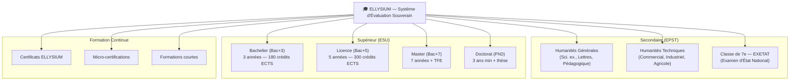
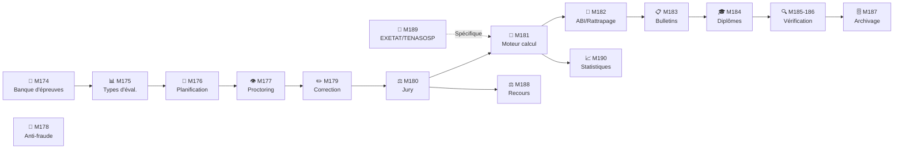

# Module 171 — Périmètre du Tome 10 — Principes d'Évaluation

> **Positionnement :** Tome 10 — Examens, Certifications, Bulletins & Diplômes · Module 171 sur 191
> **Autorité :** Directeur Académique ELLYSIUM / Préfet des Études / Jury National
> **Liaison amont/aval :** ← Tome 9 (Sécurité données) · Module 172 (Conformité) →

---

## 1. Objet

Ce module définit le périmètre, les principes fondateurs et la philosophie du système d'évaluation académique d'ELLYSIUM. Il couvre l'ensemble du cycle de validation : de la conception des épreuves à l'émission des diplômes, pour tous les niveaux de l'éducation congolaise (primaire, secondaire EPST, supérieur ESU).

---

## 2. Périmètre du Système d'Évaluation

### 2.1 Niveaux scolaires couverts



---

## 3. Principes Fondateurs de l'Évaluation

### 3.1 Les 7 Piliers de l'Évaluation ELLYSIUM

| # | Pilier | Description | Garantie technique |
|---|---|---|---|
| 1 | **Équité** | Mêmes règles pour tous, mêmes conditions | Formule de calcul unique, vérifiée automatiquement |
| 2 | **Transparence** | L'élève comprend comment sa cote est calculée | Interface d'explication détaillée |
| 3 | **Intégrité** | Les cotes ne peuvent être falsifiées après scellement | Hachage SHA-256 + Merkle tree |
| 4 | **Droit au recours** | Tout résultat peut être contesté dans un délai | Procédure formalisée (Module 188) |
| 5 | **Continuité** | Évaluation possible même hors connexion | SQLite local + synchronisation CRDT |
| 6 | **Souveraineté** | Les données restent sous juridiction RDC | GCP africa-south1 exclusivement |
| 7 | **Auxiliarité IA** | L'IA aide mais ne décide jamais d'une cote | Validation humaine obligatoire |

---

## 4. Types d'Évaluation dans le Système RDC

### 4.1 Terminologie officielle RDC (OBLIGATOIRE)

| Terme RDC | Définition | Équivalent international (pour référence) |
|---|---|---|
| **Cote** | Résultat chiffré d'une évaluation | Note, mark, grade |
| **Maximum** | Valeur maximale d'une évaluation | Barème, total points |
| **Travaux Journaliers (TJ)** | Évaluations continues en classe | Continuous Assessment |
| **Interrogation** | Évaluation courte en classe | Quiz, test |
| **Examen de fin de période** | Évaluation semestrielle/trimestrielle | Semester exam |
| **Délibération** | Jury de validation des résultats | Board of Examiners |
| **EXETAT** | Examen d'État (fin humanités) | National Baccalaureate |
| **TENASOSP** | Examen national secondaire technique | Technical National Exam |
| **Minerval** | Frais de scolarité | Tuition fee |
| **ABI** | Ajourné à la session de rattrapage | Deferred to resit |
| **Échec** | Non-admis, à reprendre l'année | Fail, repeat year |

### 4.2 Pondération standard (secondaire)

```
Période de 3 mois (trimestre ou semestre) :
  ↳ Travaux Journaliers (TJ) : 40% du maximum de la période
  ↳ Examen de fin de période : 60% du maximum de la période

Délibération annuelle :
  ↳ Taux global = (ΣPoints toutes périodes) / (ΣMaxima toutes périodes) × 100
  ↳ Seuil de réussite : 50% du total (règle générale EPST)
  ↳ Seuil par matière : variable selon règlement (certaines matières : 40% min)
```

---

## 5. Architecture Fonctionnelle du Tome 10



---

## 6. Intervenants du Cycle d'Évaluation

| Intervenant | Rôle dans l'évaluation | Droits RBAC |
|---|---|---|
| **Enseignant (Professeur Titulaire)** | Crée épreuves, saisit TJ, corrige, propose cotes | Écriture (draft uniquement) |
| **Préfet des Études** | Valide, scelle les bulletins, préside délibérations | Scellement (irréversible) |
| **Jury de délibération** | Valide collectivement les résultats | Vote électronique |
| **Directeur / Promoteur** | Vise les bulletins, supervision générale | Lecture + visa |
| **Apprenant / Élève** | Consulte ses résultats, soumet recours | Lecture seule |
| **Parent / Tuteur** | Consulte résultats enfant, reçoit alertes | Lecture seule |
| **Tuteur IA (Vertex AI)** | Propose des corrections assistées | Consultation uniquement, validation humaine requise |
| **Inspecteur EPST/ESU** | Audite les résultats d'un établissement | Lecture seule |
| **TENASOSP / EXETAT** | Validation nationale des résultats d'État | Interface dédiée |

---

## 7. Verrous Fonctionnels

| ID | Règle | Niveau |
|---|---|---|
| VF-171-01 | La formule de calcul officielle RDC est la seule autorisée (jamais de moyenne de pourcentages) | CONSTITUTIONNEL |
| VF-171-02 | L'IA ne peut jamais attribuer une cote finale — rôle consultatif uniquement | CONSTITUTIONNEL |
| VF-171-03 | Le scellement d'un bulletin par le Préfet est irréversible (sauf Super-Admin + procédure) | OBLIGATOIRE |
| VF-171-04 | Tout résultat doit être contestable dans un délai clairement affiché | CONSTITUTIONNEL |
| VF-171-05 | La terminologie officielle RDC est utilisée dans toutes les interfaces | OBLIGATOIRE |
| VF-171-06 | Toute suspicion de tricherie déclenche une révision manuelle obligatoire par un jury humain | CONSTITUTIONNEL |

---

*Sous-tome rédigé conformément aux Normes documentaires ELLYSIUM — Fondations 04.*
