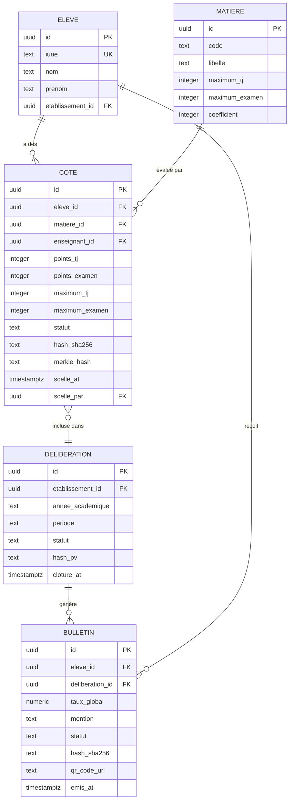

# Module 172 — Conformité avec la Constitution (Intégrité, Droit au Recours)

> **Positionnement :** Tome 10 — Examens, Certifications, Bulletins & Diplômes · Module 172 sur 191
> **Autorité :** Architecte Souverain ELLYSIUM / Conseil Constitutionnel Académique
> **Liaison amont/aval :** ← Module 171 (Périmètre) · Module 151 (Conformité T9) → Module 173 (Architecture) →

---

## 1. Objet

Ce module traduit en mécanismes techniques les articles constitutionnels applicables au système d'évaluation d'ELLYSIUM. Il garantit que chaque cote saisie, chaque délibération tenue, chaque diplôme émis est conforme aux dispositions de la Constitution ELLYSIUM et au droit académique congolais.

---

## 2. Traduction Constitutionnelle Article par Article

### Article 1 — Souveraineté des Données

```
DISPOSITIONS :
  "Les données académiques des citoyens congolais relèvent de la
   souveraineté nationale et sont hébergées sous juridiction RDC."

TRADUCTION TECHNIQUE :
  ✅ Cloud SQL (PostgreSQL 16) en région africa-south1 (Johannesburg)
  ✅ Réplication vers europe-west1 uniquement avec chiffrement AES-256
  ✅ Clés de chiffrement dans Cloud KMS (région africa-south1)
  ✅ Aucune donnée de résultats ne transite par des serveurs non-Google
  ✅ DOCTRINE_INFRASTRUCTURE_GOOGLE.md — opposable à tout intervenant
```

### Article 3 — Intégrité et Immuabilité Académique

```
DISPOSITIONS :
  "Une fois validée, la cote d'un apprenant ne peut être modifiée
   que par procédure formelle et avec l'approbation du jury."

TRADUCTION TECHNIQUE :
  ✅ Cotes en statut BROUILLON : modifiables par l'enseignant
  ✅ Cotes en statut SOUMIS : modifiables avec accord du Préfet
  ✅ Cotes en statut SCELLÉ : lecture seule pour tous sauf Super-Admin
  ✅ Hash SHA-256 de chaque cote scellée stocké dans la blockchain d'audit
  ✅ Modification post-scellement : procédure PV de rectification + double signature
```

### Article 5 — Étanchéité Pédagogie/Finances

```
DISPOSITIONS :
  "L'accès aux résultats académiques est indépendant du statut
   de paiement du minerval."

TRADUCTION TECHNIQUE :
  ✅ Un élève peut consulter ses cotes même avec un minerval impayé
  ✅ Un enseignant ne voit JAMAIS le statut financier de ses élèves
  ✅ Un Préfet ne peut pas bloquer une délibération pour raison financière
  ✅ RBAC impose l'isolation totale des deux domaines (Module 159)
```

### Article 6 — Auxiliarité Stricte de l'IA

```
DISPOSITIONS :
  "L'IA assiste l'évaluation mais ne peut jamais être décisionnaire
   d'une cote, d'un résultat ou d'une décision d'orientation."

TRADUCTION TECHNIQUE :
  ✅ L'IA peut suggérer une correction (statut SUGGESTION, jamais COTE)
  ✅ Toute suggestion IA nécessite validation humaine explicite
  ✅ Interface : bouton "Accepter la suggestion" avec log de l'enseignant
  ✅ Rapport périodique : % de suggestions IA acceptées vs modifiées (transparence)
  ✅ Interdiction : l'IA ne peut jamais proposer la décision ABI / Échec / Réussite
```

### Article 8 — Traçabilité Totale

```
DISPOSITIONS :
  "Toute action sur les données académiques est tracée,
   horodatée et conservée de manière inaltérable."

TRADUCTION TECHNIQUE :
  ✅ Table audit_cotes : INSERT seul (jamais UPDATE ni DELETE)
  ✅ Chaîne de Merkle : hash(n) = SHA-256(action(n) || hash(n-1))
  ✅ Cloud Logging WORM : logs immuables 7 ans minimum
  ✅ Horodatage RFC 3339 avec référence NTP (serveur temps GCP)
```

### Article 10 — Droit au Recours

```
DISPOSITIONS :
  "Tout apprenant a le droit de contester un résultat académique
   dans un délai défini et selon une procédure transparente."

TRADUCTION TECHNIQUE :
  ✅ Délai de recours : affiché clairement sur chaque bulletin (ex: 15 jours)
  ✅ Formulaire de recours en ligne avec accusé de réception automatique
  ✅ Statut de traitement visible par l'apprenant en temps réel
  ✅ Double correction obligatoire en cas de recours accepté
  ✅ Délai de réponse garanti : 15 jours ouvrables
```

### Article 12 — Inaliénabilité des Crédits ECTS

```
DISPOSITIONS :
  "Les crédits ECTS acquis par un étudiant sont inaliénables.
   Ils ne peuvent jamais être retirés ou invalidés rétroactivement."

TRADUCTION TECHNIQUE :
  ✅ Table credits_ects avec contrainte : UPDATE statut_acquisition WHERE acquis=TRUE interdit
  ✅ Diplôme émis = enregistrement immuable + Object Lock GCS (50 ans)
  ✅ Portabilité : l'étudiant peut exporter son relevé de crédits signé numériquement
  ✅ Procédure de reconnaissance inter-établissements basée sur le relevé ELLYSIUM
```

---

## 3. MCD — Intégrité des Données d'Évaluation



---

## 4. Verrous Fonctionnels Constitutionnels

| ID | Article | Règle | Implémentation |
|---|---|---|---|
| VF-172-01 | Art. 1 | Données hébergées GCP africa-south1 uniquement | Cloud SQL région africa-south1 |
| VF-172-02 | Art. 3 | Cotes scellées = lecture seule pour tous | PostgreSQL RLS + statut SCELLÉ |
| VF-172-03 | Art. 5 | Statut financier invisible dans le module pédagogique | RBAC + isolation domaines |
| VF-172-04 | Art. 6 | IA ne peut pas attribuer de cote finale | Workflow validation humaine obligatoire |
| VF-172-05 | Art. 8 | Chaque action sur une cote est loguée et signée | Merkle chain + WORM Cloud Logging |
| VF-172-06 | Art. 10 | Formulaire de recours disponible 24h/24 | Interface web + mobile |
| VF-172-07 | Art. 12 | Crédits ECTS acquis = immuables en base de données | Contrainte CHECK + Object Lock diplôme |

---

*Sous-tome rédigé conformément aux Normes documentaires ELLYSIUM — Fondations 04.*
