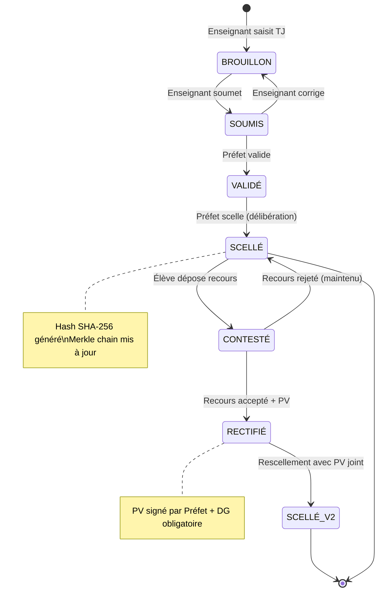

# Module 173 — Architecture Générale du Système d'Évaluation

> **Positionnement :** Tome 10 — Examens, Certifications, Bulletins & Diplômes · Module 173 sur 191
> **Autorité :** Architecte Souverain ELLYSIUM
> **Liaison amont/aval :** ← Module 172 (Conformité) → Module 174 (Banque d'épreuves) →

---

## 1. Objet

Ce module décrit l'architecture technique complète du système d'évaluation d'ELLYSIUM : les microservices, les flux de données, les états et transitions, et les interfaces avec les autres composants de la plateforme. Il constitue la référence technique pour l'implémentation de tout le Tome 10.

---

## 2. Vue d'Ensemble Architecturale

```mermaid
graph TB
    subgraph "Frontend (Firebase Hosting + PWA)"
        UI_ENS["Interface Enseignant\n(saisie TJ, correction)"]
        UI_PREF["Interface Préfet\n(délibération, scellement)"]
        UI_EL["Interface Élève/Étudiant\n(résultats, recours)"]
        UI_PAR["Interface Parent\n(résultats enfant)"]
    end

    subgraph "Backend (Cloud Run — GCP)"
        SVC_EVAL["🧮 evaluation-service\n(TJ, examens, calcul)"]
        SVC_DELIB["⚖️ deliberation-service\n(jurys, scellement)"]
        SVC_BULL["📋 bulletin-service\n(génération, PDF)"]
        SVC_DIPL["🎓 diploma-service\n(émission, signature)"]
        SVC_VERIF["🔍 verification-service\n(QR, portail public)"]
        SVC_RECOURS["📨 recours-service\n(contestations)"]
        SVC_STATS["📈 stats-service\n(analytics académiques)"]
    end

    subgraph "Données (Cloud SQL — africa-south1)"
        DB_COTES["Table cotes\n(avec états + Merkle)"]
        DB_DELIBDATA["Table deliberations"]
        DB_BULLETINS["Table bulletins"]
        DB_DIPLOMES["Table diplomes"]
        DB_AUDIT["Table audit_evaluations\n(append-only)"]
    end

    subgraph "Stockage (Cloud Storage)"
        GCS_PDF["Bucket bulletins-pdf\n(privé, chiffré)"]
        GCS_DIPL["Bucket diplomes\n(Object Lock 50 ans)"]
        GCS_EPREUVES["Bucket banque-epreuves\n(chiffré, accès restreint)"]
    end

    subgraph "IA (Vertex AI — auxiliaire)"
        AI_CORRECT["Correction assistée\n(suggestion uniquement)"]
        AI_PLAGIAT["Détection plagiat\n(Module 178)"]
    end

    UI_ENS & UI_PREF & UI_EL & UI_PAR --> SVC_EVAL & SVC_DELIB & SVC_BULL & SVC_VERIF & SVC_RECOURS
    SVC_EVAL --> DB_COTES & DB_AUDIT
    SVC_DELIB --> DB_DELIBDATA & DB_BULLETINS
    SVC_BULL --> GCS_PDF & DB_BULLETINS
    SVC_DIPL --> GCS_DIPL & DB_DIPLOMES
    SVC_VERIF --> DB_DIPLOMES & DB_BULLETINS
    AI_CORRECT -.->|Suggestion| SVC_EVAL
    AI_PLAGIAT -.->|Signal| SVC_EVAL
```



---

## 3. États et Transitions d'une Cote



---

## 4. Microservice `evaluation-service` — API Principale

```yaml
# OpenAPI 3.1 — evaluation-service
paths:
  /cotes:
    post:
      summary: Saisir une cote (TJ ou examen)
      security: [BearerAuth]
      x-roles: [ENSEIGNANT, PREFET]
      requestBody:
        content:
          application/json:
            schema:
              type: object
              required: [eleve_id, matiere_id, type, points, maximum]
              properties:
                eleve_id: {type: string, format: uuid}
                matiere_id: {type: string, format: uuid}
                type: {type: string, enum: [TJ, INTERROGATION, EXAMEN_PERIODE, EXAMEN_ETAT]}
                points: {type: integer, minimum: 0}
                maximum: {type: integer, minimum: 1}
                commentaire: {type: string, maxLength: 500}

  /cotes/{id}/soumettre:
    post:
      summary: Soumettre une cote pour validation (Enseignant → Préfet)
      security: [BearerAuth]
      x-roles: [ENSEIGNANT]

  /deliberations/{id}/sceller:
    post:
      summary: Sceller une délibération (irréversible)
      security: [BearerAuth]
      x-roles: [PREFET_ETUDES]
      x-mfa-required: true
      x-confirmation-required: "SCELLEMENT IRRÉVERSIBLE — Confirmez-vous ?"
```

---

## 5. Moteur de Calcul — Formule Constitutionnelle

```go
// Package: evaluation/calcul
// Implémentation stricte de la formule constitutionnelle ELLYSIUM

type ResultatPeriode struct {
    TotalPointsObtenus  int
    TotalMaxima         int
}

// CalculerTaux : SEULE formule autorisée
// Ne jamais faire une moyenne des pourcentages par matière
func CalculerTaux(cotes []Cote) float64 {
    var totalPoints, totalMaxima int
    for _, cote := range cotes {
        totalPoints += cote.PointsTJ + cote.PointsExamen
        totalMaxima += cote.MaximumTJ + cote.MaximumExamen
    }
    if totalMaxima == 0 {
        return 0
    }
    return (float64(totalPoints) / float64(totalMaxima)) * 100
}

// CalculerMention : barème officiel EPST/ESU
func CalculerMention(taux float64) string {
    switch {
    case taux >= 80: return "Grande Distinction"
    case taux >= 70: return "Distinction"
    case taux >= 60: return "Satisfaction"
    case taux >= 50: return "Réussite"
    default:         return "Échec"
    }
}
```

---

## 6. Interfaces avec les Autres Tomes

| Interface | Direction | Description |
|---|---|---|
| **Tome 5** (Pédagogie) | ← | Programmes d'études → structure des matières |
| **Tome 7** (Architecture) | → | APIs OpenAPI, Cloud Run, Cloud SQL |
| **Tome 8** (IA) | ← | Suggestions de correction assistée, anti-plagiat |
| **Tome 9** (Sécurité) | ← | RBAC scellement, audit chaîne Merkle, chiffrement |
| **Tome 11** (Administration) | → | Résultats → registre établissement |
| **Tome 13** (EPST/ESU) | → | Résultats → DIPROMAT, TENASOSP |

---

## 7. Verrous Fonctionnels

| ID | Règle | Niveau |
|---|---|---|
| VF-173-01 | La formule constitutionnelle (ΣPoints/ΣMaxima × 100) est la seule implémentée | CONSTITUTIONNEL |
| VF-173-02 | Le service de délibération requiert MFA pour tout scellement | OBLIGATOIRE |
| VF-173-03 | Toute transition d'état d'une cote est enregistrée dans audit_evaluations | OBLIGATOIRE |
| VF-173-04 | Le service de vérification est public (sans authentification) | OBLIGATOIRE |
| VF-173-05 | Les PDFs des bulletins sont générés côté serveur (jamais côté client) | OBLIGATOIRE |
| VF-173-06 | Toute suspicion de tricherie déclenche une révision manuelle obligatoire par un jury humain | CONSTITUTIONNEL |

---

*Sous-tome rédigé conformément aux Normes documentaires ELLYSIUM — Fondations 04.*
