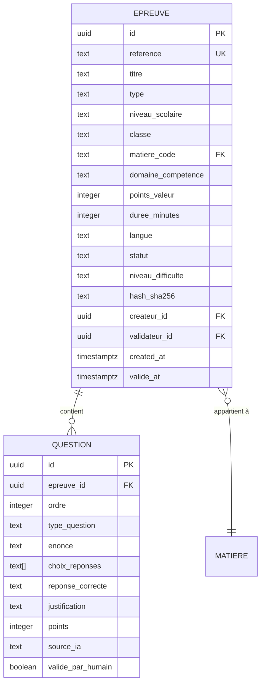
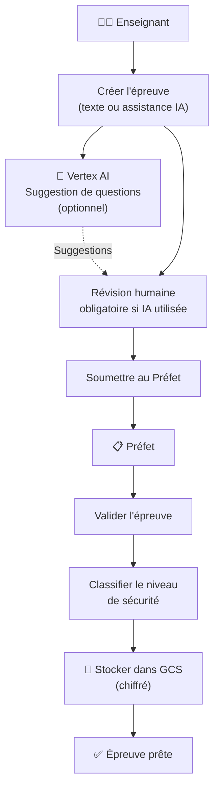

# Module 174 — Création et Gestion des Banques d'Épreuves

> **Positionnement :** Tome 10 — Examens, Certifications, Bulletins & Diplômes · Module 174 sur 191
> **Autorité :** Enseignants / Comité Pédagogique / Préfet des Études
> **Liaison amont/aval :** ← Module 173 (Architecture) → Module 175 (Types d'éval.) →

---

## 1. Objet

Ce module définit le système de création, classification, sécurisation et gestion des banques d'épreuves d'ELLYSIUM. Une épreuve est tout exercice évaluatif (QCM, question ouverte, problème, TP, projet) créé par un enseignant ou généré avec assistance IA (sous validation humaine) et stocké de manière sécurisée pour réutilisation ou examen.

---

## 2. Structure d'une Épreuve



---

## 3. Niveaux de Sécurité des Épreuves

| Niveau | Description | Usage | Accès |
|---|---|---|---|
| **PUBLIC** | Exercices pédagogiques libres | Entraînement quotidien | Tous les apprenants |
| **ÉTABLISSEMENT** | Interrogations internes | TJ, évals formatives | Classe concernée |
| **CONFIDENTIEL** | Examens de fin de période | Examens trimestriels | Enseignant + Préfet |
| **SECRET** | Examens d'État, TFE | EXETAT, TENASOSP, Diplôme | Jury uniquement |
| **NATIONAL** | Épreuves TENASOSP/EXETAT | Examens d'État nationaux | Comité national |

### Sécurité des épreuves SECRÈTES et NATIONALES

```
✅ Chiffrement AES-256-GCM dans Cloud Storage (GCS bucket dédié)
✅ Clé de déchiffrement dans Cloud KMS, libérée uniquement à J-1 de l'examen
✅ Accès : via rôle spécial "jury_examen" actif uniquement pendant la fenêtre d'examen
✅ Impression papier : générée par le système à J0, numérotée séquentiellement
✅ Aucun téléchargement possible : consultation uniquement via interface sécurisée
✅ Log de chaque consultation (qui, quand, durée)
```

---

## 4. Workflow de Création d'Épreuve



---

## 5. Assistance IA pour la Création d'Épreuves (Vertex AI)

Conforme au Module 136 (Génération d'exercices IA) :

```python
# Génération de QCM EXETAT style (Vertex AI — Gemini Pro)
SYSTEM_PROMPT = """
Tu es un expert pédagogique spécialisé dans le système éducatif congolais (RDC).
Génère des questions conformes au programme EPST officiel.
Format : QCM à 5 choix de réponse (style EXETAT).
Langue : Français académique.
Niveau : [CLASSE] Humanités [OPTION].
Matière : [MATIERE].
Chapitre : [CHAPITRE].

RÈGLES ABSOLUES :
- Les 5 distracteurs doivent être plausibles et non triviaux
- La réponse correcte ne doit pas être identifiable par son style
- Inclure une justification pédagogique pour chaque réponse
- NE JAMAIS générer de questions ambiguës ou culturellement inappropriées
"""

# L'enseignant DOIT valider chaque question avant sauvegarde
# valide_par_humain = False → épreuve non utilisable en examen
```

---

## 6. Gestion de la Banque d'Épreuves

### 6.1 Classification par domaine de compétence

```
Taxonomie de Bloom appliquée :
  Niveau 1 — Mémorisation / Connaissance
  Niveau 2 — Compréhension
  Niveau 3 — Application
  Niveau 4 — Analyse
  Niveau 5 — Synthèse / Évaluation
  Niveau 6 — Création

Chaque question est taguée avec :
  - Niveau Bloom (1-6)
  - Programme officiel (chapitre, section)
  - Compétence visée
  - Difficulté empirique (mise à jour après correction)
```

### 6.2 Génération automatique d'un examen équilibré

```python
def generer_examen_equilibre(
    matiere: str,
    classe: str,
    nb_questions: int,
    distribution_bloom: dict  # {1: 20%, 2: 30%, 3: 25%, 4: 15%, 5: 10%}
) -> list[Question]:
    """
    Sélectionne automatiquement des questions depuis la banque
    pour créer un examen équilibré selon la taxonomie de Bloom.
    """
    questions = []
    for niveau, pct in distribution_bloom.items():
        nb = int(nb_questions * pct / 100)
        pool = db.query(Question).filter(
            matiere=matiere, classe=classe,
            niveau_bloom=niveau,
            valide_par_humain=True
        ).order_by(func.random()).limit(nb * 3).all()
        questions.extend(random.sample(pool, min(nb, len(pool))))
    return questions
```

---

## 7. Verrous Fonctionnels

| ID | Règle | Niveau |
|---|---|---|
| VF-174-01 | Toute question générée par IA doit être validée par un humain avant usage en examen | CONSTITUTIONNEL |
| VF-174-02 | Les épreuves SECRÈTES et NATIONALES sont chiffrées dans GCS avec clé libérée J-1 | OBLIGATOIRE |
| VF-174-03 | Aucun téléchargement d'épreuve SECRÈTE : consultation uniquement via interface sécurisée | OBLIGATOIRE |
| VF-174-04 | Chaque épreuve est taguée avec le niveau de la taxonomie de Bloom | OBLIGATOIRE |
| VF-174-05 | La banque d'épreuves est sauvegardée quotidiennement dans GCS (chiffré) | OBLIGATOIRE |
| VF-174-06 | Toute suspicion de tricherie déclenche une révision manuelle obligatoire par un jury humain | CONSTITUTIONNEL |

---

*Sous-tome rédigé conformément aux Normes documentaires ELLYSIUM — Fondations 04.*
