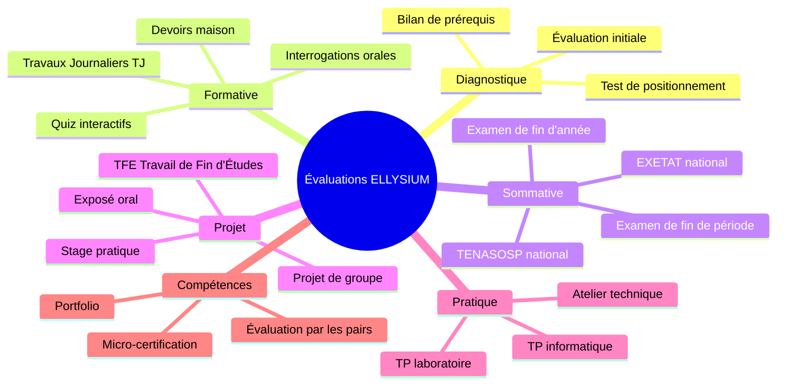
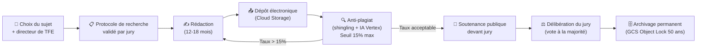

# Module 175 — Types d'Évaluations

> **Positionnement :** Tome 10 — Examens, Certifications, Bulletins & Diplômes · Module 175 sur 191
> **Autorité :** Direction Pédagogique ELLYSIUM / Préfet des Études
> **Liaison amont/aval :** ← Module 174 (Banque d'épreuves) → Module 176 (Planification) →

---

## 1. Objet

Ce module définit la taxonomie complète des types d'évaluations supportées par ELLYSIUM, leurs modalités techniques de mise en œuvre, et leur articulation avec le système de cotes RDC. Il couvre les évaluations diagnostiques, formatives, sommatives, les projets, les TP pratiques et les évaluations des compétences.

---

## 2. Taxonomie des Évaluations ELLYSIUM



---

## 3. Évaluation Diagnostique

**Objectif :** Mesurer les acquis préalables avant une nouvelle séquence pédagogique.

```
Paramètres :
  - Ne compte PAS dans les cotes officielles
  - Résultat visible uniquement par l'enseignant et l'élève
  - Déclenche automatiquement une recommandation de remédiation (Tuteur IA)
  - Fréquence recommandée : début de chaque unité de programme
  - Durée : 10 à 30 minutes
  - Format : QCM automatiquement corrigé

Score → Action automatique :
  ≥ 80% : "Niveau suffisant — continuer le programme"
  50-79% : "Quelques lacunes — révisions ciblées suggérées"
  < 50%  : "Prérequis insuffisants — plan de remédiation activé (Module 139)"
```

---

## 4. Travaux Journaliers (TJ) — Standard EPST

Les TJ constituent 40% de la cote totale par matière et par période.

```python
# Règles de saisie des TJ
class TravailJournalier:
    # Règles EPST officielles
    MINIMUM_TJ_PAR_PERIODE = 3   # Au moins 3 TJ par période et par matière
    MAXIMUM_TJ_PAR_PERIODE = 10  # Recommandation ELLYSIUM
    POIDS_TJ_DANS_COTE = 0.40   # 40% du total
    POIDS_EXAMEN_DANS_COTE = 0.60  # 60% du total

    def valider_saisie(self, points: int, maximum: int, date_ej: date) -> bool:
        assert 0 <= points <= maximum, "Points hors plage"
        assert maximum in [5, 10, 20], "Maximum non standard (5, 10 ou 20 points)"
        assert date_ej <= date.today(), "Date future interdite"
        return True
```

---

## 5. Examens de Fin de Période

| Type | Durée standard | Maximum standard | Période |
|---|---|---|---|
| Examen de fin de 1er trimestre | 2 heures | 50 points | Décembre |
| Examen de fin de 2e trimestre | 2 heures | 50 points | Mars |
| Examen de fin d'année | 3 heures | 100 points | Juin |
| Examen de session de rattrapage (ABI) | 2 heures | 50 points | Juillet/Août |

---

## 6. Travail de Fin d'Études (TFE) — Supérieur ESU



---

## 7. Évaluations par les Pairs

```
Utilisées pour : exposés, projets collectifs, simulations
Modalités :
  - Chaque élève note les productions de 3 pairs minimum
  - Grille critériée imposée (pas de notation libre)
  - La note finale = 70% jury enseignant + 30% pairs
  - L'enseignant peut invalider toute note par pair manifestement injuste
  - Log : chaque note par pair est horodatée et conservée
```

---

## 8. Verrous Fonctionnels

| ID | Règle | Niveau |
|---|---|---|
| VF-175-01 | Les TJ représentent exactement 40% de la cote totale par matière | CONSTITUTIONNEL |
| VF-175-02 | L'évaluation diagnostique n'entre jamais dans le calcul des cotes officielles | OBLIGATOIRE |
| VF-175-03 | Tout TFE passe obligatoirement par le système anti-plagiat avant soutenance | OBLIGATOIRE |
| VF-175-04 | Le seuil de plagiat pour un TFE est fixé à 15% maximum | OBLIGATOIRE |
| VF-175-05 | Le résultat d'une soutenance est enregistré par le système immédiatement après le vote | OBLIGATOIRE |

---

*Sous-tome rédigé conformément aux Normes documentaires ELLYSIUM — Fondations 04.*
