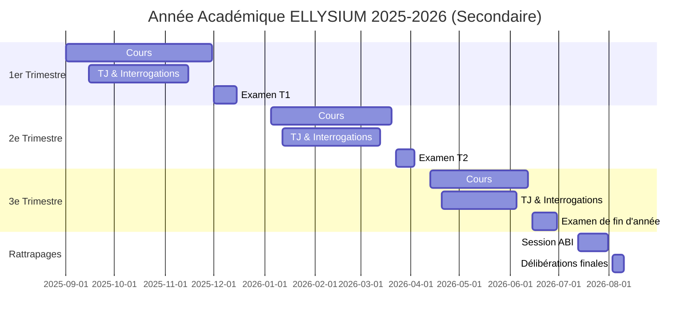
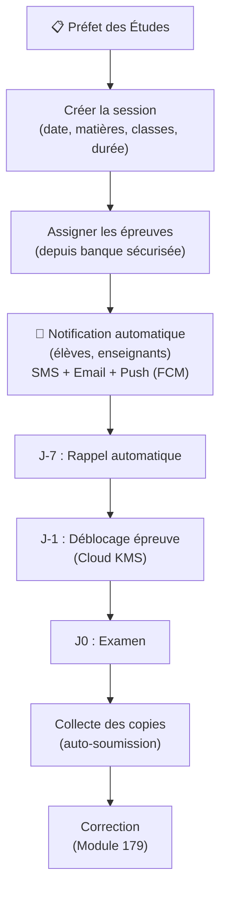

# Module 176 — Planification et Organisation des Examens

> **Positionnement :** Tome 10 — Examens, Certifications, Bulletins & Diplômes · Module 176 sur 191
> **Autorité :** Préfet des Études / Directeur Académique
> **Liaison amont/aval :** ← Module 175 (Types d'éval.) → Module 177 (Proctoring) →

---

## 1. Objet

Ce module définit les procédures de planification, d'organisation et de logistique des examens sur ELLYSIUM, qu'ils soient en ligne (synchrones ou asynchrones) ou en présentiel (avec support numérique). Il couvre la gestion du calendrier académique, l'affectation des salles, la distribution des épreuves et la gestion des cas particuliers.

---

## 2. Calendrier Académique ELLYSIUM (Secondaire — EPST)



---

## 3. Types d'Examens par Modalité

### 3.1 Examen en ligne synchrone

```
Modalités :
  - Fenêtre de passation fixe (ex: 14h00–16h00)
  - Connexion vérifiée par Firebase Auth + MFA
  - Minuterie visible en temps réel
  - Auto-soumission à l'expiration (questions non répondues = 0 point)
  - Contrôle anti-copie : randomisation des questions, ordre des choix mélangé

Conditions techniques minimales :
  - Connexion 2G suffisante (questions textuelles)
  - Mode dégradé : questions téléchargées au lancement, réponses envoyées à la fin
  - Si perte connexion > 3 minutes : session sauvegardée localement (SQLite WASM)
```

### 3.2 Examen en ligne asynchrone

```
Modalités :
  - Fenêtre de 24 à 72 heures
  - Accès uniquement pendant la fenêtre (Cloud Scheduler)
  - Une seule session par apprenant (vérification Firebase Auth)
  - Pas de proctoring vidéo (équité zones sans internet rapide)
  - Anti-fraude : questions personnalisées par apprenant (variantes IA)
```

### 3.3 Examen présentiel avec support numérique

```
Modalités :
  - Distribution papier + saisie sur tablette/PC
  - QR code sur chaque copie → lien vers le dossier numérique de l'élève
  - Correction papier scannée et versée dans le dossier numérique
  - Le Préfet valide la correspondance papier ↔ numérique avant scellement
```

---

## 4. Planification d'une Session d'Examen



---

## 5. Gestion des Cas Particuliers

| Cas | Procédure ELLYSIUM |
|---|---|
| **Élève absent (maladie justifiée)** | Report de session, créé par Préfet + justificatif uploadé |
| **Panne d'électricité** | Mode hors-ligne activé, synchronisation à la reconnexion |
| **Coupure réseau pendant l'examen** | Sauvegarde automatique SQLite, reprise transparente |
| **Élève avec handicap visuel** | Interface haute contraste, lecteur d'écran compatible (WCAG 2.2 AAA) |
| **Élève avec difficulté de lecture** | Mise à disposition audio TTS (synthèse vocale locale) |
| **Fraude avérée** | Annulation de la copie + procédure disciplinaire (Module 178) |
| **Problème technique système** | Report automatique + notification RSSI + compensation de temps |

---

## 6. Notifications Automatiques (Firebase Cloud Messaging)

```python
# Cloud Scheduler → Cloud Functions → FCM
NOTIFICATIONS_EXAMEN = [
    {"j": -7, "msg": "📚 Votre examen de {matiere} aura lieu dans 7 jours — Bonne révision !"},
    {"j": -1, "msg": "⏰ Demain : examen de {matiere} à {heure}. Vérifiez votre connexion."},
    {"j": 0, "h": -2, "msg": "🔔 Dans 2 heures : examen de {matiere}. Soyez prêt(e) !"},
    {"j": 0, "h": -0.25, "msg": "🚨 L'examen commence dans 15 minutes !"},
]
# Envoi via FCM (Firebase Cloud Messaging) — Android + Web
# Fallback : SMS via opérateurs RDC si notification non lue dans 30 min
```

---

## 7. Verrous Fonctionnels

| ID | Règle | Niveau |
|---|---|---|
| VF-176-01 | Aucune épreuve SECRET ne peut être accédée avant J-1 (Cloud KMS) | OBLIGATOIRE |
| VF-176-02 | L'auto-soumission est obligatoire à l'expiration du temps — aucune prolongation non autorisée | OBLIGATOIRE |
| VF-176-03 | Les absences non justifiées donnent cote 0 (non modifiable sans PV du Préfet) | OBLIGATOIRE |
| VF-176-04 | Toute session d'examen est notifiée aux apprenants au moins 7 jours à l'avance | OBLIGATOIRE |
| VF-176-05 | Le mode hors-ligne est systématiquement testé avant toute session d'examen majeure | OBLIGATOIRE |
| VF-176-06 | Toute suspicion de tricherie déclenche une révision manuelle obligatoire par un jury humain | CONSTITUTIONNEL |

---

*Sous-tome rédigé conformément aux Normes documentaires ELLYSIUM — Fondations 04.*
