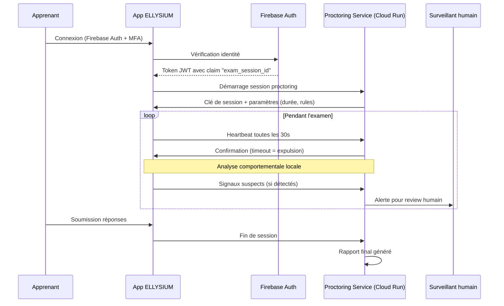

# Module 177 — Surveillance (Proctoring) Synchrone et Asynchrone

> **Positionnement :** Tome 10 — Examens, Certifications, Bulletins & Diplômes · Module 177 sur 191
> **Autorité :** Préfet des Études / RSSI
> **Liaison amont/aval :** ← Module 176 (Planification) → Module 178 (Anti-fraude) →

---

## 1. Objet

Ce module définit les modalités de surveillance des examens en ligne d'ELLYSIUM. Le proctoring est conçu pour garantir l'équité sans porter atteinte à la dignité des apprenants, en adaptant les mesures au contexte congolais (équipements variés, connectivité instable). Il distingue le proctoring synchrone (examinateur en ligne) du proctoring asynchrone (enregistrement analysé après).

---

## 2. Principes de Surveillance ELLYSIUM

```
✅ Proportionnalité : les mesures de surveillance sont proportionnelles à l'enjeu
✅ Dignité : aucune mesure humiliante ou invasive n'est autorisée
✅ Équité technologique : pas de proctoring vidéo si l'apprenant n'a pas de caméra
✅ Transparence : l'apprenant sait EXACTEMENT ce qui est collecté
✅ Auxiliarité IA : la détection IA signale, un humain décide
✅ Souveraineté : aucune image ou donnée biométrique sur serveur non-Google
```

---

## 3. Niveaux de Proctoring par Type d'Examen

| Type d'examen | Niveau surveillance | Méthodes actives |
|---|---|---|
| **TJ / Interrogations (formatives)** | Niveau 0 — Confiance | Aucune surveillance technique |
| **Examen de période asynchrone** | Niveau 1 — Léger | Validation identité (Firebase Auth + MFA) + randomisation questions |
| **Examen de période synchrone** | Niveau 2 — Standard | Auth + minuterie + analyse comportementale navigateur |
| **TFE / Mémoire** | Niveau 2 — Anti-plagiat | Shingling + IA Vertex AI (Module 142) |
| **EXETAT / TENASOSP** | Niveau 3 — Renforcé | Auth + surveillance humaine + capture d'écran périodique |
| **Soutenance de TFE** | Niveau 3 — Présentiel | Jury physique ou Google Meet (enregistré) |

---

## 4. Proctoring Synchrone (Niveau 3)

### 4.1 Architecture technique



### 4.2 Signaux comportementaux analysés (sans biométrie)

```python
# Analyse côté navigateur (JavaScript — aucune donnée envoyée sans détection)
COMPORTEMENTS_SURVEILLES = {
    "onglet_change": {
        "description": "L'apprenant change d'onglet / quitte la fenêtre",
        "seuil_alerte": 3,  # 3 fois → alerte surveillant
        "action": "log + avertissement visible"
    },
    "copier_coller": {
        "description": "Ctrl+C / Ctrl+V détectés",
        "seuil_alerte": 1,
        "action": "log + désactivation presse-papier"
    },
    "plein_ecran_quitte": {
        "description": "Mode plein écran désactivé",
        "seuil_alerte": 2,
        "action": "log + rappel à l'ordre"
    },
    "inactivite_longue": {
        "description": "Aucune interaction > 5 minutes",
        "seuil_alerte": 1,
        "action": "alerte + vérification présence"
    },
    "vitesse_reponse_anormale": {
        "description": "Réponses trop rapides (< 10 sec / question complexe)",
        "seuil_alerte": 5,
        "action": "log pour review post-examen"
    }
}
```

---

## 5. Proctoring Asynchrone (Niveau 2)

```
Méthodes appliquées sans surveillance humaine en temps réel :

1. Randomisation des questions (ordre différent par apprenant)
2. Randomisation des choix de réponse (QCM)
3. Questions personnalisées (variantes IA selon profil — Module 136)
4. Analyse post-examen des patterns de réponse (détection copie entre apprenants)
5. Vérification cohérence avec les performances antérieures
6. Analyse statistique : si un groupe entier a les mêmes réponses → alerte

Aucune vidéo, aucune capture d'écran photo, aucune biométrie faciale.
```

---

## 6. Équité et Accessibilité du Proctoring

```
Adaptations obligatoires :
  ✅ Si l'apprenant n'a pas de caméra → niveau de surveillance réduit automatiquement
  ✅ Si la connexion est 2G → mode dégradé (heartbeat toutes les 5 min, pas toutes les 30s)
  ✅ En cas de coupure réseau → session sauvegardée, le temps suspendu 5 min max
  ✅ Les apprenants en zone rurale peuvent passer en mode présentiel décentralisé
  ✅ Les apprenants avec handicap ont des aménagements documentés
```

---

## 7. Droits de l'Apprenant

```
L'apprenant est informé AVANT tout examen surveillé :
  ✅ Quelles données sont collectées (logs comportementaux)
  ✅ Qui a accès à ces données (Préfet + RSSI)
  ✅ Durée de conservation (fin de l'année académique + 1 an)
  ✅ Son droit de contester une décision basée sur ces données
  ✅ Que l'IA signale mais qu'un humain décide toujours

Ces informations figurent dans le formulaire de consentement IUNE.
```

---

## 8. Verrous Fonctionnels

| ID | Règle | Niveau |
|---|---|---|
| VF-177-01 | Aucune image biométrique (photo, empreinte, iris) n'est collectée pendant les examens | CONSTITUTIONNEL |
| VF-177-02 | L'IA proctoring signale uniquement — un humain prend toute décision disciplinaire | CONSTITUTIONNEL |
| VF-177-03 | L'apprenant est informé des modalités de surveillance avant le début de l'examen | OBLIGATOIRE |
| VF-177-04 | Une coupure réseau de < 5 minutes ne peut pas entraîner l'invalidation d'un examen | OBLIGATOIRE |
| VF-177-05 | Les logs de proctoring sont conservés 1 an après la fin de l'année académique | OBLIGATOIRE |

---

*Sous-tome rédigé conformément aux Normes documentaires ELLYSIUM — Fondations 04.*
