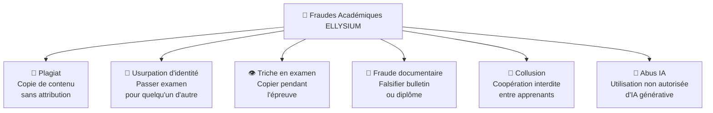
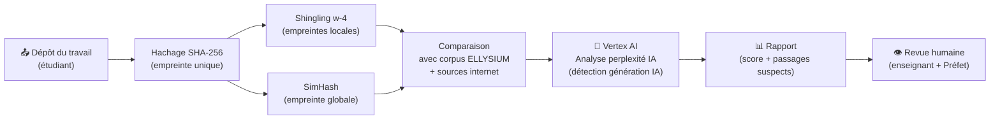
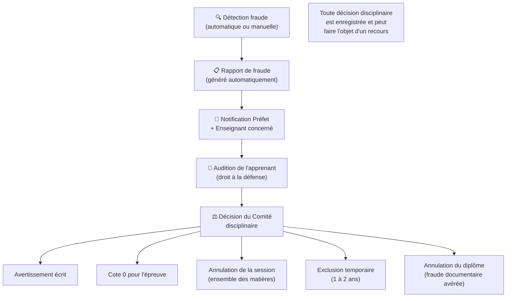

# Module 178 — Lutte contre la Fraude — Plagiat, Usurpation, Triche

> **Positionnement :** Tome 10 — Examens, Certifications, Bulletins & Diplômes · Module 178 sur 191
> **Autorité :** Préfet des Études / RSSI / Comité Disciplinaire
> **Liaison amont/aval :** ← Module 177 (Proctoring) · Module 142 (Anti-plagiat IA) → Module 179 (Correction) →

---

## 1. Objet

Ce module définit le système complet de détection et traitement des fraudes académiques sur ELLYSIUM : plagiat de devoirs et TFE, usurpation d'identité lors des examens, triche pendant les épreuves en ligne, et fraude documentaire (falsification de bulletins ou diplômes). Chaque type de fraude a une procédure de détection technique et une procédure disciplinaire associée.

---

## 2. Taxonomie des Fraudes Académiques



---

## 3. Détection du Plagiat (Textes, Devoirs, TFE)

### 3.1 Pipeline de détection



### 3.2 Seuils et actions automatiques

| Score de similarité | Signification | Action automatique |
|---|---|---|
| 0–14% | Originalité acceptable | Aucune action |
| 15–24% | Similarité notable | Avertissement à l'enseignant pour review |
| 25–39% | Plagiat probable | Blocage de la soumission + notification Préfet |
| ≥ 40% | Plagiat avéré | Refus du travail + ouverture procédure disciplinaire |

### 3.3 Détection de l'usage non autorisé d'IA

```python
# Analyse de perplexité pour détecter les textes générés par IA
# (Vertex AI — modèle de détection calibré sur corpus congolais)

def analyser_ia_generation(texte: str) -> dict:
    """
    Indicateurs d'un texte généré par IA :
    - Perplexité trop faible (texte trop "lisse")
    - Absence de fautes d'orthographe typiques du contexte RDC
    - Structure trop parfaite, transitions trop fluides
    - Mots très rares utilisés correctement (improbable pour le niveau)
    """
    score_ia = vertex_ai.detect_ai_generation(texte)
    return {
        "score_ia_probable": score_ia,  # 0.0 à 1.0
        "seuil_alerte": 0.75,
        "action": "ALERTE_ENSEIGNANT" if score_ia > 0.75 else "OK"
    }
```

---

## 4. Détection d'Usurpation d'Identité

```
Méthodes de vérification de l'identité lors des examens :

1. Firebase Authentication + MFA (clé primaire)
2. Vérification comportementale : profil de frappe clavier (typing cadence) sur appareils le permettant
3. Photo ID optionnelle lors de l'inscription (non biométrique, comparaison manuelle si soupçon)
4. Analyse de cohérence : résultats très différents des performances habituelles → alerte
5. Questions de connaissance contextuelle : 2 questions de vérification au démarrage
   (ex: "Quel était votre score TJ 1 en mathématiques ?")
```

---

## 5. Détection de Collusion entre Apprenants

```python
# Algorithme de détection de collusion (réponses identiques entre apprenants)
def detecter_collusion(session_id: str) -> list:
    """
    Compare les réponses entre tous les apprenants d'une même session.
    Une similarité > 80% entre 2+ apprenants sur des questions ouvertes → alerte.
    """
    copies = db.get_copies(session_id)
    alertes = []

    for i, copie_a in enumerate(copies):
        for copie_b in copies[i+1:]:
            similarite = calculer_similarite(copie_a.reponses, copie_b.reponses)
            if similarite > 0.80:
                alertes.append({
                    "apprenant_a": copie_a.eleve_id,
                    "apprenant_b": copie_b.eleve_id,
                    "similarite": similarite,
                    "statut": "COLLUSION_PROBABLE"
                })
    return alertes
```

---

## 6. Fraude Documentaire — Protection des Bulletins et Diplômes

```
Chaque bulletin ou diplôme ELLYSIUM contient :
  ✅ Hash SHA-256 du document (imprimé en bas de page en hexadécimal tronqué)
  ✅ QR code dynamique → portail verification.ellysium.cd
  ✅ Signature numérique de l'établissement (Cloud KMS)
  ✅ Numéro de série unique séquentiel
  ✅ Filigrane numérique invisible (watermark steganographique)

Vérification :
  → Scan QR code → portail public → affichage du résultat officiel
  → Si le document est falsifié, le hash ne correspond pas → "DOCUMENT NON VALIDE"
  → Toute tentative de vérification est loguée (sans données personnelles)
```

---

## 7. Procédure Disciplinaire



---

## 8. Verrous Fonctionnels

| ID | Règle | Niveau |
|---|---|---|
| VF-178-01 | Tout TFE est soumis au système anti-plagiat avant soutenance (seuil 15%) | OBLIGATOIRE |
| VF-178-02 | La détection IA de plagiat est un signal — la décision disciplinaire est toujours humaine | CONSTITUTIONNEL |
| VF-178-03 | L'apprenant accusé de fraude a droit à une audition avant toute sanction | CONSTITUTIONNEL |
| VF-178-04 | La falsification d'un diplôme ELLYSIUM est signalée aux autorités RDC | LÉGAL |
| VF-178-05 | Les algorithmes de détection de fraude sont révisés annuellement pour éviter les faux positifs | OBLIGATOIRE |
| VF-178-06 | Toute suspicion de tricherie déclenche une révision manuelle obligatoire par un jury humain | CONSTITUTIONNEL |

---

*Sous-tome rédigé conformément aux Normes documentaires ELLYSIUM — Fondations 04.*
