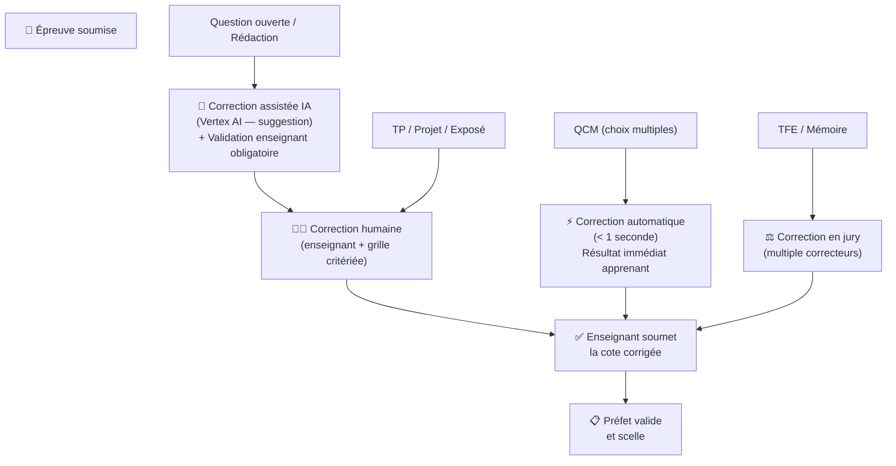

# Module 179 — Correction et Notation

> **Positionnement :** Tome 10 — Examens, Certifications, Bulletins & Diplômes · Module 179 sur 191
> **Autorité :** Enseignants / Préfet des Études
> **Liaison amont/aval :** ← Module 178 (Anti-fraude) → Module 180 (Jury de délibération) →

---

## 1. Objet

Ce module définit les procédures de correction des épreuves sur ELLYSIUM : correction automatique (QCM), correction humaine assistée par IA, double correction pour les cas litigieux, et système de validation hiérarchique. Il garantit que chaque cote attribuée est équitable, traçable et vérifiable.

---

## 2. Flux de Correction selon le Type d'Épreuve



---

## 3. Correction Automatique (QCM)

```go
// correction-service — QCM auto-corrigé
func CorrigerQCM(reponses []ReponseApprenant, barème []QuestionBareme) CoteQCM {
    var pointsObtenus int
    var details []DetailCorrection

    for i, rep := range reponses {
        b := barème[i]
        correct := rep.Choix == b.ReponseCorrecte

        if correct {
            pointsObtenus += b.Points
        }

        details = append(details, DetailCorrection{
            QuestionID:      b.QuestionID,
            ReponseApprenant: rep.Choix,
            ReponseCorrecte:  b.ReponseCorrecte,
            Correct:          correct,
            Points:           cond(correct, b.Points, 0),
            Justification:    b.Justification,  // Expliqué à l'apprenant
        })
    }

    return CoteQCM{
        PointsObtenus: pointsObtenus,
        MaximumTotal:  barème.TotalPoints(),
        Details:       details,
        CorrectionAt:  time.Now(),
        Methode:       "AUTOMATIQUE",
    }
}
```

---

## 4. Correction Assistée IA (Questions Ouvertes)

Conforme au Module 137 (Correction assistée IA éthique) :

```python
# Correction assistée — Vertex AI (Gemini Pro)
# L'IA SUGGÈRE uniquement — l'enseignant valide toujours

SYSTEM_PROMPT_CORRECTION = """
Tu es un correcteur expert du système éducatif congolais (RDC), spécialisé en [MATIERE].
Évalue la réponse de l'apprenant selon la grille critériée fournie.

GRILLE CRITÉRIÉE :
[GRILLE_AVEC_DESCRIPTEURS_PAR_NIVEAU]

FORMAT DE RÉPONSE OBLIGATOIRE :
{
  "score_suggere": 14,  // sur [MAXIMUM]
  "justification": "...",  // en français, référence au programme officiel
  "points_forts": ["...", "..."],
  "points_amélioration": ["...", "..."],
  "confiance": 0.85  // 0.0 à 1.0 — si < 0.7, recommander double correction
}

RÈGLES ABSOLUES :
- Ne jamais donner 0/maximum sans justification détaillée
- Ne jamais donner maximum/maximum sans justification
- Référencer le programme officiel EPST/ESU RDC
- Si la réponse est dans une langue nationale (Lingala, Swahili...) : évaluer le fond
"""
```

### Workflow de validation humaine obligatoire

```
1. IA génère suggestion → statut "SUGGESTION_IA"
2. Enseignant voit la suggestion + la justification IA
3. Enseignant peut :
   a. Accepter la suggestion → statut "COTE_DRAFT" (source: IA_ACCEPTED)
   b. Modifier → statut "COTE_DRAFT" (source: HUMAIN_MODIFIÉ)
   c. Rejeter → correction manuelle complète (source: HUMAIN_COMPLET)
4. Enseignant soumet → statut "SOUMIS"
5. Préfet valide → statut "VALIDÉ" puis "SCELLÉ"
```

---

## 5. Double Correction

Déclenchée automatiquement dans les cas suivants :

| Cas | Déclencheur |
|---|---|
| TFE / Mémoire / Thèse | Systématique |
| Confiance IA < 0.70 | Automatique |
| Écart entre deux correcteurs > 20% | Automatique + arbitrage Préfet |
| Recours accepté (Module 188) | Systématique |
| Examen EXETAT / TENASOSP | Systématique (politique nationale) |

```go
// Double correction — écart > 20%
func NecessiteDoubleCorrection(cote1, cote2 Cote) bool {
    max := float64(cote1.Maximum)
    ecart := math.Abs(float64(cote1.Points - cote2.Points)) / max * 100
    return ecart > 20.0
}

// Si double correction nécessaire → arbitrage par le Préfet
// Cote finale = décision du Préfet (pas la moyenne)
```

---

## 6. Grille Critériée Standard (Questions Ouvertes)

```
Niveaux de performance (5 niveaux) :

Niveau 5 — Excellent (90-100%) :
  "La réponse est complète, précise, bien structurée et démontre
   une maîtrise approfondie du concept. Des exemples pertinents
   tirés du contexte congolais sont utilisés."

Niveau 4 — Bien (75-89%) :
  "La réponse est correcte et bien argumentée. Quelques éléments
   mineurs sont manquants ou imprécis."

Niveau 3 — Satisfaisant (60-74%) :
  "La réponse contient les éléments essentiels mais manque de
   développement ou de précision."

Niveau 2 — Insuffisant (40-59%) :
  "La réponse montre une compréhension partielle. Des erreurs
   conceptuelles importantes sont présentes."

Niveau 1 — Très insuffisant (0-39%) :
  "La réponse est hors sujet, incomplète ou démontre une
   incompréhension fondamentale du concept."
```

---

## 7. Retour Pédagogique à l'Apprenant

```
Après chaque correction, l'apprenant reçoit :
  ✅ Sa cote (points obtenus / maximum)
  ✅ Sa mention (Excellent, Bien, Satisfaisant, etc.)
  ✅ Les points forts de sa réponse
  ✅ Les points d'amélioration
  ✅ Une référence aux ressources du cours (lien interne ELLYSIUM)
  ✅ Si suggestion IA acceptée : mention "Corrigé avec assistance IA — validé par [Nom Enseignant]"

Ce retour est disponible immédiatement après scellement de la cote.
```

---

## 8. Verrous Fonctionnels

| ID | Règle | Niveau |
|---|---|---|
| VF-179-01 | L'IA suggère une correction mais l'enseignant valide toujours | CONSTITUTIONNEL |
| VF-179-02 | Les TFE, mémoires et thèses font l'objet d'une double correction systématique | OBLIGATOIRE |
| VF-179-03 | Le retour pédagogique est fourni à l'apprenant dès la publication des cotes | OBLIGATOIRE |
| VF-179-04 | La source de chaque cote (AUTOMATIQUE / IA_ACCEPTED / HUMAIN) est enregistrée | OBLIGATOIRE |
| VF-179-05 | Un écart > 20% entre deux correcteurs déclenche obligatoirement un arbitrage du Préfet | OBLIGATOIRE |
| VF-179-06 | Toute suspicion de tricherie déclenche une révision manuelle obligatoire par un jury humain | CONSTITUTIONNEL |

---

*Sous-tome rédigé conformément aux Normes documentaires ELLYSIUM — Fondations 04.*
