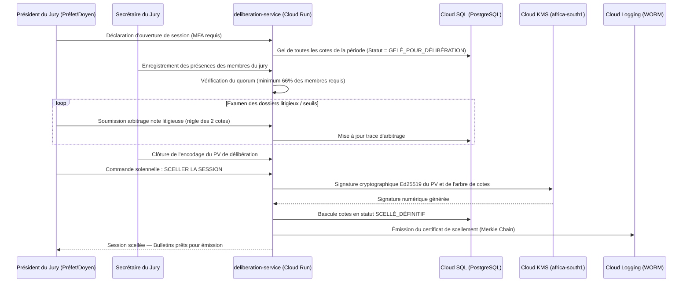

# Module 180 — Jurys de Délibération — Composition, Validation, Verrouillage

> **Positionnement :** Tome 10 — Examens, Certifications, Bulletins & Diplômes · Module 180 sur 191
> **Autorité :** Préfet des Études / Doyen de Faculté / Commission Nationale de Délibération
> **Liaison amont/aval :** ← Module 179 (Correction) → Module 181 (Moteur de calcul) →

---

## 1. Objet

Ce module régit la constitution, la gouvernance, le protocole délibératif et le verrouillage cryptographique irréversible des jurys de délibération au sein de la plateforme ELLYSIUM. Il formalise le passage du statut d'évaluation courante à la sanction académique solennelle, tant pour le secondaire (EPST) que pour l'enseignement supérieur et universitaire (ESU).

---

## 2. Composition et Rôles des Jurys

### 2.1 Jury du Secondaire (EPST)

| Rôle | Titulaire | Attributions sur ELLYSIUM |
|---|---|---|
| **Président du Jury** | Préfet des Études | Ouverture de séance, conduite des votes, scellement final par signature numérique Cloud KMS |
| **Secrétaire du Jury** | Directeur des Études / Secrétaire | Saisie du procès-verbal (PV) numérique, inscription des mentions spéciales |
| **Membres délibérants** | Professeurs Titulaires des disciplines | Vote des cas litigieux, avis pédagogique sur les cotes litigieuses |
| **Observateur légal** | Représentant de l'Antenne DIPROMAT / Inspecteur | Consultation en lecture seule, attestation de régularité administrative |

### 2.2 Jury Universitaire (ESU — Régime LMD)

| Rôle | Titulaire | Attributions sur ELLYSIUM |
|---|---|---|
| **Président du Jury** | Doyen de Faculté / Chef d'Établissement | Proclamation officielle, scellement des crédits ECTS acquis |
| **Secrétaire du Jury** | Secrétaire Académique de Faculté | Encodage des décisions de compensation et validation d'UE |
| **Membres effectifs** | Professeurs et Maîtres de Conférences | Délibération sur les TFE, mémoires, rattrapages (ABI) |

---

## 3. Protocole Délibératif Numérique



---

## 4. Quorum et Mécanismes de Vote

1. **Quorum strict** : Aucune délibération ne peut s'ouvrir sur ELLYSIUM si moins de deux tiers (66%) des membres du corps enseignant assigné ne sont authentifiés avec MFA.
2. **Vote à la majorité simple** : Les décisions de rachat ou d'ajournement se font par vote à bulletin secret numérique hébergé en mémoire volatile isolée (Cloud Run).
3. **Impossibilité de blocage financier** : En vertu de l'Article 5 de la Constitution, le jury n'a aucune visibilité sur le statut financier (minerval) des élèves délibérés. Le bouton "Ajourner pour frais" n'existe pas dans le système.

---

## 5. Verrouillage Cryptographique et Procès-Verbal Numérique

Le PV de délibération généré automatiquement comprend :
- L'empreinte SHA-256 de chaque cote composante.
- L'horodatage RFC 3339 avec ancre temps GCP.
- La signature numérique du Président du Jury via une clé asymétrique dédiée hébergée dans **Cloud KMS**.
- La liste complète des membres présents ayant validé la session.

```sql
-- Structure de la table deliberation_scellement (Cloud SQL)
CREATE TABLE deliberation_scellement (
    id                      UUID PRIMARY KEY DEFAULT gen_random_uuid(),
    session_id              UUID NOT NULL UNIQUE,
    etablissement_id        UUID NOT NULL,
    annee_academique        TEXT NOT NULL,
    periode                 TEXT NOT NULL,
    date_scellement         TIMESTAMPTZ NOT NULL DEFAULT NOW(),
    president_user_id       UUID NOT NULL,
    quorum_atteint          BOOLEAN NOT NULL DEFAULT TRUE,
    hash_pv_sha256          TEXT NOT NULL,
    signature_kms_ed25519   TEXT NOT NULL,
    cle_kms_version         TEXT NOT NULL,
    statut                  TEXT NOT NULL CHECK (statut IN ('SCELLÉ_DÉFINITIF', 'CONTESTÉ_JUDICIAIRE')),
    CONSTRAINT fk_president FOREIGN KEY (president_user_id) REFERENCES users(id)
);
```

---

## 6. Verrous Fonctionnels

| ID | Règle | Niveau |
|---|---|---|
| VF-180-01 | Quorum obligatoire de 66% vérifié cryptographiquement avant ouverture de la séance | OBLIGATOIRE |
| VF-180-02 | Verrouillage irréversible : aucune cote ne peut être altérée après scellement KMS | CONSTITUTIONNEL |
| VF-180-03 | Étanchéité financière absolue : zéro donnée de caisse visible pendant le jury | CONSTITUTIONNEL |
| VF-180-04 | Double facteur obligatoire (MFA) pour le Président lors de l'exécution du scellement | OBLIGATOIRE |
| VF-180-05 | Archivage immédiat du PV chiffré dans Cloud Storage (GCS) avec Object Lock 50 ans | LÉGAL |
| VF-180-06 | Toute suspicion de tricherie déclenche une révision manuelle obligatoire par un jury humain | CONSTITUTIONNEL |

---

*Sous-tome rédigé conformément aux Normes documentaires ELLYSIUM — Fondations 04.*
