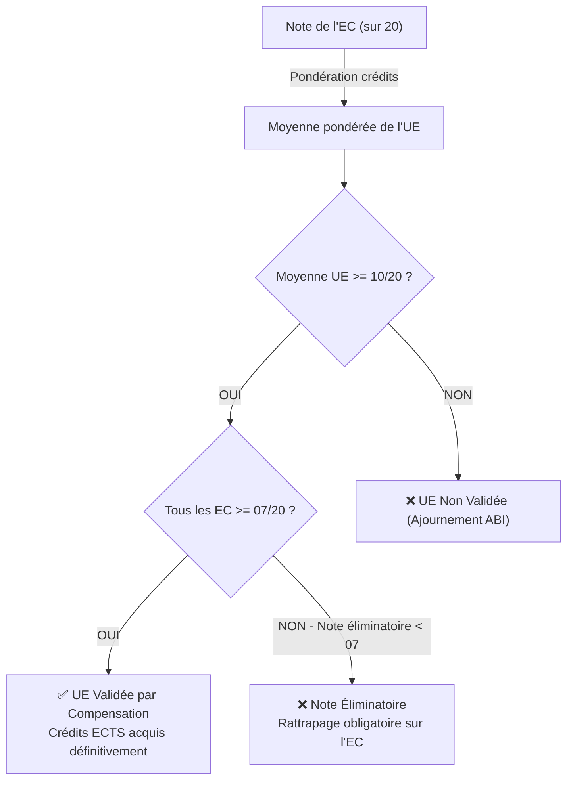

# Module 181 — Moteur de Calcul — Moyennes, Crédits, Compensations, Classements

> **Positionnement :** Tome 10 — Examens, Certifications, Bulletins & Diplômes · Module 181 sur 191
> **Autorité :** Architecte Algorithmique ELLYSIUM / Commission Pédagogique Nationale
> **Liaison amont/aval :** ← Module 180 (Jurys) → Module 182 (Gestion ABI) →

---

## 1. Objet

Ce module formalise l'intégralité des algorithmes de calcul académique d'ELLYSIUM. Il implémente rigoureusement la formule souveraine de la RDC pour l'enseignement secondaire (EPST) et le système d'accumulation et de transfert de crédits (ECTS) avec compensation encadrée pour l'enseignement supérieur (ESU).

---

## 2. Formule Canonique RDC pour l'Enseignement Secondaire (EPST)

### 2.1 Règle Fondatrice et Inviolable

Sous peine de nullité juridique et de violation constitutionnelle, **aucune moyenne arithmétique simple de pourcentages ne doit jamais être calculée**. 

La seule formule de synthèse valide en République Démocratique du Congo est le rapport de la somme brute des points obtenus sur la somme brute des maxima prévus :

$$\text{Taux Global} = \left( \frac{\sum_{i=1}^{N} \text{Points Obtenus}_i}{\sum_{i=1}^{N} \text{Maximum Fixé}_i} \right) \times 100$$

### 2.2 Pondération Périodique (TJ vs Examen)

Pour chaque période trimestrielle ou semestrielle :
- **Travaux Journaliers (TJ)** : Totalisent 40 % du maximum périodique.
- **Examen de fin de période** : Totalise 60 % du maximum périodique.

$$\text{Cote Période Matière} = \text{TJ (sur 40)} + \text{Examen (sur 60)} = \text{Total (sur 100)}$$

---

## 3. Système ESU (Régime LMD — Crédits ECTS & Compensations)

### 3.1 Unité d'Enseignement (UE) et Éléments Constitutifs (EC)

- Chaque année académique universitaire compte exactement **60 crédits ECTS** (30 par semestre).
- 1 crédit ECTS équivaut à 25–30 heures de travail de l'étudiant (cours magistraux, TP, recherche personnelle).

### 3.2 Règles de Validation et de Compensation



- **Note éliminatoire** : Toute note strictement inférieure à **07/20** dans un élément constitutif empêche la compensation de l'UE, même si la moyenne de celle-ci dépasse 10/20.
- **Acquisition définitive** : Les crédits capitalisés sont **inaliénables** (Article 12 de la Constitution).

---

## 4. Algorithme de Classement et Ex-æquo

### 4.1 Ordre de Tri Strict

Le classement d'une promotion ou d'une classe obéit à la hiérarchie algorithmique déterministe suivante :
1. **Taux Global décroissant** (arrondi à 2 décimales, banque d'arrondi arithmétique standard).
2. **Somme des points dans les branches maîtresses** (mathématiques, sciences, langues d'enseignement).
3. **Nombre d'échecs partiels** (0 échec classé prioritaire sur un profil avec 1 échec compensé).
4. **Assiduité** (taux de présence certifié).
5. Si égalité parfaite : statut **Ex-æquo** officiel certifié, sans attribution arbitraire d'un rang différent.

```go
// Extrait du moteur de classement Go (Cloud Run)
type RangEtudiant struct {
    IUNE          string
    TauxGlobal    float64
    PointsMaitres int
    NbEchecs      int
    Rang          int
    ExAequo       bool
}

func CalculerRangs(etudiants []ResultatEtudiant) []RangEtudiant {
    sort.Slice(etudiants, func(i, j int) bool {
        if etudiants[i].TauxGlobal != etudiants[j].TauxGlobal {
            return etudiants[i].TauxGlobal > etudiants[j].TauxGlobal
        }
        if etudiants[i].PointsMaitres != etudiants[j].PointsMaitres {
            return etudiants[i].PointsMaitres > etudiants[j].PointsMaitres
        }
        return etudiants[i].NbEchecs < etudiants[j].NbEchecs
    })
    // Attribution des rangs avec gestion ex-æquo...
    return formaliserRangs(etudiants)
}
```

---

## 5. Mentions Académiques Officielles

| Taux Global (EPST) / Note (ESU) | Mention Officielle EPST | Mention Officielle ESU (LMD) |
|---|---|---|
| $\ge 90\%$ / $\ge 18/20$ | La Plus Grande Distinction | Somme Cum Laude |
| $80\% \le T < 90\%$ / $16 \le N < 18$ | Grande Distinction | Magna Cum Laude |
| $70\% \le T < 80\%$ / $14 \le N < 16$ | Distinction | Cum Laude |
| $60\% \le T < 70\%$ / $12 \le N < 14$ | Satisfaction | Satisfecit |
| $50\% \le T < 60\%$ / $10 \le N < 12$ | Ajourné avec Réussite Simple | Passable |
| $< 50\%$ / $< 10/20$ | Ajourné (Session de rattrapage / Échec) | Ajourné |

---

## 6. Verrous Fonctionnels

| ID | Règle | Niveau |
|---|---|---|
| VF-181-01 | Interdiction absolue de la moyenne arithmétique de pourcentages en EPST | CONSTITUTIONNEL |
| VF-181-02 | Inviolabilité des crédits ECTS acquis : aucune régression de base possible | CONSTITUTIONNEL |
| VF-181-03 | Barème éliminatoire (< 07/20) non contournable par les délibérations automatiques | OBLIGATOIRE |
| VF-181-04 | Précision arithmétique à virgule fixe (Decimal 128-bit) pour éliminer les erreurs d'arrondi | OBLIGATOIRE |
| VF-181-05 | Exécution vérifiable et reproductible garantie sur conteneurs Cloud Run | OBLIGATOIRE |

---

*Sous-tome rédigé conformément aux Normes documentaires ELLYSIUM — Fondations 04.*
