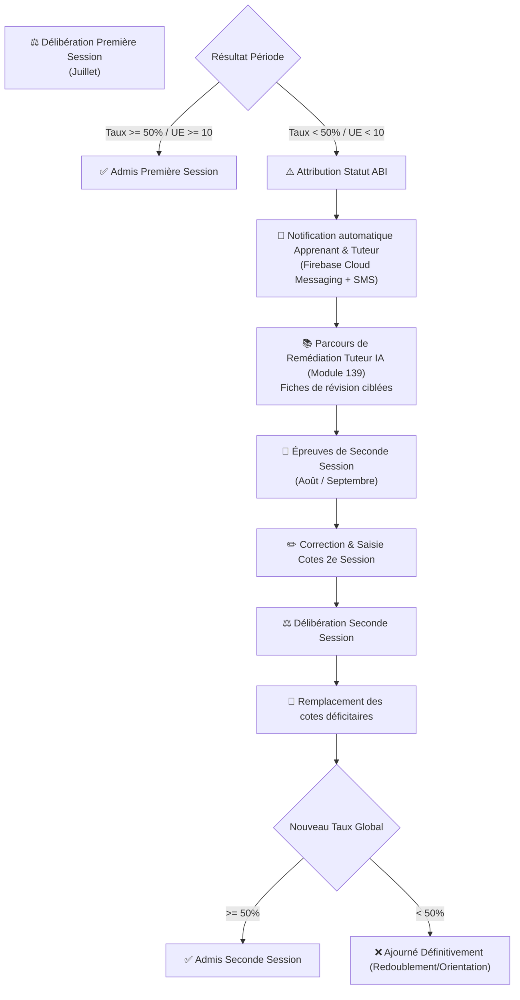

# Module 182 — Gestion des Notes ABI et Sessions de Rattrapage

> **Positionnement :** Tome 10 — Examens, Certifications, Bulletins & Diplômes · Module 182 sur 191
> **Autorité :** Direction des Examens et Concours / Jurys de Deuxième Session
> **Liaison amont/aval :** ← Module 181 (Moteur de calcul) → Module 183 (Bulletins et relevés) →

---

## 1. Objet

Ce module régit le statut académique **ABI (Ajourné / Absence Injustifiée / Deuxième Session)** ainsi que l'organisation, le traitement arithmétique et la réconciliation des sessions de rattrapage (deuxième session). Il garantit l'égalité des chances, la traçabilité des parcours de remédiation et la mise à jour infalsifiable des relevés de notes.

---

## 2. Typologie des Statuts d'Ajournement

Dans la nomenclature officielle de l'éducation congolaise, trois statuts préliminaires déclenchent la convocation à la session de rattrapage :

| Code Statut | Libellé Officiel | Signification et Conditions |
|---|---|---|
| **ABI** | Ajourné avec Bilan Insuffisant | Taux global $< 50\%$ (secondaire) ou moyenne UE $< 10/20$ (supérieur), avec droit légal de se représenter |
| **ABJ** | Absent Justifié | Absence couverte par certificat médical ou cas de force majeure validé par le Préfet/Doyen |
| **ABS** | Absence Non Justifiée | Défaut de comparution sans motif valable ; note attribuée = $0/20$ ou $0\%$ pour l'épreuve |

---

## 3. Workflow de la Deuxième Session (Rattrapage)



---

## 4. Règles Arithmétiques de Remplacement de Note

Lorsqu'un apprenant se présente à la seconde session :

1. **Règle du Bénéfice de la Meilleure Note** :
   $$\text{Cote Finale} = \max(\text{Cote Session 1}, \text{Cote Session 2})$$
   L'élève ne peut pas être pénalisé par une note inférieure en seconde session.
2. **Plafonnement des Mentions en 2e Session** :
   - En régime secondaire (EPST), un élève admis en seconde session ne peut prétendre au titre de major ou à une mention supérieure à **Satisfaction**, nonobstant le taux arithmétique obtenu.
   - En régime universitaire (ESU LMD), la mention officielle enregistrée porte obligatoirement la mention explicite : *"Admis en seconde session"*.
3. **Conservation des Travaux Journaliers (TJ)** :
   - Les points de TJ acquis en première session restent intangibles. Seule la composante **Examen** est repassée, sauf décision motivée du conseil de délibération.

---

## 5. Modèle de Données des Rattrapages (Cloud SQL)

```sql
CREATE TABLE sessions_rattrapage (
    id                      UUID PRIMARY KEY DEFAULT gen_random_uuid(),
    eleve_id                UUID NOT NULL REFERENCES users(id),
    annee_academique        TEXT NOT NULL,
    matiere_id              UUID NOT NULL REFERENCES matieres(id),
    cote_initiale           NUMERIC(5,2) NOT NULL,
    maxima_initial          NUMERIC(5,2) NOT NULL,
    statut_initial          TEXT NOT NULL CHECK (statut_initial IN ('ABI', 'ABJ', 'ABS')),
    cote_rattrapage         NUMERIC(5,2),
    maxima_rattrapage       NUMERIC(5,2),
    cote_retenue            NUMERIC(5,2) GENERATED ALWAYS AS (
                                GREATEST(cote_initiale, COALESCE(cote_rattrapage, 0))
                            ) STORED,
    date_examen_s2          TIMESTAMPTZ,
    scelle_par_prefet_id    UUID REFERENCES users(id),
    deliberation_s2_id      UUID REFERENCES deliberation_scellement(id),
    created_at              TIMESTAMPTZ DEFAULT NOW()
);
```

---

## 6. Verrous Fonctionnels

| ID | Règle | Niveau |
|---|---|---|
| VF-182-01 | Règle du max non régressif : la cote retenue est toujours le maximum entre S1 et S2 | OBLIGATOIRE |
| VF-182-02 | Notification multicanale obligatoire (SMS + Push FCM) aux parents sous 48h après S1 | OBLIGATOIRE |
| VF-182-03 | Accès automatique aux modules de remédiation IA (Module 139) dès l'attribution du statut ABI | PÉDAGOGIQUE |
| VF-182-04 | Impossibilité pour un candidat absent injustifié (ABS) de valider sans décision du jury | LÉGAL |
| VF-182-05 | Inscription infalsifiable de la mention "Seconde Session" sur le bulletin final | CONSTITUTIONNEL |

---

*Sous-tome rédigé conformément aux Normes documentaires ELLYSIUM — Fondations 04.*
