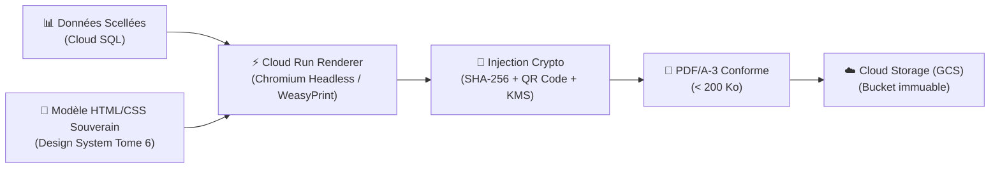

# Module 183 — Génération des Bulletins Scolaires et Relevés de Notes

> **Positionnement :** Tome 10 — Examens, Certifications, Bulletins & Diplômes · Module 183 sur 191
> **Autorité :** Direction Administrative et Numérique / Secrétariat Général EPST-ESU
> **Liaison amont/aval :** ← Module 182 (Gestion ABI) → Module 184 (Attestations et diplômes) →

---

## 1. Objet

Ce module définit l'ingénierie logicielle et graphique relative à la génération, au rendu et à la sécurisation des bulletins scolaires officiels (secondaire) et des relevés de notes académiques (universitaire). Il garantit la stricte conformité avec les maquettes nationales de la RDC, l'optimisation frugale du poids des documents (< 200 Ko par PDF) et l'intégration des éléments de sécurité infalsifiables.

---

## 2. Architecture de Génération Dématérialisée

Le pipeline de rendu est opéré de manière serverless au sein de **Google Cloud Run** pour garantir une mise à l'échelle instantanée lors des pics de fin d'année (pic de délibération de juin, jusqu'à 65 000 requêtes concurrentes).



---

## 3. Spécifications du Bulletin Scolaire Officiel EPST

Le bulletin officiel ELLYSIUM reproduit scrupuleusement les exigences du Ministère de l'Éducation Nationale et Nouvelle Citoyenneté (EPST) :

### 3.1 Éléments d'En-tête Réglementaires
- Armoiries de la République Démocratique du Congo et devise nationale (*Justice - Paix - Travail*).
- Mention du Ministère de tutelle et de la Direction Provinciale (DIPROMAT).
- Dénomination de l'établissement, Code SECOPE officiel, Arrêté d'agrément.
- Données de l'élève : Nom, Post-nom, Prénom, Sexe, Lieu et Date de naissance, **IUNE** (Format `CD-EL-YYYY-NNNNNNNN`).

### 3.2 Grille des Branches et Évaluations
La grille standardisée comporte pour chaque période (4 périodes ou 2 semestres) :
1. Maximum TJ et Points TJ obtenus.
2. Maximum Examen et Points Examen obtenus.
3. Total Période et Pourcentage Périodique.
4. Total Général Annuel et **Taux Global Officiel** calculé conformément au Module 181.
5. Place de l'élève (Rang / Effectif total).
6. Décision du Jury : *Admis(e)*, *Ajourné(e) (ABI)*, *Refusé(e)*.
7. Visa du Professeur Titulaire, Visa du Préfet des Études (Signature électronique certifiée), et Visa du Parent.

---

## 4. Spécifications du Relevé de Notes Universitaire LMD (ESU)

- Référence à la maquette harmonisée du Ministère de l'Enseignement Supérieur et Universitaire.
- Détail par Semestre (S1 à S6 pour la Licence, S1 à S4 pour le Master).
- Intitulé des Unités d'Enseignement (UE) et Éléments Constitutifs (EC).
- Nombre de **crédits ECTS** alloués et statut de validation (*Capitalisé*, *Compensé*).
- Moyenne pondérée semestrielle et cumulée (GPA sur base 4.0 et 20).
- Empreinte cryptographique globale du cursus.

---

## 5. Mesures Anti-Falsification Visuelles et Numériques

```
┌────────────────────────────────────────────────────────────────────────┐
│                   ÉLÉMENTS DE SÉCURITÉ DU BULLETIN                    │
├────────────────────────────────────────────────────────────────────────┤
│ 1. QR Code Dynamique Signé : Pointe vers verification.ellysium.cd       │
│ 2. Empreinte SHA-256 tronquée : En pied de page (ex: 8f4c...b902)       │
│ 3. Guillochis Numérique : Trame de fond anti-copie à micro-motifs      │
│ 4. Filigrane Numérique : Logo officiel transparent invisible à l'œil   │
│ 5. Horodatage RFC 3339 certifié par Cloud KMS                         │
│ 6. Format PDF/A-3b : Norme ISO pour la conservation pérenne            │
└────────────────────────────────────────────────────────────────────────┘
```

---

## 6. Pipeline Technique de Génération (Go + Cloud Run)

```go
// Exemple de génération serverless (Go)
func GenererBulletinPDF(ctx context.Context, eleveID string, sessionID string) ([]byte, error) {
    // 1. Récupération des données scellées en base
    donnees, err := db.GetDonneesScellees(ctx, eleveID, sessionID)
    if err != nil {
        return nil, err
    }

    // 2. Génération du Hash SHA-256 du contenu
    hashDoc := sha256.Sum256(donnees.SerialiserPourHash())
    hashHex := hex.EncodeToString(hashDoc[:])

    // 3. Génération du QR Code sécurisé
    qrURL := fmt.Sprintf("https://verification.ellysium.cd/doc/%s?sig=%s", donnees.IUNE, hashHex[:16])
    qrCodePNG, _ := qrcode.Encode(qrURL, qrcode.Medium, 256)

    // 4. Rendu HTML vers PDF via Chromium headless
    pdfBytes, err := renderer.RenderHTMLToPDF(donnees, qrCodePNG, hashHex)
    if err != nil {
        return nil, err
    }

    // 5. Stockage GCS avec métadonnées immuables
    go gcs.ArchiverBulletin(eleveID, sessionID, pdfBytes, hashHex)

    return pdfBytes, nil
}
```

---

## 7. Verrous Fonctionnels

| ID | Règle | Niveau |
|---|---|---|
| VF-183-01 | Impossibilité de générer un bulletin si la session n'est pas scellée en base | CONSTITUTIONNEL |
| VF-183-02 | Poids du fichier PDF généré strictement inférieur à 250 Ko (frugalité réseau RDC) | TECHNIQUE |
| VF-183-03 | QR Code obligatoire sur chaque document produit, sans exception | OBLIGATOIRE |
| VF-183-04 | Rendu PDF/A conforme aux normes d'archivage légal international (ISO 19005-3) | LÉGAL |
| VF-183-05 | Inscription des armoiries et mentions légales selon la charte graphique de la RDC | INSTITUTIONNEL |

---

*Sous-tome rédigé conformément aux Normes documentaires ELLYSIUM — Fondations 04.*
