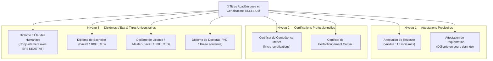

# Module 184 — Attestations, Certificats et Diplômes Institutionnels

> **Positionnement :** Tome 10 — Examens, Certifications, Bulletins & Diplômes · Module 184 sur 191
> **Autorité :** Conseil d'Administration ELLYSIUM / Commission Nationale d'Homologation des Diplômes
> **Liaison amont/aval :** ← Module 183 (Bulletins) → Module 185 (Vérification infalsifiable) →

---

## 1. Objet

Ce module fixe les conditions juridiques, administratives et techniques d'émission, de délivrance et de scellement des titres académiques et professionnels délivrés par ELLYSIUM. Il couvre les attestations de réussite provisoires, les certificats professionnels de spécialisation, ainsi que les diplômes d'État (en liaison avec le Ministère) et les parchemins universitaires (Bachelier, Licence, Master, Doctorat).

---

## 2. Typologie des Titres Délivrés



---

## 3. Conditions d'Éligibilité et de Délivrance

Pour qu'un diplôme soit émis par le système :
1. **Validation intégrale des crédits / cours** : Aucune dérogation arithmétique possible. 100% des crédits du référentiel doivent être marqués `VALIDÉ` en base de données.
2. **Soutenance formelle validée** : Pour les diplômes requérant un mémoire ou un TFE (Bac+3, Bac+5, Doctorat), le PV de soutenance doit être signé par le jury et scellé dans le système.
3. **Quitus académique et administratif** : Attestation de conformité du dossier de scolarité (acte de naissance légalisé, diplôme préalable authentifié).
4. **Indépendance financière (Art. 5)** : Le diplôme académique ne peut être confisqué pour litige commercial. Une attestation de fin d'études est délivrée de plein droit dès la validation académique.

---

## 4. Attributs Obligatoires du Parchemin Numérique

Tout titre émis sur ELLYSIUM comprend les métadonnées inaltérables suivantes :
- **Numéro d'Enregistrement National Unique** : Généré selon la syntaxe `CD-DIP-[ANNEE]-[NIVEAU]-[SEQUENCE]`.
- **IUNE de l'impétrant** : Identifiant Unique National ELLYSIUM.
- **Identité d'état civil certifiée** : Noms complets, lieu et date de naissance.
- **Intitulé exact de la filière et de la mention** : Conforme à la nomenclature officielle de l'ESU ou de l'EPST.
- **Empreinte Merkle Root** : Hash représentant l'intégralité du cursus de l'étudiant depuis son inscription.
- **Signature cryptographique triple** :
  1. Signature du Recteur / Préfet (Clé matérielle ou Cloud KMS).
  2. Signature du Doyen / Inspecteur Principal.
  3. Sceau d'autorité de l'État / ELLYSIUM Trust Root.

---

## 5. Registre National des Diplômes (Cloud SQL + GCS)

```sql
CREATE TABLE registre_diplomes (
    id                      UUID PRIMARY KEY DEFAULT gen_random_uuid(),
    numero_diplome          TEXT UNIQUE NOT NULL,
    eleve_id                UUID NOT NULL REFERENCES users(id),
    type_titre              TEXT NOT NULL CHECK (type_titre IN ('ATTESTATION', 'CERTIFICAT', 'BACHELIER', 'LICENCE', 'MASTER', 'DOCTORAT', 'EXETAT')),
    specialite              TEXT NOT NULL,
    promotion               TEXT NOT NULL,
    mention                 TEXT NOT NULL,
    taux_ou_gpa             NUMERIC(5,2) NOT NULL,
    date_deliberation       DATE NOT NULL,
    hash_document_sha256    TEXT NOT NULL UNIQUE,
    uri_parchemin_pdf       TEXT NOT NULL,
    statut                  TEXT NOT NULL DEFAULT 'VALIDE' CHECK (statut IN ('VALIDE', 'SUSPENDU', 'ANNULE_POUR_FRAUDE')),
    signature_kms_token     TEXT NOT NULL,
    date_emission           TIMESTAMPTZ DEFAULT NOW()
);
```

---

## 6. Verrous Fonctionnels

| ID | Règle | Niveau |
|---|---|---|
| VF-184-01 | Impossibilité physique d'émettre un diplôme sans complétude à 100% des crédits requis | CONSTITUTIONNEL |
| VF-184-02 | Clé privée de signature des diplômes sécurisée au niveau HSM FIPS 140-3 (Cloud KMS) | TECHNIQUE |
| VF-184-03 | Tout diplôme émis est inscrit instantanément dans le registre public de vérification | OBLIGATOIRE |
| VF-184-04 | Rétention minimale de 50 ans avec réplication multi-régionale (Cloud Storage Archive) | LÉGAL |
| VF-184-05 | L'annulation d'un diplôme ne peut résulter que d'une décision de justice coulée en force de chose jugée | CONSTITUTIONNEL |

---

*Sous-tome rédigé conformément aux Normes documentaires ELLYSIUM — Fondations 04.*
