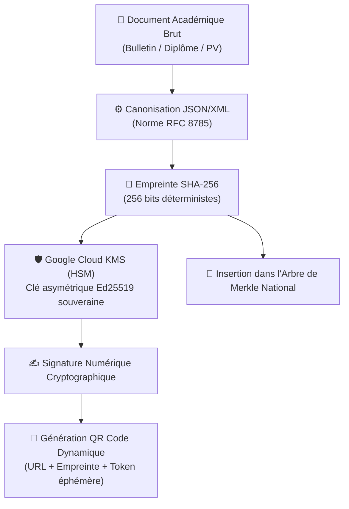

# Module 185 — Vérification Infalsifiable — Hachage SHA-256, QR Code Dynamique, Signature Numérique

> **Positionnement :** Tome 10 — Examens, Certifications, Bulletins & Diplômes · Module 185 sur 191
> **Autorité :** Direction de la Cybersécurité et Cryptographie Souveraine / RSSI
> **Liaison amont/aval :** ← Module 184 (Diplômes) → Module 186 (Portail public de vérification) →

---

## 1. Objet

Ce module détaille l'arsenal cryptographique employé pour garantir l'authenticité absolue, la non-répudiation et l'inviolabilité des documents académiques émis par ELLYSIUM. Il combine le hachage canonique SHA-256, les signatures numériques asymétriques Ed25519 gérées sous Cloud KMS et les QR codes dynamiques anti-rejeu.

---

## 2. Chaîne de Confiance Cryptographique



---

## 3. Algorithme de Canonisation et de Hachage

Pour éviter toute discordance due aux encodages, sauts de ligne ou espaces invisibles, les données du document sont préalablement converties selon le standard **RFC 8785 (JSON Canonicalization Scheme)** avant calcul du hash :

```python
import hashlib
import json
from google.cloud import kms

def calculer_empreinte_canonique(donnees_academiques: dict) -> str:
    # 1. Tri récursif des clés et encodage strict UTF-8 sans espaces superfétatoires
    json_canonique = json.dumps(
        donnees_academiques, 
        sort_keys=True, 
        separators=(',', ':'), 
        ensure_ascii=False
    ).encode('utf-8')
    
    # 2. Hachage SHA-256
    hash_sha256 = hashlib.sha256(json_canonique).hexdigest()
    return hash_sha256
```

---

## 4. Signature Numérique Asymétrique sous Cloud KMS

ELLYSIUM n'utilise aucun certificat logiciel stocké sur serveur applicatif. Les opérations de signature s'opèrent au sein des modules de sécurité matériels (**HSM FIPS 140-3**) de Google Cloud KMS en région africaine :

- **Algorithme** : `EC_SIGN_ED25519` (haute performance, résistance aux attaques par canaux auxiliaires).
- **Rotation des clés** : Annuelle, avec préservation indéfinie des clés publiques de vérification pour les archives historiques.
- **Audit de chaque signature** : Toute signature de diplôme génère un log immuable dans Google Cloud Logging audité par le DPO.

---

## 5. Spécifications du QR Code Dynamique

Le QR Code imprimé sur les parchemins et bulletins ne contient pas de données brutes en clair (ce qui permettrait la contrefaçon hors-ligne), mais un pointeur cryptographique sécurisé :

### 5.1 Format de l'URI encodée
```text
https://verification.ellysium.cd/v1/cert?id=CD-DIP-2026-LIC-00842&h=a9f3b7c2&sig=MEQCID...
```

### 5.2 Propriétés Anti-Rejeu et Anti-Falsification
1. **Pointeur vers le registre officiel** : Redirige vers le portail souverain `verification.ellysium.cd` (Module 186).
2. **Empreinte partielle intégrée (`h`)** : Permet au lecteur de valider instantanément la concordance avec le texte imprimé.
3. **Résilience à la dégradation physique** : Correction d'erreur Reed-Solomon de **Niveau H (30%)**, assurant la lisibilité même si le document papier est déchiré ou taché.

---

## 6. Structure de Preuve d'Inclusion Merkle

Chaque titre académique scellé est inséré comme feuille dans l'arbre de Merkle national d'ELLYSIUM. Une preuve cryptographique d'inclusion (*Merkle Proof*) peut être fournie à tout employeur ou université étrangère pour prouver l'existence et l'ancienneté du diplôme sans exposer les données des autres lauréats.

```
       [ Racine Merkle Nationale : Root_2026 ]
                   /             \
            [ Hash_A ]         [ Hash_B ]
             /      \           /      \
        [ H_1 ]   [ H_2 ]   [ H_3 ]  [ H_Diplôme_Cible ]
```

---

## 7. Verrous Fonctionnels

| ID | Règle | Niveau |
|---|---|---|
| VF-185-01 | Algorithme de hachage imposé : SHA-256 (interdiction absolue de MD5 ou SHA-1) | CONSTITUTIONNEL |
| VF-185-02 | Clés de signature conservées exclusivement en HSM Cloud KMS, export interdit | TECHNIQUE |
| VF-185-03 | QR Code calibré avec tolérance aux erreurs minimale de niveau H (30%) | OBLIGATOIRE |
| VF-185-04 | Canonisation stricte RFC 8785 avant tout calcul d'empreinte | OBLIGATOIRE |
| VF-185-05 | Vérification universelle possible en moins de 500 ms sur réseau mobile 2G/3G | TECHNIQUE |
| VF-185-06 | Toute suspicion de tricherie déclenche une révision manuelle obligatoire par un jury humain | CONSTITUTIONNEL |

---

*Sous-tome rédigé conformément aux Normes documentaires ELLYSIUM — Fondations 04.*
