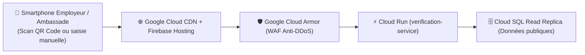

# Module 186 — Portail Public de Vérification des Diplômes

> **Positionnement :** Tome 10 — Examens, Certifications, Bulletins & Diplômes · Module 186 sur 191
> **Autorité :** Direction de la Communication et des Services Numériques / Secrétariat Général
> **Liaison amont/aval :** ← Module 185 (Vérification infalsifiable) → Module 187 (Archivage permanent) →

---

## 1. Objet

Ce module spécifie l'architecture, l'ergonomie, la haute disponibilité et la sécurité du portail public `verification.ellysium.cd`. Ce guichet national permet à tout tiers légitime (employeurs, ambassades, universités internationales, administrations) de vérifier en temps réel, gratuitement et sans création de compte préalable, l'authenticité d'un diplôme, d'un certificat ou d'un bulletin délivré par ELLYSIUM.

---

## 2. Hébergement et Haute Disponibilité (Google Cloud)

Conformément à la **DOCTRINE INFRASTRUCTURE GOOGLE**, le portail est hébergé sur :
- **Firebase Hosting** pour le frontend statique ultra-rapide (Astro / Tailwind CSS) distribué via le **Cloud CDN** mondial de Google.
- **Google Cloud Run** pour l'API de vérification cryptographique sans état (*stateless*), capable d'absorber les attaques DDoS via **Google Cloud Armor**.
- **Cloud SQL** (Réplica de lecture en zone isolée DMZ) pour interroger le registre public sans jamais exposer la base de production transactionnelle.



---

## 3. Parcours Utilisateur de Vérification

### 3.1 Mode Scan Instantané (QR Code)
1. L'utilisateur pointe son appareil photo sur le QR Code figurant sur le parchemin ou le bulletin.
2. La page s'ouvre instantanément (< 1,2 seconde sur réseau 3G).
3. L'application valide la signature Ed25519 côté serveur via Cloud KMS.
4. Affichage de la pastille officielle :
   - 🟢 **DOCUMENT AUTHENTIQUE ET VALIDE**
   - 🟡 **DOCUMENT EN COURS DE RÉVISION / ATTESTATION TEMPORAIRE**
   - 🔴 **DOCUMENT INVALIDE, RÉVOQUÉ OU NON RÉPERTORIÉ**

### 3.2 Mode Recherche Manuelle
Si le document papier est dégradé ou le QR Code illisible :
- Saisie du numéro d'enregistrement national (`CD-DIP-...`).
- Saisie de la clé de contrôle à 4 caractères imprimée sur le diplôme.
- Résolution immédiate du statut.

---

## 4. Données Publiées vs Protection de la Vie Privée

Pour respecter strictement la loi RDC n° 15/023 et les principes de minimisation des données (Module 169), le portail public n'affiche que les informations strictement nécessaires à la validation du titre, sans exposer la vie privée :

| Donnée Affichée Publiquement | Donnée Masquée / Non Publiée |
|---|---|
| ✅ Nom, Post-nom et Prénom du titulaire | ❌ Numéro de téléphone ou email personnel |
| ✅ Intitulé officiel du titre obtenu | ❌ Détail des cotes matière par matière |
| ✅ Établissement de collation | ❌ Situation financière ou paiements minerval |
| ✅ Année d'obtention et mention | ❌ Adresse du domicile privé |
| ✅ Statut de validité actuel | ❌ Historique des sanctions disciplinaires purgées |

---

## 5. API Publique pour Tiers Agréés (B2B / Administrations)

Une API RESTful sécurisée par clé d'API et quota (Google Cloud API Gateway) est mise à disposition des universités partenaires, ministères et ambassades pour la vérification par lots (*batch verification*) :

```http
POST /v1/batch-verify HTTP/1.1
Host: api.verification.ellysium.cd
Authorization: Bearer <API_KEY_AMBASSADE>
Content-Type: application/json

{
  "references": [
    "CD-DIP-2026-LIC-00842",
    "CD-DIP-2026-BAC-01290"
  ]
}
```

Réponse JSON :
```json
{
  "statut": "SUCCES",
  "resultats": [
    {
      "reference": "CD-DIP-2026-LIC-00842",
      "valide": true,
      "titulaire": "KABAMBA MUKENDI Jean",
      "titre": "Licence en Informatique Fondamentale",
      "annee": "2025-2026",
      "mention": "Distinction",
      "date_scellement": "2026-07-28T14:22:00Z"
    }
  ]
}
```

---

## 6. Verrous Fonctionnels

| ID | Règle | Niveau |
|---|---|---|
| VF-186-01 | Accès libre et gratuit pour tout tiers, sans inscription ni péage financier | CONSTITUTIONNEL |
| VF-186-02 | Hébergement strict sur infrastructure Google (Firebase Hosting, Cloud Run, Cloud Armor) | CONSTITUTIONNEL |
| VF-186-03 | Protection stricte des données privées : zéro divulgation des cotes détaillées en public | LÉGAL |
| VF-186-04 | Isolation de la base publique : interrogation exclusive d'un Read-Replica dédié | TECHNIQUE |
| VF-186-05 | Temps de réponse global garanti < 1,5 seconde au 95e centile sur réseau africain | SLO |

---

*Sous-tome rédigé conformément aux Normes documentaires ELLYSIUM — Fondations 04.*
