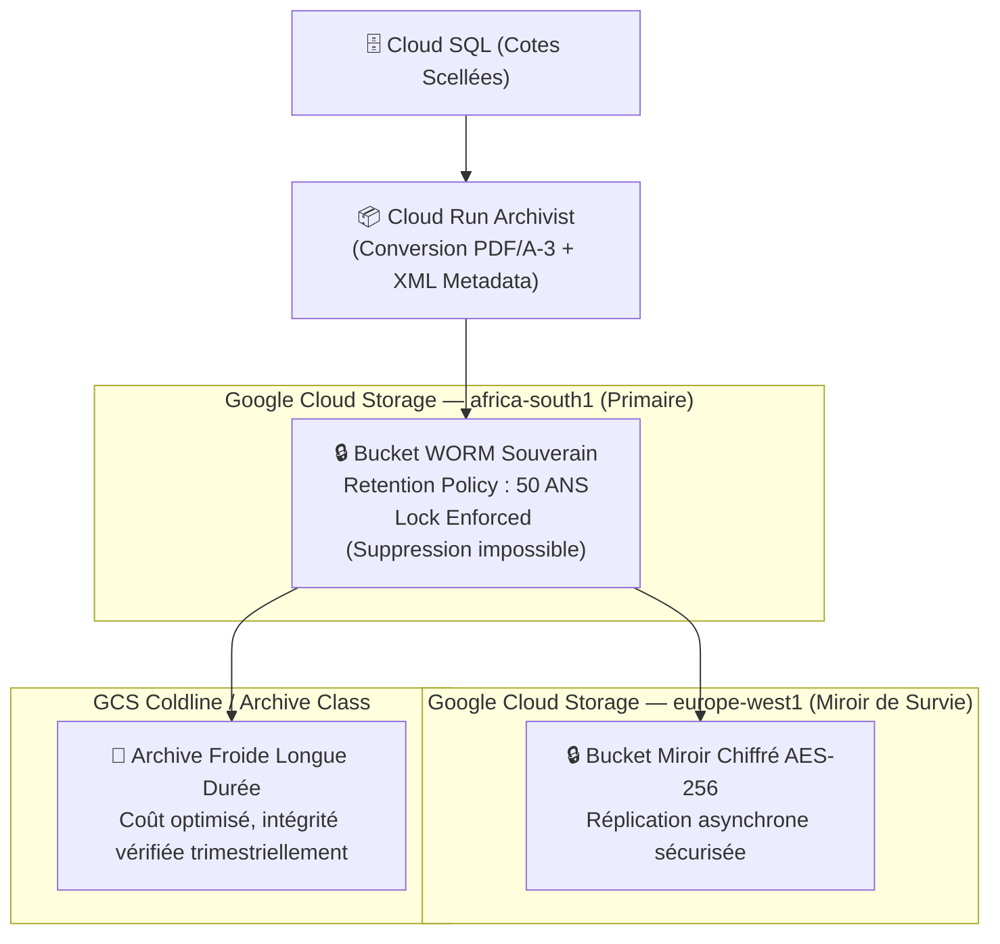

# Module 187 — Archivage Permanent des Résultats et Registre Inaltérable

> **Positionnement :** Tome 10 — Examens, Certifications, Bulletins & Diplômes · Module 187 sur 191
> **Autorité :** Conservateur en Chef des Archives Nationales Académiques / RSSI
> **Liaison amont/aval :** ← Module 186 (Portail public) → Module 188 (Recours et contestations) →

---

## 1. Objet

Ce module définit la stratégie patrimoniale et technique d'archivage pérenne des résultats académiques d'ELLYSIUM pour une durée constitutionnelle minimale de **50 ans**. Il détaille les mécanismes de conservation inaltérable (WORM - Write Once, Read Many), l'encapsulation au format normalisé PDF/A-3, la réplication géodistribuée sur Google Cloud Storage et la garantie de lisibilité intergénérationnelle.

---

## 2. Principes Constitutionnels et Légaux

- **Article 12 de la Constitution ELLYSIUM** : Les crédits acquis et les diplômes conférés sont inaliénables et perpétuels. Aucune panne informatique, migration de format ou faillite d'opérateur ne peut effacer un résultat scolaire légitimement acquis.
- **Règlementation RDC sur les Archives Publiques** : Les procès-verbaux de jurys d'État et registres de délibération sont des biens publics imprescriptibles relevant du patrimoine souverain.

---

## 3. Architecture du Coffre-Fort Numérique (Google Cloud Storage)

L'archivage s'appuie sur la technologie **Bucket Lock (Retention Policy)** de Google Cloud Storage :



---

## 4. Spécifications du Format d'Archivage (PDF/A-3b + Métadonnées XML)

Chaque dossier d'archive d'un impétrant ou d'une session de délibération est encapsulé sous la forme d'un conteneur numérique autonome :
1. **Fichier PDF/A-3b** : Toutes les polices de caractères sont vectorisées et incorporées, espace colorimétrique sRGB fixé, absence de scripts exécutables ou liens externes volatils.
2. **Métadonnées XML intégrées (Norme XMP)** :
   - Identifiant Unique National ELLYSIUM (IUNE).
   - Identifiant de session et signature KMS.
   - Intégralité des cotes brutes et pondérées en XML conforme au schéma national ELLYSIUM.
3. **Empreinte Merkle racine** rattachée au registre national annuel.

---

## 5. Politique de Rétention et Verrouillage WORM

Configuration du bucket Cloud Storage par infrastructure-as-code (Terraform) :

```hcl
resource "google_storage_bucket" "archives_academiques_souveraines" {
  name          = "cnel-elysium-archives-permanentes-prod"
  location      = "africa-south1"
  storage_class = "COLDLINE"

  # Politique de verrouillage WORM stricte
  retention_policy {
    is_locked        = true
    retention_period = 1577880000 # 50 ans en secondes (50 * 365.25 * 86400)
  }

  versioning {
    enabled = true
  }

  encryption {
    default_kms_key_name = google_kms_crypto_key.archive_key.id
  }
}
```

> **Avertissement technique** : Une fois la directive `is_locked = true` validée, **même le Super-Administrateur GCP ou l'équipe Google ne peut supprimer les fichiers avant l'expiration des 50 années**.

---

## 6. Audit Périodique d'Intégrité (Automated Proof-of-Data-Possession)

Tous les premiers jours du trimestre, un job **Cloud Functions Gen 2** déclenche une vérification par échantillonnage aléatoire :
- Contrôle de 5% des fichiers archivés par recalcul à chaud du hash SHA-256.
- Comparaison avec l'empreinte enregistrée dans le journal d'audit immuable (Module 162).
- En cas de discordance cryptographique : émission d'une alerte immédiate P0 au RSSI et bascule automatique sur le réplica de secours.

---

## 7. Verrous Fonctionnels

| ID | Règle | Niveau |
|---|---|---|
| VF-187-01 | Rétention WORM de 50 ans verrouillée au niveau infrastructure GCP (Bucket Lock) | CONSTITUTIONNEL |
| VF-187-02 | Format de fichier obligatoire : PDF/A-3 avec polices embarquées et balisage XMP | TECHNIQUE |
| VF-187-03 | Réplication géographique obligatoire en dehors du datacenter primaire | SÉCURITÉ |
| VF-187-04 | Audit trimestriel automatique de vérification d'intégrité par hachage SHA-256 | OBLIGATOIRE |
| VF-187-05 | Interdiction absolue de stocker les archives permanentes sur cloud non-Google | CONSTITUTIONNEL |
| VF-187-06 | Toute suspicion de tricherie déclenche une révision manuelle obligatoire par un jury humain | CONSTITUTIONNEL |

---

*Sous-tome rédigé conformément aux Normes documentaires ELLYSIUM — Fondations 04.*
