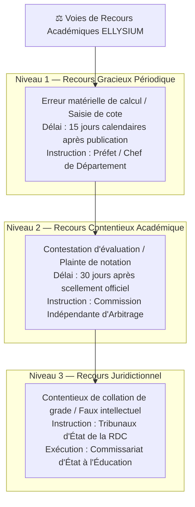
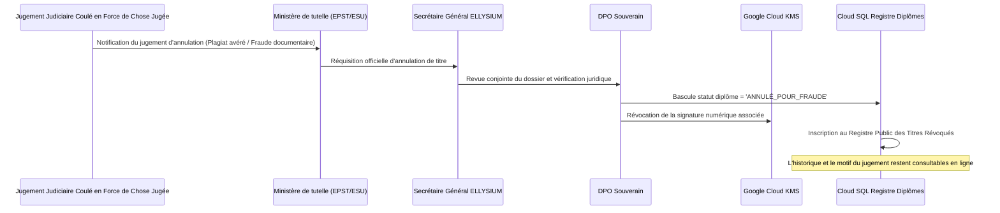

# Module 188 — Procédure de Contestation, Recours et Annulation de Titre

> **Positionnement :** Tome 10 — Examens, Certifications, Bulletins & Diplômes · Module 188 sur 191
> **Autorité :** Commission Juridique et Contentieux Académique / Conseil Supérieur de l'Éducation
> **Liaison amont/aval :** ← Module 187 (Archivage) → Module 189 (Accompagnement EXETAT) →

---

## 1. Objet

Ce module opérationnalise l'**Article 10 de la Constitution ELLYSIUM** relatif au droit inaliénable de recours et de contestation d'une décision académique. Il définit les délais légaux, le circuit d'instruction dématérialisé, les protocoles de contre-expertise (double correction aveugle) et le cadre judiciaire strict encadrant l'annulation exceptionnelle d'un titre académique pour fraude avérée.

---

## 2. Typologie des Voies de Recours



---

## 3. Procédure Dématérialisée de Dépôt de Recours

1. **Dépôt via l'Espace Apprenant / Parent** :
   - Sélection précise de l'épreuve ou de la cote litigieuse.
   - Dépôt des pièces justificatives (copie annotée, brouillons scannés, rapport circonstancié).
   - Horodatage certifié et délivrance d'un **Récépissé Numérique de Recours** doté d'un identifiant unique de suivi.
2. **Suspension Conservatoire** :
   - L'introduction du recours ne bloque pas la poursuite de la scolarité de l'élève.
   - Le statut de la cote bascule en `EN_COURS_DE_RECOURS`, sans suspendre la délibération globale.
3. **Délai Impératif de Réponse** :
   - L'administration scolaire dispose de **15 jours ouvrables** au maximum pour notifier sa décision motivée.
   - Tout silence gardé au-delà de 21 jours vaut décision implicite de recevabilité et transmission automatique à la Commission d'Arbitrage.

---

## 4. Protocole de Double Correction Arbitrale Aveugle

En cas de recours contentieux sur une épreuve ouverte ou un mémoire de TFE :
- **Anonymisation stricte** : Le document est purgé de l'identité de l'élève et du premier correcteur.
- **Désignation aléatoire** : Le système sélectionne deux correcteurs certifiés indépendants via un algorithme de tirage au sort (sans conflit d'intérêts géographique ou institutionnel).
- **Calcul de la cote rectificative** :
  - Si l'écart entre les deux nouveaux correcteurs est $\le 10\%$, la note retenue est la moyenne exacte de ces deux corrections.
  - Si l'écart dépasse $15\%$, le Préfet ou le Doyen préside un jury tripartite d'arbitrage définitif.

---

## 5. Procédure d'Annulation et Révocation de Titre Académique

L'annulation d'un diplôme délivré est une mesure gravissime encadrée par des garde-fous constitutionnels stricts :



---

## 6. Table de Suivi des Recours (Cloud SQL)

```sql
CREATE TABLE recours_academiques (
    id                      UUID PRIMARY KEY DEFAULT gen_random_uuid(),
    reference_recours       TEXT UNIQUE NOT NULL, -- Ex: REC-2026-00412
    demandeur_id            UUID NOT NULL REFERENCES users(id),
    cote_id                 UUID NOT NULL REFERENCES cotes(id),
    type_recours            TEXT NOT NULL CHECK (type_recours IN ('ERREUR_MATERIELLE', 'CONTESTATION_NOTATION', 'FRAUDE_TIERS')),
    motif_detaille          TEXT NOT NULL,
    pieces_jointes_uris     TEXT[],
    statut                  TEXT NOT NULL DEFAULT 'RECU' CHECK (statut IN ('RECU', 'EN_INSTRUCTION', 'ACCEPTE', 'REJETE', 'TRANSMIS_ARBITRAGE')),
    decision_motivation     TEXT,
    nouvelle_cote           NUMERIC(5,2),
    instructeur_id          UUID REFERENCES users(id),
    date_depot              TIMESTAMPTZ DEFAULT NOW(),
    date_notification       TIMESTAMPTZ
);
```

---

## 7. Verrous Fonctionnels

| ID | Règle | Niveau |
|---|---|---|
| VF-188-01 | Droit de recours garanti à tout apprenant sans frais de justice scolaire | CONSTITUTIONNEL |
| VF-188-02 | Délai impératif d'instruction fixé à 15 jours ouvrables maximum | OBLIGATOIRE |
| VF-188-03 | Double correction arbitrale aveugle obligatoire pour toute réévaluation d'épreuve | PÉDAGOGIQUE |
| VF-188-04 | Annulation d'un diplôme impossible sans réquisition judiciaire ou ministérielle formelle | LÉGAL |
| VF-188-05 | Publication instantanée de toute révocation sur le portail public de vérification | OBLIGATOIRE |

---

*Sous-tome rédigé conformément aux Normes documentaires ELLYSIUM — Fondations 04.*
