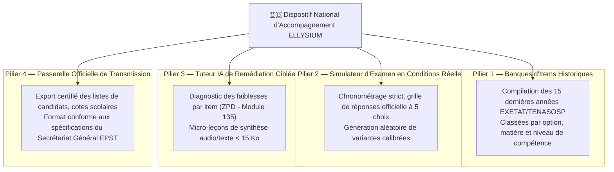
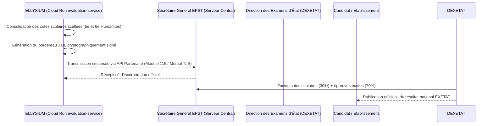

# Module 189 — Accompagnement aux Examens d'État (TENASOSP, EXETAT)

> **Positionnement :** Tome 10 — Examens, Certifications, Bulletins & Diplômes · Module 189 sur 191
> **Autorité :** Direction Pédagogique Nationale / Inspection Générale de l'EPST
> **Liaison amont/aval :** ← Module 188 (Recours) → Module 190 (Statistiques académiques) →

---

## 1. Objet

Ce module régit le dispositif national d'accompagnement, de préparation intensive et d'interfaçage d'ELLYSIUM avec les deux examens d'État souverains de la République Démocratique du Congo :
1. **Le TENASOSP** : Test National de Sélection et d'Orientation Scolaire et Professionnelle (fin du cycle terminal de l'éducation de base / 8e année).
2. **L'EXETAT** : Examen d'État sanctionnant la fin des études secondaires (Humanités) et ouvrant l'accès à l'enseignement supérieur.

---

## 2. Piliers Pédagogiques de la Préparation Nationale

---

## 3. Spécifications du Simulateur EXETAT

Le simulateur national ELLYSIUM reproduit fidèlement l'environnement de l'Examen d'État :
- **Grille de QCM standardisée** : 5 distracteurs calibrés selon la méthodologie de l'Inspection Générale.
- **Gestion du stress et du temps** : Minuteur dynamique synchronisé, alerte aux 15 dernières minutes.
- **Frugalité et mode hors-ligne** : Téléchargement complet du sujet en un bloc compressé (< 80 Ko), passation en mode avion, téléversement chiffré des réponses dès reconnexion.
- **Correction instantanée et explicative** : Dès la fin de l'épreuve d'entraînement, chaque distracteur est analysé pour expliquer la nature exacte du piège conceptuel.

---

## 4. Transmission Réglementaire des Cotes Scolaires (Année Pré-EXETAT)

L'admissibilité et la note finale de l'EXETAT intègrent réglementairement la moyenne des cotes scolaires des 5e et 6e Humanités :

---

## 5. Mesures d'Égalité Territoriale (Grandes Villes vs Territoires Enclavés)

Conformément à la vocation souveraine d'ELLYSIUM :
- **Gratuité absolue** : L'accès à la préparation EXETAT et TENASOSP est garanti sans frais pour tout apprenant indépendant ou élève affilié (Article 4 de la Constitution).
- **Format ultra-frugal pour réseaux 2G** : Les items d'examens d'État sont consultables en mode texte pur sur feature phones et smartphones d'entrée de gamme (Itel, Tecno).
- **Accompagnement par radio communautaire et SMS** : Diffusion des clés de corrigés et des synthèses essentielles par notifications SMS sponsorisées dans les provinces isolées.

---

## 6. Verrous Fonctionnels

| ID | Règle | Niveau |
|---|---|---|
| VF-189-01 | Accès 100% gratuit et universel au module de préparation aux examens d'État | CONSTITUTIONNEL |
| VF-189-02 | Format des épreuves d'entraînement strictement conforme aux maquettes officielles EPST | PÉDAGOGIQUE |
| VF-189-03 | Transmission des cotes de scolarité à la DEXETAT chiffrée de bout en bout (mTLS) | SÉCURITÉ |
| VF-189-04 | Fonctionnement complet garanti en mode hors-ligne sans connexion permanente | TECHNIQUE |
| VF-189-05 | Neutralité de l'IA : l'IA n'intervient que pour expliquer les corrigés, jamais pour noter | CONSTITUTIONNEL |
| VF-189-06 | Toute suspicion de tricherie déclenche une révision manuelle obligatoire par un jury humain | CONSTITUTIONNEL |

---

*Sous-tome rédigé conformément aux Normes documentaires ELLYSIUM — Fondations 04.*
