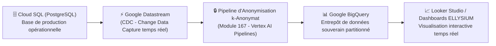

# Module 190 — Statistiques Académiques et Reporting

> **Positionnement :** Tome 10 — Examens, Certifications, Bulletins & Diplômes · Module 190 sur 191
> **Autorité :** Direction de la Planification et des Statistiques Scolaires / Direction Générale ELLYSIUM
> **Liaison amont/aval :** ← Module 189 (EXETAT) → Module 191 (Matrice des dépendances Tome 10) →

---

## 1. Objet

Ce module définit l'architecture décisionnelle, les pipelines d'agrégation statistique et les tableaux de bord analytiques d'ELLYSIUM. Il permet aux décideurs publics (Ministères EPST/ESU, Gouverneurs de province, Inspecteurs, Directeurs d'établissements) de disposer d'indicateurs fiables, anonymisés et temps réel sur le niveau académique national, la détection des décrochages et l'efficacité des apprentissages.

---

## 2. Architecture Analytics Serverless (Google Cloud)

Conformément à la **DOCTRINE INFRASTRUCTURE GOOGLE**, le pipeline décisionnel repose exclusivement sur l'écosystème Big Data de GCP :



---

## 3. Indicateurs Clés de Performance (KPI) Nationaux

### 3.1 Indicateurs de Réussite et de Niveau
- **Taux de Réussite Global** par province, sous-division et établissement.
- **Taux d'Échec par Matière** : Identification précoce des disciplines à forte déperdition (ex: Mathématiques en 4e Scientifique).
- **Indice de Dispersion des Cotes (Écart-type / Gini)** : Mesure de l'hétérogénéité pédagogique d'une classe ou d'une région.
- **Taux de Réussite en Première Session vs Seconde Session (ABI)**.

### 3.2 Indicateurs d'Équité et d'Inclusion
- **Indice Parité Fille-Garçon (IPG)** : Accès, persévérance et réussite comparée par niveau.
- **Taux d'Abandon / Décrochage Scolaire Périodique (IVS - Indice de Vulnérabilité)**.
- **Ratio Rural / Urbain** : Suivi des écarts d'acquisition entre grands centres urbains et écoles de brousse.

---

## 4. Protection des Données et Anonymisation Statistique

```
RÈGLES D'AGRÉGATION STRICTES (Article 1 & 6 de la Constitution) :
1. Principe du K-Anonymat (k >= 5) : Aucune ligne statistique ne peut porter sur un échantillon
   inférieur à 5 individus dans un croisement de critères.
2. Suppression totale des identifiants directs : Ni nom, ni prénom, ni IUNE brut dans BigQuery.
3. Agrégation géographique minimale au niveau de l'établissement ou du groupement scolaire.
4. Export public certifié conforme à la loi RDC n° 15/023.
```

---

## 5. Modèle de Vue BigQuery (Exemple Détection des Faiblesses par Province)

```sql
-- Requête d'agrégation partitionnée par province et matière
CREATE OR REPLACE VIEW `cnel-elysium-analytics.academique.vue_performance_provinciale` AS
SELECT
    p.nom_province,
    m.code_matiere,
    m.libelle_matiere,
    COUNT(c.id) AS effectif_evalue,
    ROUND(AVG(c.points / c.maximum * 100), 2) AS moyenne_taux_reussite,
    ROUND(STDDEV(c.points / c.maximum * 100), 2) AS ecart_type_dispersion,
    COUNTIF(c.points / c.maximum < 0.50) AS nb_echecs,
    ROUND(COUNTIF(c.points / c.maximum < 0.50) / COUNT(c.id) * 100, 2) AS taux_echec_pct
FROM
    `cnel-elysium-analytics.academique.cotes_anonymisees` c
JOIN
    `cnel-elysium-analytics.referentiel.matieres` m ON c.matiere_id = m.id
JOIN
    `cnel-elysium-analytics.referentiel.provinces` p ON c.province_id = p.id
GROUP BY
    p.nom_province, m.code_matiere, m.libelle_matiere
HAVING
    COUNT(c.id) >= 10; -- Respect du k-anonymat
```

---

## 6. Tableaux de Bord selon les Rôles Institutionnels

| Destinataire | Périmètre du Dashboard | Fréquence de Rafraîchissement |
|---|---|---|
| **Ministre EPST / ESU** | Panorama national, comparatif des 26 provinces, projections EXETAT | Quotidienne |
| **Inspecteur Principal Provincial** | Cartographie de la province, alertes sur écoles sous-performantes | Temps réel |
| **Préfet / Promoteur d'École** | Tableau de bord de l'établissement, suivi des cohortes et classes | Immédiate après délibération |
| **Enseignant Titulaire** | Distribution des notes de sa classe, acquisition des compétences | Continue |
| **Grand Public / Partenaires** | Baromètre annuel de l'éducation nationale (données ouvertes) | Annuelle |

---

## 7. Verrous Fonctionnels

| ID | Règle | Niveau |
|---|---|---|
| VF-190-01 | Respect absolu du k-anonymat ($k \ge 5$) sur tous les rapports statistiques | LÉGAL |
| VF-190-02 | Pipeline analytique 100% hébergé sur Google BigQuery et Cloud Datastream | CONSTITUTIONNEL |
| VF-190-03 | Séparation physique totale entre base transactionnelle Cloud SQL et BigQuery | SÉCURITÉ |
| VF-190-04 | Interdiction d'utiliser les statistiques individuelles à des fins de profilage commercial | CONSTITUTIONNEL |
| VF-190-05 | Export ouvert des données consolidées annuelles sous licence publique d'État | INSTITUTIONNEL |
| VF-190-06 | Toute suspicion de tricherie déclenche une révision manuelle obligatoire par un jury humain | CONSTITUTIONNEL |

---

*Sous-tome rédigé conformément aux Normes documentaires ELLYSIUM — Fondations 04.*
