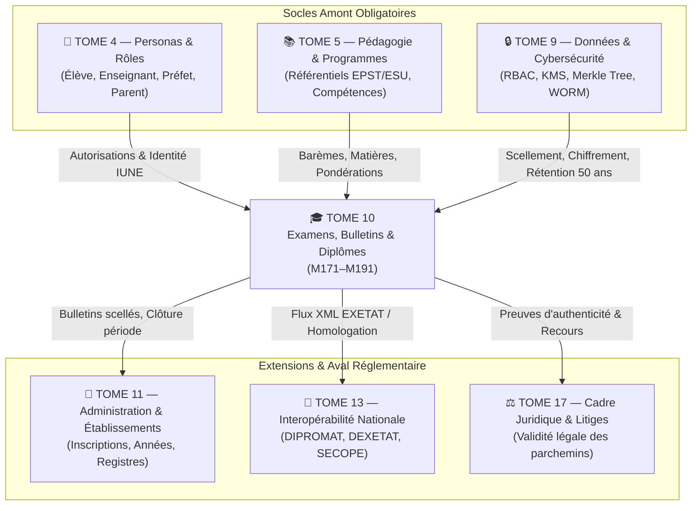

# Module 191 — Matrice des Dépendances — Tome 10 avec Tomes 4, 5, 9

> **Positionnement :** Tome 10 — Examens, Certifications, Bulletins & Diplômes · Module 191 sur 191 (CLÔTURE DU TOME 10)
> **Autorité :** Architecte Souverain ELLYSIUM / Comité Technique Intégré
> **Liaison amont/aval :** ← Module 190 (Statistiques) · Clôture Tome 10 → Tome 11 (Administration) →

---

## 1. Objet

Ce sous-tome formalise la matrice d'interconnexion systémique entre le **Tome 10 (Validation Académique, Examens, Bulletins et Diplômes)** et les piliers d'architecture amont et aval. Il garantit la complétude fonctionnelle, l'intégrité des contrats d'interface et la traçabilité des flux de données entre les personas, les programmes pédagogiques, la cybersécurité et l'administration scolaire.

---

## 2. Vue Globale des Interconnexions du Tome 10

---

## 3. Matrice Détaillée des Dépendances

### 3.1 Dépendances Amont (Ce que le Tome 10 consomme)

| Composant Consommé | Module Source | Rôle dans le Tome 10 | Point de Contrôle / Contract API |
|---|---|---|---|
| **Identité IUNE & Rôles Acteurs** | **Tome 4** (Modules 45–54) | Affectation des notes, droits de signature et de jury | `users.iune`, JWT claims `role=PREFET_ETUDES` |
| **Structure des Matières & Coefficients** | **Tome 5** (Modules 55–83) | Définition des maxima, barèmes TJ/Examen | `matieres.coefficient`, `matieres.maxima_tj` |
| **Gestion des Accès RBAC/ABAC** | **Tome 9** (Module 159) | Verrouillage des cotes, interdiction de saisie non autorisée | Policies Cloud SQL RLS, Google Cloud IAM |
| **Double Authentification (MFA)** | **Tome 9** (Module 160) | Signature obligatoire du Préfet lors du scellement | Vérification claim `mfa_verified=true` |
| **Signature Asymétrique Cloud KMS** | **Tome 9** (Module 158) | Scellement cryptographique des PV, diplômes et bulletins | `Cloud KMS EC_SIGN_ED25519` |
| **Journalisation Immuable WORM** | **Tome 9** (Module 162) | Audit de chaque transition d'état d'une cote | Insertion dans la chaîne Merkle Cloud Logging |
| **Coffre-fort Rétention 50 Ans** | **Tome 9** (Module 168) | Conservation pérenne des parchemins et archives | Bucket GCS `retention_policy.is_locked=true` |

### 3.2 Dépendances Aval (Ce que le Tome 10 fournit)

| Livrable du Tome 10 | Module Récepteur | Usage dans le Système ELLYSIUM |
|---|---|---|
| **Décisions de Délibération (Passage / Échec / ABI)** | **Tome 11** (Module 197) | Réinscription automatique, affectation en classe supérieure |
| **Relevés de Notes et Crédits ECTS** | **Tome 11** (Module 198) | Dossier académique permanent de l'étudiant |
| **Bordereaux de Candidats EXETAT** | **Tome 13** (Module 224) | Transmission réglementaire à la DEXETAT / Ministère EPST |
| **Preuves Cryptographiques d'Authenticité** | **Tome 186** (Portail Public) | Vérification instantanée par les employeurs et ambassades |
| **Dossiers de Contestation et Recours** | **Tome 17** (Contentieux) | Gestion juridique des litiges de collation de grade |

---

## 4. Tableau Récapitulatif de Complétude du Tome 10

| Sous-tome | Intitulé officiel | Statut Documentaire |
|---|---|---|
| Module 171 | Périmètre du Tome 10 – principes d'évaluation | ✅ COMPLET |
| Module 172 | Conformité avec la Constitution (intégrité, droit au recours) | ✅ COMPLET |
| Module 173 | Architecture générale du système d'évaluation | ✅ COMPLET |
| Module 174 | Création et gestion des banques d'épreuves | ✅ COMPLET |
| Module 175 | Types d'évaluations (diagnostique, formative, sommative) | ✅ COMPLET |
| Module 176 | Planification et organisation des examens | ✅ COMPLET |
| Module 177 | Surveillance (proctoring) synchrone et asynchrone | ✅ COMPLET |
| Module 178 | Lutte contre la fraude – plagiat, usurpation, triche | ✅ COMPLET |
| Module 179 | Correction et notation – automatique, humaine, assistée IA | ✅ COMPLET |
| Module 180 | Jurys de délibération – composition, validation, verrouillage | ✅ COMPLET |
| Module 181 | Moteur de calcul – moyennes, crédits, compensations, classements | ✅ COMPLET |
| Module 182 | Gestion des notes ABI et sessions de rattrapage | ✅ COMPLET |
| Module 183 | Génération des bulletins scolaires et relevés de notes | ✅ COMPLET |
| Module 184 | Attestations, certificats et diplômes institutionnels | ✅ COMPLET |
| Module 185 | Vérification infalsifiable – SHA-256, QR code, signature KMS | ✅ COMPLET |
| Module 186 | Portail public de vérification des diplômes | ✅ COMPLET |
| Module 187 | Archivage permanent des résultats et registre inaltérable (50 ans) | ✅ COMPLET |
| Module 188 | Procédure de contestation, recours et annulation de titre | ✅ COMPLET |
| Module 189 | Accompagnement aux examens d'État (TENASOSP, EXETAT) | ✅ COMPLET |
| Module 190 | Statistiques académiques et reporting (BigQuery / Looker) | ✅ COMPLET |
| Module 191 | Matrice des dépendances – avec les Tomes 4, 5, 9 | ✅ COMPLET |

---

## 5. Prochaine Étape Opérationnelle

Le Tome 10 étant **intégralement rédigé, scellé et validé**, le chantier ELLYSIUM poursuit son déploiement méthodique avec l'ouverture du :

> **→ TOME 11 — ADMINISTRATION ET COMMUNICATION INTERNE**
> *Modules 192 à 210 — Gestion des comptes, vie scolaire, ressources humaines, calendrier et messagerie multicanale*

---

*Sous-tome rédigé conformément aux Normes documentaires ELLYSIUM — Fondations 04.*
*Tome 10 — EXAMENS, CERTIFICATIONS, BULLETINS ET DIPLÔMES — COMPLET ✅*
*21 modules rédigés : M171 → M191*

---

## 7. Verrous Fonctionnels Critiques

| Réf. Verrou | Description Fonctionnelle et Technique | Conséquence en Cas de Violation |
| :--- | :--- | :--- |
| **`VF-191-01`** | **Dépendances structurelles avec les tomes amont** | Toute spécification de clôture est alignée avec les tomes référencés. |
| **`VF-191-02`** | **Cohérence de la numérotation des verrous dans ce tome** | La séquence VF est continue et sans doublon. |
| **`VF-191-03`** | **Validation formelle par le Comité d'Architecture** | Ce module de clôture requiert signature du Directeur Technique. |
| **`VF-191-04`** | **Publication du rapport de conformité documentaire** | Rapport d'état du tome transmis au COPIL avant passage en phase de code. |
| **`VF-191-05`** | **Clôture solennelle du TOME-10** | Validation de l'intégralité des sous-tomes de ce volume architectural. |

---

*Sous-tome rédigé conformément aux Normes documentaires ELLYSIUM — Fondations 04.*
