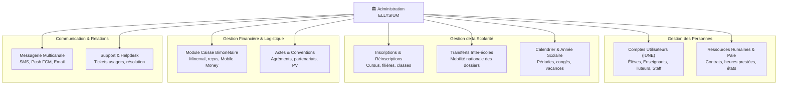

# Module 192 — Périmètre du Tome 11 — Fonctions Administratives Centralisées

> **Positionnement :** Tome 11 — Administration et Communication Interne · Module 192 sur 210
> **Autorité :** Secrétariat Général ELLYSIUM / Direction des Services Administratifs
> **Liaison amont/aval :** ← Tome 10 (Examens) · Module 193 (Conformité) →

---

## 1. Objet

Ce module circonscrit le domaine fonctionnel de l'administration scolaire et institutionnelle d'ELLYSIUM. Il établit la typologie des processus administratifs gérés, leur articulation entre le niveau central national et les établissements d'enseignement partenaires (primaire, secondaire, universitaire), et fixe les responsabilités organisationnelles.

---

## 2. Cartographie des Domaines Administratifs

---

## 3. Découpage Centralisé vs Décentralisé

ELLYSIUM applique le principe de **subsidiarité administrative** :

| Processus | Niveau d'Autorité | Responsable Opérationnel | Rôle du Système Central ELLYSIUM |
|---|---|---|---|
| **Création IUNE** | Central (National) | Système Automatisé Cloud Run | Attribution unique déterministe avec hachage de l'état civil |
| **Admission & Inscription** | Établissement | Préfet des Études / Doyen | Enregistrement, contrôle des prérequis, affectation de classe |
| **Agrément d'un établissement** | Central (National) | Commission Nationale d'Homologation | Audit, conventionnement, activation des clés d'accès |
| **Perception des frais (Minerval)** | Mixte | Caisse de l'établissement / Mobile Money | Idempotence des transactions, réconciliation comptable |
| **Ressources Humaines (Paie)** | Établissement | Promoteur / Direction Financière | Calcul des heures, génération des fiches de paie conformes |
| **Communication Réglementaire** | Central & Local | Secrétariat Général & Préfet | Diffusion ciblée avec accusé de réception certifié |

---

## 4. Architecture Logique (Google Cloud Platform)

Conformément à la **DOCTRINE INFRASTRUCTURE GOOGLE**, les modules administratifs s'articulent autour des services managés suivants :

- **Google Cloud Run** (`admin-service`, `caisse-service`, `hr-service`) pour le traitement métier sans serveur.
- **Google Cloud SQL** (PostgreSQL 16) hébergeant les schémas administratifs avec Row-Level Security (RLS) par établissement.
- **Google Secret Manager** & **Cloud KMS** pour le scellement des conventions et actes officiels.
- **Firebase Authentication** pour le cycle de vie des identités et les sessions multi-appareils.
- **Google Workspace for Education** pour la messagerie collaborative institutionnelle des équipes pédagogiques.

---

## 5. Verrous Fonctionnels

| ID | Règle | Niveau |
|---|---|---|
| VF-192-01 | Unicité absolue de l'IUNE : un citoyen ne peut posséder qu'un seul compte administratif national | CONSTITUTIONNEL |
| VF-192-02 | Frugalité documentaire : interdiction des formulaires papier non numérisés dans les écoles partenaires | OBLIGATOIRE |
| VF-192-03 | Hébergement strict des dossiers scolaires sur l'infrastructure Google Cloud agréée | CONSTITUTIONNEL |
| VF-192-04 | Séparation des privilèges : le personnel administratif local n'a aucun accès aux tables globales | SÉCURITÉ |
| VF-192-05 | Traçabilité intégrale : toute modification d'un dossier administratif est enregistrée en log WORM | OBLIGATOIRE |

---

*Sous-tome rédigé conformément aux Normes documentaires ELLYSIUM — Fondations 04.*
