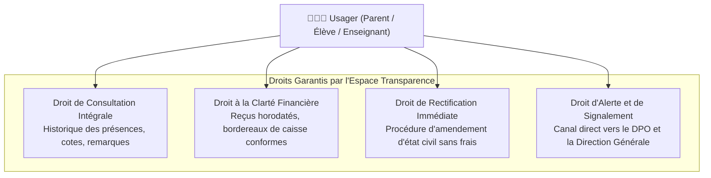

# Module 193 — Conformité avec la Constitution (Transparence, Protection)

> **Positionnement :** Tome 11 — Administration et Communication Interne · Module 193 sur 210
> **Autorité :** Conseiller Juridique Institutionnel / DPO Souverain ELLYSIUM
> **Liaison amont/aval :** ← Module 192 (Périmètre) → Module 194 (Gestion des comptes) →

---

## 1. Objet

Ce module traduit les principes fondamentaux de la Constitution ELLYSIUM en obligations administratives exécutoires dans la gestion quotidienne. Il consacre la transparence totale vis-à-vis des usagers, la protection renforcée des mineurs et la non-discrimination scolaire, tout en établissant des barrières techniques infranchissables contre les abus de pouvoir administratifs.

---

## 2. Traduction des Articles Constitutionnels Clés

### 2.1 Article 4 — Gratuité Inaliénable des Apprenants Indépendants (AIS/AIU)
- **Application Administrative** : Les interfaces d'inscription d'ELLYSIUM interdisent techniquement l'affichage de toute passerelle de paiement ou de facture pour les profils déclarés sous le statut d'Apprenant Indépendant Secondaire (AIS) ou Universitaire (AIU).
- **Zéro barrière d'accès** : La création du compte, l'accès aux cours, les devoirs et les évaluations formatives sont activés immédiatement sans condition de caution.

### 2.2 Article 5 — Étanchéité Stricte Pédagogie / Finances
- **Protection contre l'expulsion académique pour défaut de paiement** :
  ```
  RÈGLE ADMINISTRATIVE INVIOLABLE :
  Aucun administrateur d'école, préfet ou caissier ne peut désactiver le compte
  pédagogique d'un élève ou lui interdire l'accès à la classe virtuelle pour motif
  d'arriéré de minerval. Tout litige financier relève exclusivement de la relation
  contractuelle avec les parents ou tuteurs légaux.
  ```

### 2.3 Article 7 — Protection Renforcée des Données des Mineurs
- **Consentement parental vérifié** : Pour tout élève âgé de moins de 18 ans, l'activation administrative complète est subordonnée à la validation d'un tuteur légal majeur via un code OTP SMS/WhatsApp ou signature manuscrite numérisée.
- **Interdiction de monétisation ou de cession** : Aucune donnée de scolarité ou de contact ne peut être transmise à des tiers, sponsors ou annonceurs publicitaires.

---

## 3. Matrice de Transparence Administrative



---

## 4. Garde-Fous Techniques Contre l'Arbitraire Administratif

1. **Interdiction de la radiation unilatérale** : La suppression définitive ou la radiation d'un élève nécessite un avis motivé du conseil de discipline, la notification formelle aux parents avec accusé de réception, et la confirmation par le Secrétariat Général.
2. **Historique des modifications d'état civil** : Tout changement de patronyme, de date de naissance ou de filiation génère un événement horodaté dans le journal d'audit immuable (Cloud Logging WORM) et requiert l'attestation d'un jugement supplétif légalisé.
3. **Égalité de traitement des établissements** : Le système applique les mêmes barèmes de validation et règles de calcul quel que soit le statut de l'établissement partenaire (école publique d'État, réseau conventionné ou collège privé laïc).

---

## 5. Verrous Fonctionnels

| ID | Règle | Niveau |
|---|---|---|
| VF-193-01 | Impossibilité de bloquer l'accès pédagogique d'un élève pour arriéré de paiement | CONSTITUTIONNEL |
| VF-193-02 | Inscription des élèves mineurs conditionnée à la vérification d'un tuteur légal (OTP) | LÉGAL |
| VF-193-03 | Les candidats libres (AIS/AIU) ne peuvent faire l'objet d'aucune facturation | CONSTITUTIONNEL |
| VF-193-04 | Droit d'accès et d'export des données personnelles en libre-service (Loi RDC 15/023) | LÉGAL |
| VF-193-05 | Journalisation obligatoire de toute suspension ou mesure disciplinaire administrative | OBLIGATOIRE |
| VF-193-06 | Toute opération administrative est réversible jusqu'à validation humaine explicite par le responsable hiérarchique | OBLIGATOIRE |

---

*Sous-tome rédigé conformément aux Normes documentaires ELLYSIUM — Fondations 04.*
