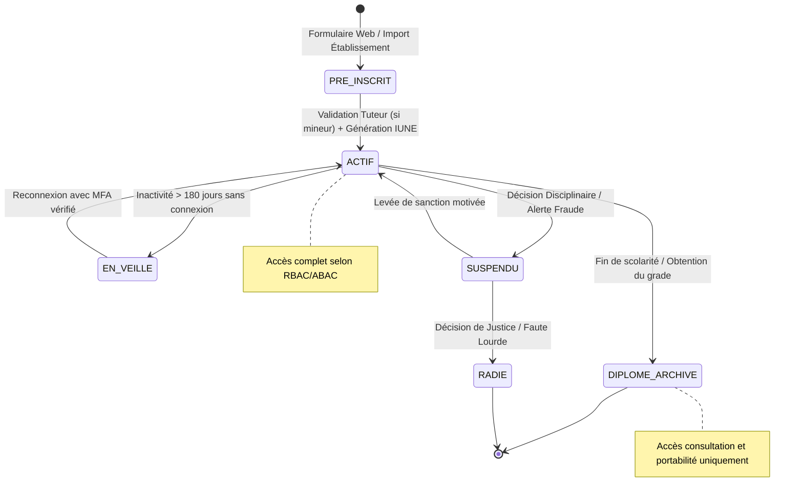

# Module 194 — Gestion des Comptes Utilisateurs — Cycle de Vie

> **Positionnement :** Tome 11 — Administration et Communication Interne · Module 194 sur 210
> **Autorité :** Direction des Systèmes d'Information / Responsable Annuaire National (IUNE)
> **Liaison amont/aval :** ← Module 193 (Conformité) → Module 195 (Rôles et responsabilités) →

---

## 1. Objet

Ce module définit le cycle de vie complet de tous les comptes d'accès à la plateforme souveraine ELLYSIUM : de la création initiale avec attribution du matricule **IUNE** (Identifiant Unique National ELLYSIUM) jusqu'à l'archivage définitif, en passant par les transitions d'état (actif, en pause, suspendu, radié).

---

## 2. Cycle de Vie et Machine à États d'un Compte



---

## 3. Format et Génération Canonique de l'IUNE

L'Identifiant Unique National ELLYSIUM constitue le matricule régalien de l'apprenant à travers toute sa vie académique (de la maternelle au doctorat) :

$$\text{Format IUNE} : \mathbf{CD-EL-[AAAA]-[XXXXXXXX]}$$

- `CD` : Code ISO de la République Démocratique du Congo.
- `EL` : Sceau national ELLYSIUM.
- `[AAAA]` : Année de première immatriculation dans le système.
- `[XXXXXXXX]` : Numéro de séquence séquentiel ou hash déterministe de l'état civil (8 caractères alphanumériques base 32, sans caractères ambigus comme 0/O, 1/I).

```go
// Algorithme de génération déterministe IUNE (Go)
func GenererIUNE(annee int, nom, postnom, prenom, dateNaissance string) string {
    source := fmt.Sprintf("%s|%s|%s|%s|%d", 
        strings.ToUpper(nom), 
        strings.ToUpper(postnom), 
        strings.ToUpper(prenom), 
        dateNaissance, 
        annee)
    hash := sha256.Sum256([]byte(source))
    suffixe := strings.ToUpper(hex.EncodeToString(hash[:])[:8])
    return fmt.Sprintf("CD-EL-%d-%s", annee, suffixe)
}
```

---

## 4. Gestion des Identités sur Google Cloud Platform

L'annuaire d'authentification s'appuie sur la synergie entre **Firebase Authentication** et **Google Cloud SQL** :
1. **Firebase Authentication** :
   - Gestion des identifiants (Email, Téléphone, IUNE en UID).
   - Stockage sécurisé des clés Argon2id.
   - Gestion des jetons JWT et Custom Claims (Rôles, Droits d'établissement).
2. **Google Cloud SQL (PostgreSQL 16)** :
   - Table `profils_utilisateurs` enrichie : état civil, filiation, historique de scolarité, établissements d'attache.
   - Synchronisation bidirectionnelle par triggers Eventarc.

---

## 5. Procédures de Suspension et de Radiation

| Statut | Motif Déclencheur | Conséquence Technique | Autorité Habilitée |
|---|---|---|---|
| **Mise en Veille** | Défaut d'activité prolongée (> 180 jours) | Suspension temporaire des sessions, réactivation par SMS OTP | Système Automatique |
| **Suspension Conservatoire** | Soupçon d'usurpation d'identité ou enquête disciplinaire | Révocation immédiate des jetons Firebase Auth (`revokeRefreshTokens`) | RSSI / Préfet |
| **Suspension Disciplinaire** | Sanction de conseil de discipline (durée déterminée : 1 à 30 jours) | Accès restreint aux cours seuls (examens et forums bloqués) | Conseil de Discipline |
| **Radiation Définitive** | Fausse identité avérée, décision judiciaire | Désactivation permanente du compte Firebase, données archivées WORM | Secrétariat Général |

---

## 6. Verrous Fonctionnels

| ID | Règle | Niveau |
|---|---|---|
| VF-194-01 | Unicité de l'IUNE contrôlée par contrainte d'unicité en base de données | CONSTITUTIONNEL |
| VF-194-02 | L'IUNE reste immuable et attaché au citoyen même en cas de changement d'école | CONSTITUTIONNEL |
| VF-194-03 | Les jetons d'accès révoqués sont invalidés en moins de 30 secondes (Firebase Auth) | TECHNIQUE |
| VF-194-04 | Aucun compte d'élève mineur ne peut être activé sans rattachement à un tuteur | LÉGAL |
| VF-194-05 | La radiation d'un compte conserve l'historique dans le registre d'audit WORM | OBLIGATOIRE |
| VF-194-06 | Toute opération administrative est réversible jusqu'à validation humaine explicite par le responsable hiérarchique | OBLIGATOIRE |

---

*Sous-tome rédigé conformément aux Normes documentaires ELLYSIUM — Fondations 04.*
