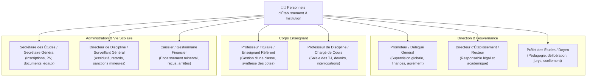
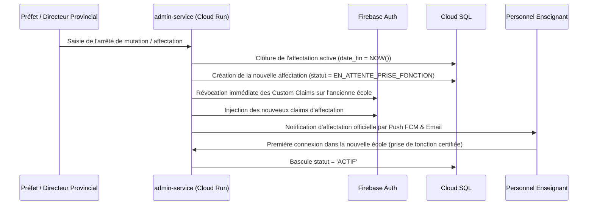

# Module 195 — Gestion des Rôles et Responsabilités (Affectation des Personnels)

> **Positionnement :** Tome 11 — Administration et Communication Interne · Module 195 sur 210
> **Autorité :** Direction des Ressources Humaines / Secrétariat Général ELLYSIUM
> **Liaison amont/aval :** ← Module 194 (Comptes utilisateurs) → Module 196 (Établissements partenaires) →

---

## 1. Objet

Ce module formalise l'attribution, l'affectation territoriale et institutionnelle, le contrôle d'activité et la révocation des rôles administratifs et pédagogiques des personnels au sein d'ELLYSIUM. Il traduit la hiérarchie officielle du système éducatif congolais en matrices de droits d'accès contextualisées (ABAC) par école, faculté, classe et discipline.

---

## 2. Typologie des Rôles des Personnels



---

## 3. Mécanisme d'Affectation Dynamique (Contextual Claims)

Un personnel ne dispose pas de droits abstraits ou universels : ses privilèges sont rigoureusement circonscrits à son établissement d'affectation et aux classes qui lui sont assignées.

### 3.1 Structure du Claim d'Affectation dans Firebase Auth
```json
{
  "role": "PROF_DISCIPLINE",
  "etablissement_id": "etab-kin-gomb-0012",
  "affectations": [
    {
      "classe_id": "cls-6e-sc-A",
      "matiere_id": "mat-chimie-6",
      "annee": "2025-2026"
    },
    {
      "classe_id": "cls-5e-sc-B",
      "matiere_id": "mat-chimie-5",
      "annee": "2025-2026"
    }
  ],
  "date_fin_validite": "2026-08-31T23:59:59Z"
}
```

---

## 4. Règles d'Incompatibilité et Séparation des Fonctions (SoD)

Pour garantir l'intégrité de l'institution et prévenir les fraudes ou conflits d'intérêts :

| Rôle Primaire | Rôles Strictement Incompatibles (Cumul Interdit) | Justification Institutionnelle |
|---|---|---|
| **Caissier / Comptable** | Professeur Titulaire, Préfet des Études | Étanchéité absolue Pédagogie / Finances (Article 5) |
| **Préfet des Études** | Caissier, Auditeur de Sécurité DPO | Séparation du pouvoir décisionnel et du contrôle |
| **Professeur de Discipline** | Inspecteur Provincial de sa propre discipline | Conflit d'intérêts flagrant en cas de recours ou audit |

---

## 5. Workflow de Mutation et Changement d'Affectation



---

## 6. Verrous Fonctionnels

| ID | Règle | Niveau |
|---|---|---|
| VF-195-01 | Interdiction absolue du cumul des rôles pédagogique et caissier (Art. 5) | CONSTITUTIONNEL |
| VF-195-02 | Les privilèges d'accès expirent automatiquement à la date de fin d'année scolaire | OBLIGATOIRE |
| VF-195-03 | L'affectation d'un enseignant requiert son numéro de matricule SECOPE officiel | LÉGAL |
| VF-195-04 | Révocation immédiate des droits (< 30s) en cas de suspension de personnel | TECHNIQUE |
| VF-195-05 | Journalisation WORM de toute modification de la grille des droits d'affectation | OBLIGATOIRE |
| VF-195-06 | Toute opération administrative est réversible jusqu'à validation humaine explicite par le responsable hiérarchique | OBLIGATOIRE |

---

*Sous-tome rédigé conformément aux Normes documentaires ELLYSIUM — Fondations 04.*
