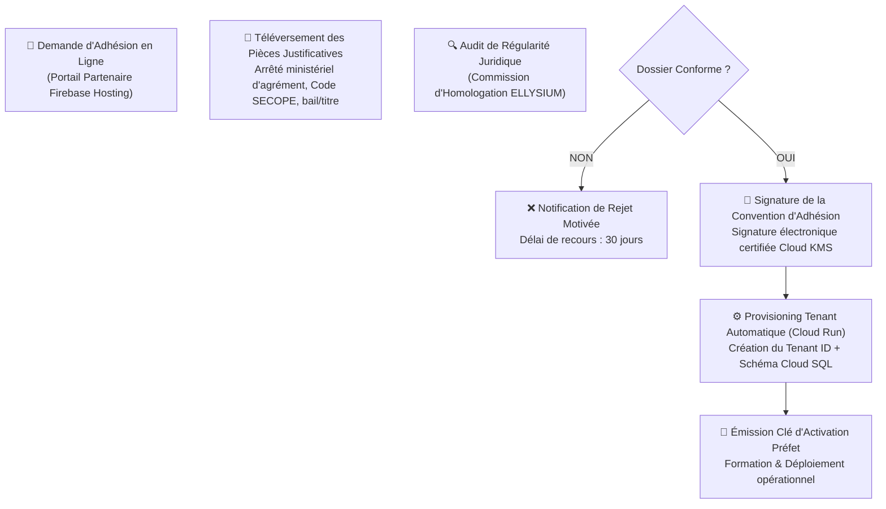

# Module 196 — Gestion des Établissements Partenaires (Agrément, Paramétrage)

> **Positionnement :** Tome 11 — Administration et Communication Interne · Module 196 sur 210
> **Autorité :** Direction du Partenariat et de l'Homologation / Commission d'Agrément
> **Liaison amont/aval :** ← Module 195 (Rôles) → Module 197 (Inscriptions et transferts) →

---

## 1. Objet

Ce module régit le cycle d'onboarding, de conformité légale, d'agrément institutionnel et de paramétrage technique des établissements scolaires et universitaires rejoignant le réseau souverain ELLYSIUM. Il formalise la vérification des arrêtés ministériels, l'attribution du code établissement national et l'isolation multitenant des données.

---

## 2. Typologie des Établissements Partenaires

| Catégorie | Description Institutionnelle | Tutelle Officielle en RDC |
|---|---|---|
| **Écoles Publiques Officielles** | Écoles non conventionnées créées et gérées directement par l'État | Ministère EPST |
| **Écoles Conventionnées** | Gérées par les coordinations religieuses (Catholique, Protestante, Kimbanguiste, Islamique) | Conventions État-Confessions |
| **Écoles Privées Agréées** | Collèges, lycées et complexes scolaires privés disposant d'un arrêté d'agrément en règle | Ministère EPST |
| **Institutions Supérieures & Universités** | Universités publiques et privées, Instituts Supérieurs Pédagogiques (ISP), Techniques (ISTA) | Ministère ESU |

---

## 3. Workflow d'Onboarding et d'Homologation



---

## 4. Paramétrage Multitenant et Isolation des Données (Google Cloud)

Pour garantir l'étanchéité stricte des données entre écoles rivales ou de juridictions différentes, ELLYSIUM implémente un modèle **Multitenant Hybride Sécurisé** :

- **Identifiant Unique de Tenant** : `etablissement_id` au format UUIDv4, injecté dans chaque session utilisateur.
- **Row-Level Security (RLS) PostgreSQL sur Cloud SQL** :
  ```sql
  -- Politique universelle d'isolation des tables par école
  ALTER TABLE eleves ENABLE ROW LEVEL SECURITY;
  
  CREATE POLICY isolation_par_ecole ON eleves
      FOR ALL
      TO role_application
      USING (etablissement_id = current_setting('app.current_tenant_id')::UUID);
  ```
- **Bucket Cloud Storage Dédié** : Chaque école possède un préfixe isolé `gs://ellysium-prod-docs/etablissements/[TENANT_ID]/` protégé par les règles IAM de Google Cloud.

---

## 5. Paramètres de Configuration de l'Établissement

Lors de son activation, l'établissement configure ses paramètres souverains via l'interface Préfet :

1. **Régime Académique** : Trimestriel (primaire/secondaire) ou Semestriel LMD (universitaire).
2. **Options et Filières Enseignées** : Sélection des référentiels nationaux agréés (Tome 5).
3. **Barème Financier du Minerval** : Fixation des frais autorisés par le comité des parents et l'arrêté des gouverneurs de province (bimonétaire CDF / USD).
4. **Charte Visuelle Locale** : Téléversement du logo et du sceau de l'école (intégré sur les bulletins).
5. **Calendrier Spécifique** : Journées pédagogiques locales, fêtes patronales, sous réserve du respect du minimum légal de jours de cours fixé par le Ministère.

---

## 6. Suspension et Retrait d'Agrément

En cas de manquement grave (fraude massive aux examens, non-respect de l'étanchéité financière, fausse déclaration d'agrément) :
- **Mise sous tutelle administrative** : Blocage de la saisie des cotes, nomination d'un administrateur provisoire par l'Inspection.
- **Révocation de la convention** : Gel immédiat du tenant, rapatriement des dossiers d'élèves vers le pôle public central ELLYSIUM pour garantir la continuité de scolarité des enfants.

---

## 7. Verrous Fonctionnels

| ID | Règle | Niveau |
|---|---|---|
| VF-196-01 | Impossibilité d'activer une école sans validation formelle de l'arrêté ministériel | LÉGAL |
| VF-196-02 | Isolation des données par Row-Level Security (RLS) obligatoire sur Cloud SQL | CONSTITUTIONNEL |
| VF-196-03 | L'expulsion ou la fermeture d'une école ne détruit jamais les dossiers des élèves (WORM) | CONSTITUTIONNEL |
| VF-196-04 | Tous les documents légaux d'agrément sont archivés de façon immuable sur GCS | OBLIGATOIRE |
| VF-196-05 | Vérification annuelle de la validité de l'agrément ministériel par audit systématique | INSTITUTIONNEL |
| VF-196-06 | Toute opération administrative est réversible jusqu'à validation humaine explicite par le responsable hiérarchique | OBLIGATOIRE |

---

*Sous-tome rédigé conformément aux Normes documentaires ELLYSIUM — Fondations 04.*
