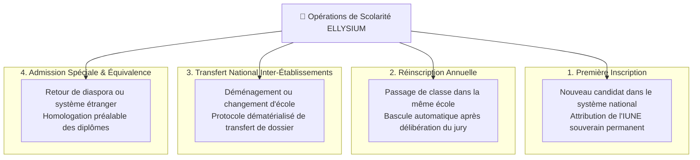

# Module 197 — Gestion des Inscriptions, Réinscriptions et Transferts

> **Positionnement :** Tome 11 — Administration et Communication Interne · Module 197 sur 210
> **Autorité :** Direction de la Scolarité et des Admissions / Préfets des Études
> **Liaison amont/aval :** ← Module 196 (Établissements) → Module 198 (Gestion administrative) →

---

## 1. Objet

Ce module spécifie les flux réglementaires, les pièces exigibles et les transactions de base de données associées aux admissions, inscriptions annuelles, passages de classe (réinscriptions) et transferts inter-établissements au sein du territoire de la République Démocratique du Congo ou depuis la diaspora.

---

## 2. Typologie des Opérations de Scolarité



---

## 3. Protocole Dématérialisé de Transfert Inter-Écoles

Le changement d'école en RDC souffre historiquement de lenteurs, de falsification de bulletins et de pertes de dossiers. ELLYSIUM supprime les attestations papier volatiles par une transaction atomique sécurisée :

```mermaid
sequenceDiagram
    participant PAR as Parent / Tuteur
    participant E1 as École d'Origine (Préfet A)
    participant SYS as admin-service (Cloud Run)
    participant E2 as École d'Accueil (Préfet B)
    participant DB as Cloud SQL Registre National

    PAR->>E2: Demande d'admission avec IUNE de l'élève
    E2->>SYS: Requête de transfert officiel (demande de dossier)
    SYS->>E1: Notification d'avis de départ & demande de quitus
    E1->>SYS: Émission du Quitus Scolaire (validation des cotes scellées)
    Note over E1,E2: Interdiction formelle de bloquer le transfert pour motif de minerval
    SYS->>DB: Transaction atomique : clôture scolarité E1, ouverture scolarité E2
    SYS->>E2: Dossier complet transféré instantanément (bulletins, historique médical, IVS)
    SYS->>PAR: Confirmation de transfert par SMS / Push FCM
```

---

## 4. Pièces Constitutives du Dossier Numérique Permanent

Tout élève inscrit dispose d'un coffre numérique sécurisé sur **Google Cloud Storage** regroupant :
1. Extrait d'acte de naissance certifié conforme ou jugement supplétif légalisé.
2. Certificat de nationalité ou pièce d'identité du tuteur légal.
3. Bulletins scolaires antérieurs scellés avec hash SHA-256.
4. Certificat d'aptitude physique et carnet vaccinal obligatoire (Module 157).
5. Photographie d'identité numérique récente au format normalisé.

---

## 5. Modèle de Données des Inscriptions (Cloud SQL)

```sql
CREATE TABLE inscriptions_scolaires (
    id                      UUID PRIMARY KEY DEFAULT gen_random_uuid(),
    eleve_id                UUID NOT NULL REFERENCES users(id),
    etablissement_id        UUID NOT NULL REFERENCES etablissements(id),
    annee_academique        TEXT NOT NULL, -- Ex: "2025-2026"
    classe_id               UUID NOT NULL REFERENCES classes(id),
    filiere_id              UUID NOT NULL REFERENCES filieres(id),
    statut_inscription     TEXT NOT NULL DEFAULT 'PROVISOIRE' 
                            CHECK (statut_inscription IN ('PROVISOIRE', 'CONFIRMEE', 'TRANSFERE', 'RADIE', 'ABANDON')),
    type_admission          TEXT NOT NULL CHECK (type_admission IN ('NOUVEAU', 'REINSCRIPTION', 'TRANSFERT_ENTRANT')),
    quitus_pedagogique      BOOLEAN NOT NULL DEFAULT TRUE,
    date_confirmation       TIMESTAMPTZ,
    agent_validateur_id     UUID REFERENCES users(id),
    created_at              TIMESTAMPTZ DEFAULT NOW(),
    CONSTRAINT unique_eleve_annee UNIQUE (eleve_id, annee_academique)
);
```

---

## 6. Verrous Fonctionnels

| ID | Règle | Niveau |
|---|---|---|
| VF-197-01 | Un élève ne peut être inscrit que dans un seul établissement à la fois par année scolaire | CONSTITUTIONNEL |
| VF-197-02 | L'IUNE est obligatoire et préalable à toute confirmation définitive d'inscription | OBLIGATOIRE |
| VF-197-03 | Interdiction de refuser le transfert d'un élève pour arriéré financier (Article 5) | CONSTITUTIONNEL |
| VF-197-04 | Tous les documents téléversés sont scannés par Cloud Armor et analysés antivirus | TECHNIQUE |
| VF-197-05 | L'inscription d'un élève mineur nécessite l'approbation formelle d'un tuteur légal | LÉGAL |
| VF-197-06 | Toute opération administrative est réversible jusqu'à validation humaine explicite par le responsable hiérarchique | OBLIGATOIRE |

---

*Sous-tome rédigé conformément aux Normes documentaires ELLYSIUM — Fondations 04.*
