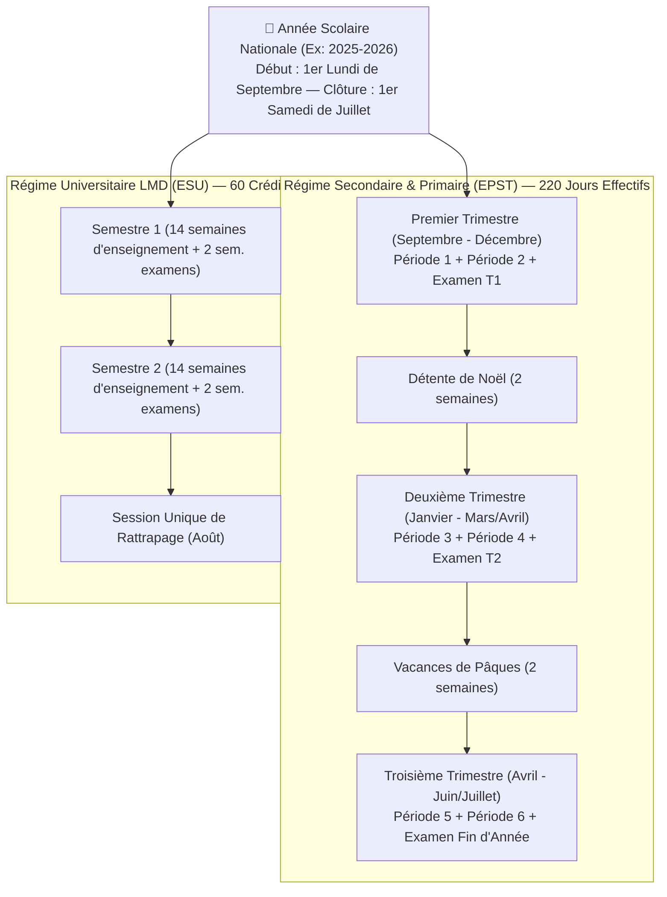
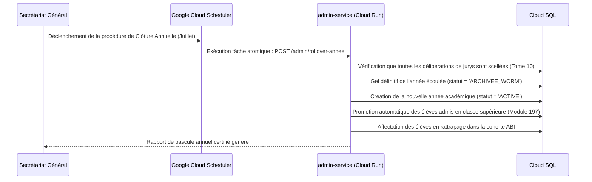

# Module 199 — Paramétrage des Années Académiques, Périodes et Calendriers

> **Positionnement :** Tome 11 — Administration et Communication Interne · Module 199 sur 210
> **Autorité :** Secrétariat Général EPST-ESU / Direction des Études
> **Liaison amont/aval :** ← Module 198 (Gestion administrative) → Module 200 (Gestion financière) →

---

## 1. Objet

Ce module régit la configuration temporelle, la planification pluriannuelle, la découpe périodique et le verrouillage des calendriers scolaires et académiques sur ELLYSIUM. Il intègre le calendrier officiel promulgué par le Ministre de l'Éducation Nationale de la RDC (minimum de 220 jours de cours annuels effectifs) et assure la transition automatisée entre années académiques.

---

## 2. Découpage Temporel Officiel en RDC



---

## 3. Paramètres Nationaux vs Adaptations Provinciales

Le Ministre de l'Éducation fixe le cadre national intangible, mais des variations climatiques ou logistiques sont admises selon les provinces de la RDC :

| Paramètre | Autorité Habilitée | Caractère Dérogatoire |
|---|---|---|
| **Date de la Rentrée des Classes** | Ministre National EPST | Intangible sauf cas de force majeure nationale (épidémie, conflit) |
| **Périodes des Examens d'État (EXETAT/TENASOSP)** | Inspection Générale | Calendrier unique synchrone pour les 26 provinces |
| **Congés Locaux / Fêtes Provinciales** | Gouverneur de Province | Tolérance de 3 jours ouvrables max par an, compensation obligatoire |
| **Minimum de 220 Jours de Classe** | Loi-Cadre de l'Enseignement | Seuil légal absolu : aucune délibération valide si quorum de jours non atteint |

---

## 4. Clôture d'Année et Bascule Automatisée (Rollover)

La transition d'une année académique à la suivante obéit à un protocole hautement sécurisé orchestré par **Google Cloud Scheduler** et **Cloud Run** :



---

## 5. Modèle de Données du Calendrier (Cloud SQL)

```sql
CREATE TABLE annees_academiques (
    id                      TEXT PRIMARY KEY, -- Ex: "2025-2026"
    date_debut              DATE NOT NULL,
    date_fin                DATE NOT NULL,
    statut                  TEXT NOT NULL DEFAULT 'PREPARATION' 
                            CHECK (statut IN ('PREPARATION', 'ACTIVE', 'CLOTUREE', 'ARCHIVEE')),
    nb_jours_cours_requis   INTEGER NOT NULL DEFAULT 220,
    created_at              TIMESTAMPTZ DEFAULT NOW()
);

CREATE TABLE periodes_scolaires (
    id                      UUID PRIMARY KEY DEFAULT gen_random_uuid(),
    annee_academique_id     TEXT NOT NULL REFERENCES annees_academiques(id),
    code_periode            TEXT NOT NULL, -- Ex: "T1_P1", "T1_EXAM", "S1"
    libelle                 TEXT NOT NULL,
    date_ouverture          DATE NOT NULL,
    date_fermeture_saisie   DATE NOT NULL, -- Verrouillage de saisie des cotes
    date_deliberation       DATE NOT NULL,
    est_verrouillee         BOOLEAN NOT NULL DEFAULT FALSE
);
```

---

## 6. Verrous Fonctionnels

| ID | Règle | Niveau |
|---|---|---|
| VF-199-01 | Respect impératif du seuil légal des 220 jours d'enseignement effectif | CONSTITUTIONNEL |
| VF-199-02 | Verrouillage automatique de la saisie des cotes à la date de fermeture fixée | OBLIGATOIRE |
| VF-199-03 | Une seule année académique active à la fois par établissement | TECHNIQUE |
| VF-199-04 | Impossibilité de clôturer l'année sans que 100% des jurys soient scellés | LÉGAL |
| VF-199-05 | L'historique des calendriers est archivé de manière inaltérable (Cloud Storage) | OBLIGATOIRE |
| VF-199-06 | Toute opération administrative est réversible jusqu'à validation humaine explicite par le responsable hiérarchique | OBLIGATOIRE |

---

*Sous-tome rédigé conformément aux Normes documentaires ELLYSIUM — Fondations 04.*
