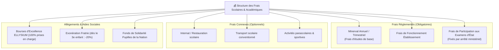

# Module 200 — Gestion Financière — Frais, Échéanciers, Bourses, Exonérations

> **Positionnement :** Tome 11 — Administration et Communication Interne · Module 200 sur 210
> **Autorité :** Direction Administrative et Financière / Comité de Gestion des Bourses
> **Liaison amont/aval :** ← Module 199 (Calendriers) → Module 201 (Module Caisse) →

---

## 1. Objet

Ce module définit la gouvernance des frais scolaires et académiques au sein d'ELLYSIUM : tarification bimonétaire (CDF / USD), échéanciers de paiement convenus avec les parents, relances bienveillantes, politique d'exonérations sociales et attribution souveraine de bourses d'excellence ou de solidarité nationale.

---

## 2. Principes Constitutionnels et Éthiques

1. **Étanchéité Pédagogie / Finances (Article 5)** : Aucune donnée de retard de paiement n'est visible sur les fiches de cotes, bulletins ou interfaces pédagogiques des professeurs.
2. **Gratuité Absolue des Apprenants Indépendants (Article 4)** : Les candidats libres (AIS/AIU) sont totalement exemptés de facturation ou de minerval.
3. **Plafonnement Réglementaire** : Les frais fixés par les écoles partenaires doivent strictement respecter les arrêtés des Gouverneurs de province et les directives du Ministère de tutelle.

---

## 3. Typologie des Frais et Échéanciers



---

## 4. Politique d'Échéanciers et Relances Éthiques

Pour s'adapter aux flux de trésorerie réels des ménages congolais (salaires mensuels, activités informelles, cours des matières premières) :

- **Échelonnement Flexible** : Possibilité de paiement en 3 tranches trimestrielles ou en 10 mensualités égales.
- **Relances Dématérialisées Non Culpabilisantes** :
  - Envoi d'un rappel SMS bienveillant à J-5 de l'échéance.
  - Deuxième rappel à J+5 sans interruption de service.
  - Prise de contact personnalisée par le service social à J+15 pour proposer un rééchelonnement adapté.
  - **Interdiction formelle de chasser l'enfant de la classe** pour défaut de paiement des parents.

---

## 5. Bourses d'Excellence et Exonérations Sociales

ELLYSIUM intègre un moteur d'attribution automatique et équitable des aides :

| Type d'Aide | Critères d'Éligibilité | Taux de Prise en Charge | Source de Financement |
|---|---|---|---|
| **Bourse d'Excellence Nationale** | Taux global $\ge 85\%$ à l'EXETAT ou au diplôme | 100% Minerval + Équipement | Fonds Souverain ELLYSIUM / Bailleurs |
| **Bourse Inclusion Jeune Fille** | Filles inscrites en filières scientifiques et techniques (STEM) | 50% à 100% Minerval | Partenariat Égalité des Chances |
| **Exonération Fratrie** | Même foyer fiscal avec $\ge 3$ enfants inscrits | -20% sur le 3e, -40% sur le 4e et suivants | Péréquation établissement |
| **Pupilles de la Nation & Réfugiés** | Orphelins de guerre, déplacés internes certifiés | 100% Gratuité totale | Subvention d'État / Aide humanitaire |

---

## 6. Modèle de Données Facturation (Cloud SQL)

```sql
CREATE TABLE echeanciers_facturation (
    id                      UUID PRIMARY KEY DEFAULT gen_random_uuid(),
    eleve_id                UUID NOT NULL REFERENCES users(id),
    etablissement_id        UUID NOT NULL REFERENCES etablissements(id),
    annee_academique        TEXT NOT NULL,
    montant_total_cdf       NUMERIC(12,2) NOT NULL,
    montant_total_usd       NUMERIC(10,2) NOT NULL,
    taux_bourse_pct         NUMERIC(5,2) DEFAULT 0.00,
    motif_bourse            TEXT,
    montant_net_a_payer_cdf NUMERIC(12,2) GENERATED ALWAYS AS (
                                montant_total_cdf * (1 - taux_bourse_pct / 100)
                            ) STORED,
    nb_tranches             INTEGER NOT NULL DEFAULT 3,
    statut_reglement        TEXT NOT NULL DEFAULT 'EN_COURS' 
                            CHECK (statut_reglement IN ('EN_COURS', 'SOLDE', 'ARRIERE', 'CONTENTIEUX')),
    created_at              TIMESTAMPTZ DEFAULT NOW()
);
```

---

## 7. Verrous Fonctionnels

| ID | Règle | Niveau |
|---|---|---|
| VF-200-01 | Interdiction absolue de refouler un enfant d'un cours pour retard de minerval | CONSTITUTIONNEL |
| VF-200-02 | Les candidats libres (AIS/AIU) ne peuvent avoir aucun enregistrement de facturation | CONSTITUTIONNEL |
| VF-200-03 | Tarifs des écoles partenaires plafonnés par les arrêtés provinciaux officiels | LÉGAL |
| VF-200-04 | Traitement des relances financières réservé exclusivement au contact parent/tuteur | OBLIGATOIRE |
| VF-200-05 | Les bourses d'excellence attribuées sont inaliénables pour toute l'année académique | INSTITUTIONNEL |
| VF-200-06 | Toute opération administrative est réversible jusqu'à validation humaine explicite par le responsable hiérarchique | OBLIGATOIRE |

---

*Sous-tome rédigé conformément aux Normes documentaires ELLYSIUM — Fondations 04.*
