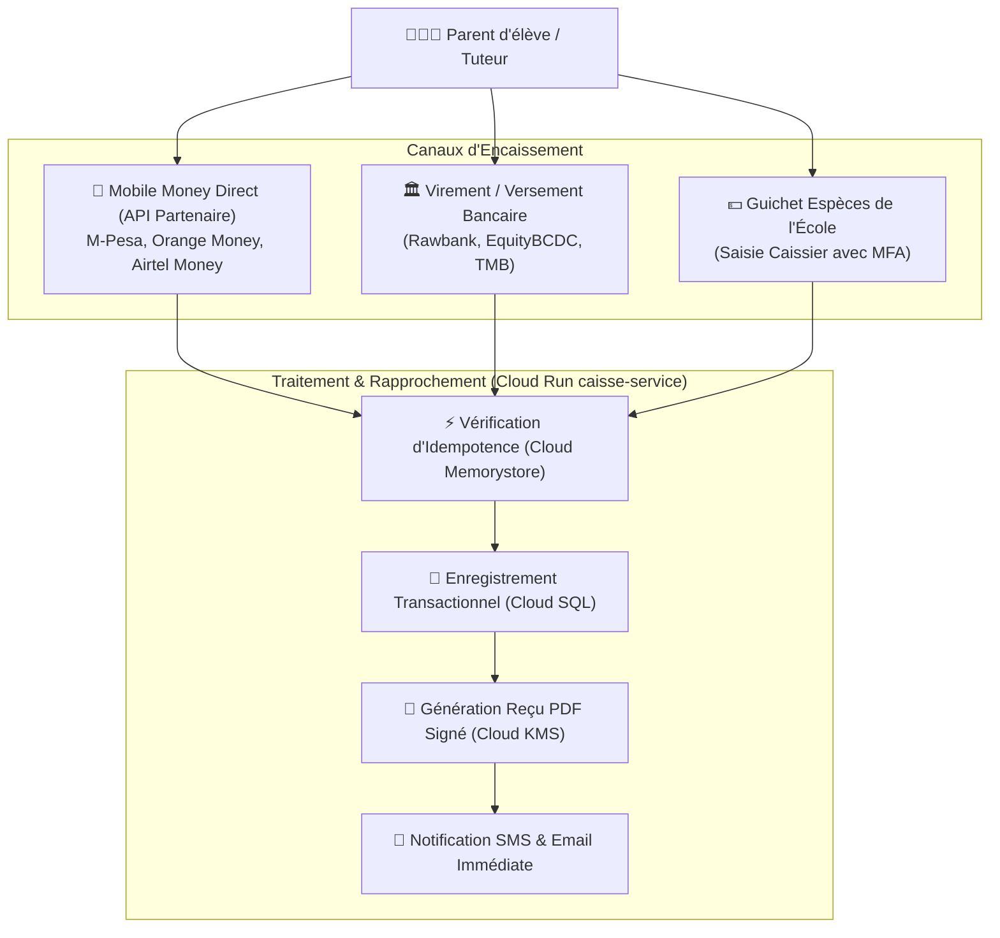

# Module 201 — Module Caisse — Encaissements, Reçus, Rapprochement

> **Positionnement :** Tome 11 — Administration et Communication Interne · Module 201 sur 210
> **Autorité :** Direction Financière / Trésorerie Centrale ELLYSIUM / Conformité OHADA
> **Liaison amont/aval :** ← Module 200 (Gestion financière) → Module 202 (Paie enseignante) →

---

## 1. Objet

Ce module opérationnalise les flux d'encaissement de la caisse d'établissement et de la plateforme centrale ELLYSIUM. Il encadre les paiements multicanaux (Mobile Money M-Pesa, Orange Money, Airtel Money, espèces guichet, virements bancaires), l'émission instantanée de reçus fiscaux numériquement signés et le rapprochement comptable quotidien conforme aux normes SYSCOHADA.

---

## 2. Architecture de Caisse Sécurisée Bimonétaire

L'économie de la République Démocratique du Congo étant structurellement bimonétaire, le module caisse gère nativement et simultanément les flux en **Francs Congolais (CDF)** et en **Dollars Américains (USD)** :



---

## 3. Idempotence Absolue des Transactions

Pour parer aux micro-coupures de connexion fréquentes sur les réseaux mobiles congolais :
- Chaque intention de paiement génère un jeton d'idempotence unique :
  $$\text{Clé Idempotence} = \text{SHA-256}(\text{IUNE} + \text{Montant} + \text{Tranche} + \text{HorodatageMinute})$$
- Si un parent clique plusieurs fois ou si la requête est rejouée par l'opérateur Mobile Money, la transaction n'est exécutée qu'une seule fois et le reçu déjà généré est renvoyé sans double débit.

---

## 4. Spécifications du Reçu de Caisse Officiel

Le reçu généré par ELLYSIUM constitue un titre libératoire probant vis-à-vis de l'école et de l'administration fiscale :

```
┌────────────────────────────────────────────────────────────────────────┐
│               RÉPUBLIQUE DÉMOCRATIQUE DU CONGO                         │
│             CENTRE NATIONAL D'ÉTUDE EN LIGNE ELLYSIUM                  │
│                     REÇU DE PAIEMENT SOUVERAIN                         │
├────────────────────────────────────────────────────────────────────────┤
│ Réf. Transaction : REC-2026-KIN-008149                                │
│ Date & Heure     : 2026-09-17 14:32:05 (Kinshasa UTC+1)                │
│ IUNE Élève       : CD-EL-2025-01428590                                 │
│ Nom & Post-nom   : KABEYA TSHIMANGA David                              │
│ Établissement    : Complexe Scolaire Saint-Joseph (Gombe)              │
│ Classe           : 6e Humanités Scientifiques                          │
├────────────────────────────────────────────────────────────────────────┤
│ Motif            : Minerval - 1ère Tranche (2025-2026)                 │
│ Montant Payé     : 150.000 CDF (Équivalent : 52,50 USD)                │
│ Mode de Paiement : M-Pesa RDC (Réf Opérateur : MP-9948271)             │
│ Reste à Payer    : 0 CDF pour la tranche                               │
├────────────────────────────────────────────────────────────────────────┤
│ QR Code Authentique : https://verification.ellysium.cd/recu/REC-...    │
│ Signature KMS    : 3f8a...b721 (Certifiée par ELLYSIUM Trust Root)    │
└────────────────────────────────────────────────────────────────────────┘
```

---

## 5. Rapprochement Bancaire et Clôture Journalière de Caisse

Chaque jour à **17h00 (heure locale)**, le système déclenche un arrêté automatique des écritures :
1. **Totalisation des flux par devise** : $\sum \text{CDF}$ et $\sum \text{USD}$.
2. **Réconciliation API Mobile Money** : Comparaison automatique des relevés télématiques fournis par Vodacom, Orange et Airtel avec les transactions enregistrées en base de données.
3. **PV de Caisse Journalier** : Génération du procès-verbal de caisse signé par le caissier et visé par le Directeur/Promoteur.
4. **Détection des Écarts** : Tout écart supérieur à zéro génère un ticket d'audit immédiat auprès du DAF.

---

## 6. Verrous Fonctionnels

| ID | Règle | Niveau |
|---|---|---|
| VF-201-01 | Idempotence obligatoire sur tout encaissement : interdiction absolue du double prélèvement | TECHNIQUE |
| VF-201-02 | Signature numérique de chaque reçu avec clé matérielle Cloud KMS (non répudiable) | SÉCURITÉ |
| VF-201-03 | Les données de caisse sont hermétiquement isolées du domaine pédagogique (Art. 5) | CONSTITUTIONNEL |
| VF-201-04 | Arrêté et clôture de caisse quotidiens obligatoires avec journalisation WORM | COMPTABLE |
| VF-201-05 | Conservation légale des écritures et reçus pendant 10 ans (Norme SYSCOHADA) | LÉGAL |

---

*Sous-tome rédigé conformément aux Normes documentaires ELLYSIUM — Fondations 04.*
