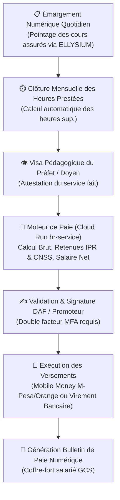

# Module 202 — Gestion de la Paie Enseignante (Contrats, Heures, Versements)

> **Positionnement :** Tome 11 — Administration et Communication Interne · Module 202 sur 210
> **Autorité :** Direction des Ressources Humaines / Direction Financière / Délégués Syndicaux
> **Liaison amont/aval :** ← Module 201 (Module Caisse) → Module 203 (Documents administratifs) →

---

## 1. Objet

Ce module régit la rémunération, le suivi de la charge horaire, les déclarations fiscales et sociales et le versement automatisé des salaires et primes du corps professoral et des agents administratifs. Il garantit la régularité des paiements, la valorisation du travail réel presté et la conformité au Code du Travail de la République Démocratique du Congo.

---

## 2. Typologie des Contrats et Régimes de Rémunération

| Type de Statut | Mode de Calcul | Composantes de Rémunération |
|---|---|---|
| **Enseignant Permanent (Temps Plein)** | Salaire de base mensuel fixe | Salaire de base + Prime de craie + Prime de transport + Allocations familiales |
| **Chargé de Cours Vacataire** | Rémunération horaire à la vacation | Taux horaire négocié $\times$ Nombre d'heures effectives émargées |
| **Tuteur Virtuel ELLYSIUM (En ligne)** | Rémunération hybride | Forfait de suivi d'apprenants + Primes d'animation de webinaires |
| **Personnel Administratif & Technique** | Salaire barémique indiciaire | Salaire mensuel contractuel selon la grille de l'établissement |

---

## 3. Workflow de Calcul et de Validation de la Paie



---

## 4. Retenues Légales et Fiscales en RDC

Le moteur de paie applique automatiquement les retenues prévues par la législation congolaise :
1. **IPR (Impôt Professionnel sur les Rémunérations)** : Barème progressif officiel par tranches (Direction Générale des Impôts - DGI).
2. **Cotisations Sociales CNSS (Caisse Nationale de Sécurité Sociale)** :
   - Part ouvrière : 5 % retenue sur le salaire brut.
   - Part patronale : 13 % (charge établissement).
3. **INPP (Institut National de Préparation Professionnelle)** : Cotisation patronale légale de formation.
4. **ONEM (Office National de l'Emploi)** : Contribution légale pour la promotion de l'emploi.

---

## 5. Canaux de Versement et Primes Mobiles

Pour répondre aux défis de bancarisation dans les territoires provinciaux de la RDC :
- **Versement Mobile Money Direct** : Paiement instantané et sans frais de retrait sur le compte M-Pesa, Airtel Money ou Orange Money de l'enseignant le 28 de chaque mois.
- **Virement Bancaire Automatisé** : Fichier de virement interbancaire au format ISO 20022 pour les établissements bancarisés (Rawbank, EquityBCDC).
- **Alerte SMS de Paie** : Réception d'un SMS notifiant le montant net crédité et le lien sécurisé vers le bulletin de paie dématérialisé.

---

## 6. Structure de la Table de Paie (Cloud SQL)

```sql
CREATE TABLE bulletins_paie (
    id                      UUID PRIMARY KEY DEFAULT gen_random_uuid(),
    personnel_id            UUID NOT NULL REFERENCES users(id),
    etablissement_id        UUID NOT NULL REFERENCES etablissements(id),
    mois                    INTEGER NOT NULL CHECK (mois BETWEEN 1 AND 12),
    annee                   INTEGER NOT NULL,
    salaire_base_cdf        NUMERIC(12,2) NOT NULL,
    primes_transport_cdf    NUMERIC(10,2) DEFAULT 0.00,
    prime_craie_cdf         NUMERIC(10,2) DEFAULT 0.00,
    heures_sup_heures       NUMERIC(5,2) DEFAULT 0.00,
    montant_heures_sup_cdf  NUMERIC(10,2) DEFAULT 0.00,
    brut_imposable_cdf      NUMERIC(12,2) NOT NULL,
    retenue_ipr_cdf         NUMERIC(10,2) NOT NULL,
    retenue_cnss_cdf        NUMERIC(10,2) NOT NULL,
    net_a_payer_cdf         NUMERIC(12,2) NOT NULL,
    mode_versement          TEXT NOT NULL CHECK (mode_versement IN ('MOBILE_MONEY', 'BANQUE', 'ESPECES')),
    statut_versement        TEXT NOT NULL DEFAULT 'EN_ATTENTE' CHECK (statut_versement IN ('EN_ATTENTE', 'PAYE', 'ECHOUE')),
    date_versement          TIMESTAMPTZ,
    hash_bulletin_sha256    TEXT NOT NULL,
    uri_pdf_gcs             TEXT NOT NULL,
    created_at              TIMESTAMPTZ DEFAULT NOW(),
    CONSTRAINT unique_paie_agent_mois UNIQUE (personnel_id, mois, annee)
);
```

---

## 7. Verrous Fonctionnels

| ID | Règle | Niveau |
|---|---|---|
| VF-202-01 | Respect impératif de la date de paie fixée au 28 du mois calendaire | SOCIAL |
| VF-202-02 | Calcul automatique et rigoureux des retenues fiscales IPR et cotisations CNSS | LÉGAL |
| VF-202-03 | Les heures prestées doivent être préalablement visées par le Préfet ou Doyen | PÉDAGOGIQUE |
| VF-202-04 | Bulletin de paie accessible à vie dans le coffre-fort numérique de l'enseignant | OBLIGATOIRE |
| VF-202-05 | Double validation obligatoire (DAF + Promoteur avec MFA) avant tout virement | SÉCURITÉ |
| VF-202-06 | Toute opération administrative est réversible jusqu'à validation humaine explicite par le responsable hiérarchique | OBLIGATOIRE |

---

*Sous-tome rédigé conformément aux Normes documentaires ELLYSIUM — Fondations 04.*
