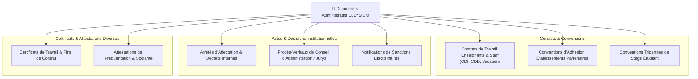
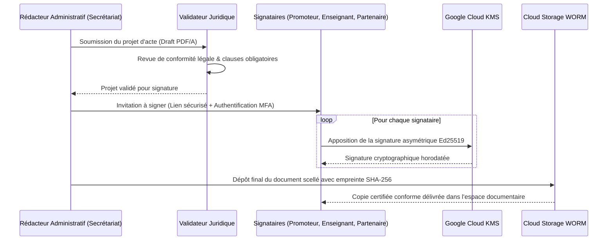

# Module 203 — Gestion des Documents Administratifs (Contrats, Conventions, PV)

> **Positionnement :** Tome 11 — Administration et Communication Interne · Module 203 sur 210
> **Autorité :** Secrétariat Général / Service Juridique et Archives Administratives
> **Liaison amont/aval :** ← Module 202 (Paie) → Module 204 (Messagerie interne) →

---

## 1. Objet

Ce module régit la production, la validation collaborative, la signature numérique et l'archivage sécurisé des documents juridiques et administratifs de l'écosystème ELLYSIUM : contrats d'engagement du personnel, conventions de partenariat avec les écoles et universités, procès-verbaux (PV) d'assemblées générales et arrêtés internes d'affectation.

---

## 2. Typologie des Documents Administratifs



---

## 3. Workflow de Signature Électronique Dématérialisée

ELLYSIUM intègre une chaîne de signature électronique à valeur probante conforme à la loi congolaise sur les télécommunications et les transactions numériques :



---

## 4. Modèle de Sécurité Documentaire (Google Cloud Storage)

Chaque catégorie de document est classée dans un compartiment GCS étanche :
- **Documents Publics / Arrêtés Institutionnels** : `gs://ellysium-prod-docs/public/arretes/` (distribué via Cloud CDN).
- **Documents RH Confidentiels** : `gs://ellysium-prod-docs/rh/contrats/` (accès restreint IAM, chiffrement Cloud KMS avec clé dédiée `rh-crypto-key`).
- **Conventions d'Écoles** : `gs://ellysium-prod-docs/partenariats/` (verrouillage de rétention WORM de 10 ans).

---

## 5. Table de Gestion des Actes Administratifs (Cloud SQL)

```sql
CREATE TABLE actes_administratifs (
    id                      UUID PRIMARY KEY DEFAULT gen_random_uuid(),
    reference_acte          TEXT UNIQUE NOT NULL, -- Ex: "CONV-2026-KIN-0042"
    type_acte               TEXT NOT NULL CHECK (type_acte IN ('CONTRAT_TRAVAIL', 'CONVENTION_ECOLE', 'PV_CONSEIL', 'ARRETE', 'CONVENTION_STAGE')),
    titre                   TEXT NOT NULL,
    parties_prenantes       JSONB NOT NULL, -- Tableau des identifiants utilisateurs / écoles signataires
    statut                  TEXT NOT NULL DEFAULT 'BROUILLON' CHECK (statut IN ('BROUILLON', 'EN_SIGNATURE', 'SCELLE_VALIDE', 'RESILIE', 'CADUC')),
    date_effet              DATE NOT NULL,
    date_expiration         DATE,
    hash_sha256             TEXT NOT NULL,
    uri_gcs_pdf             TEXT NOT NULL,
    signatures_collectees   JSONB DEFAULT '[]'::JSONB,
    created_at              TIMESTAMPTZ DEFAULT NOW(),
    scelle_at               TIMESTAMPTZ
);
```

---

## 6. Verrous Fonctionnels

| ID | Règle | Niveau |
|---|---|---|
| VF-203-01 | Tout contrat ou convention est scellé par signature numérique Cloud KMS certifiée | SÉCURITÉ |
| VF-203-02 | Conservation minimale de 10 ans pour les contrats de travail et conventions d'école | LÉGAL |
| VF-203-03 | Format PDF/A obligatoire pour garantir la pérennité de lecture sur plusieurs décennies | TECHNIQUE |
| VF-203-04 | Révocation ou résiliation enregistrée obligatoirement avec acte de dénonciation joint | JURIDIQUE |
| VF-203-05 | Accès aux contrats RH strictement interdit aux administrateurs pédagogiques locaux | CONSTITUTIONNEL |

---

*Sous-tome rédigé conformément aux Normes documentaires ELLYSIUM — Fondations 04.*
