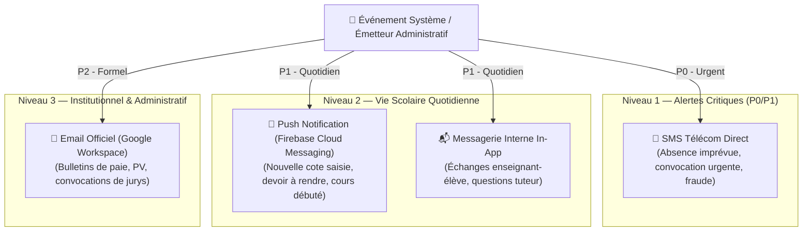

# Module 204 — Messagerie Interne et Notifications Multicanaux

> **Positionnement :** Tome 11 — Administration et Communication Interne · Module 204 sur 210
> **Autorité :** Direction de la Communication et des Relations Usagers / RSSI
> **Liaison amont/aval :** ← Module 203 (Documents administratifs) → Module 205 (Communiqués officiels) →

---

## 1. Objet

Ce module définit l'architecture et les protocoles de routage de la messagerie interne et du moteur de notifications multicanales d'ELLYSIUM. Il intègre **Firebase Cloud Messaging (FCM)** pour les notifications mobiles instantanées, l'envoi de **SMS souverains** via les passerelles télécoms locales (Vodacom, Airtel, Orange), l'intégration **Google Workspace for Education** pour la messagerie institutionnelle et une messagerie sécurisée interne respectant la vie privée des apprenants mineurs.

---

## 2. Matrice des Canaux selon la Criticité



---

## 3. Architecture Technique des Notifications (Google Cloud Platform)

Conformément à la **DOCTRINE INFRASTRUCTURE GOOGLE** :

- **Bus d'Événements Asynchrone** : **Google Cloud Pub/Sub** pour le découplage et la résilience lors des pics d'envoi (ex: 200 000 notifications lors de la publication nationale des bulletins).
- **Consommateur de Messages** : **Google Cloud Run** (`notification-worker`), gérant l'idempotence et les files d'attente prioritaires.
- **Routage Mobile** : **Firebase Cloud Messaging (FCM)** garantissant une réception à faible consommation de données sur appareils Android basiques.
- **Passerelles SMS RDC** : Agrégation de connexions SMPP directes avec Vodacom M-Pesa/SMS, Airtel RDC et Orange RDC.

---

## 4. Protection des Mineurs et Règles Éthiques de Messagerie

1. **Étanchéité des Échanges Enseignant-Élève Mineur** :
   - Tout message privé envoyé par un enseignant à un élève de moins de 18 ans est **automatiquement mis en copie cachée visible dans l'espace du parent/tuteur**.
   - Interdiction formelle des échanges vocaux ou d'images non pédagogiques en messagerie individuelle.
2. **Modération Automatisée Temps Réel (Vertex AI)** :
   - Détection des propos haineux, harcèlement, sollicitations déplacées ou langage inapproprié en français et dans les 4 langues nationales (Lingala, Swahili, Kikongo, Tshiluba).
   - Tout signalement suspect bascule en alerte immédiate auprès du Préfet et du DPO.
3. **Droit à la Déconnexion** :
   - Blocage des notifications non urgentes entre **21h00 et 06h00 (heure locale)** pour préserver le repos des enfants et des enseignants.

---

## 5. Modèle de Données des Messages (Cloud SQL)

```sql
CREATE TABLE notifications_systeme (
    id                      UUID PRIMARY KEY DEFAULT gen_random_uuid(),
    destinataire_id         UUID NOT NULL REFERENCES users(id),
    canal                   TEXT NOT NULL CHECK (canal IN ('PUSH_FCM', 'SMS', 'EMAIL', 'IN_APP')),
    priorite                TEXT NOT NULL DEFAULT 'NORMALE' CHECK (priorite IN ('URGENTE', 'NORMALE', 'BASSE')),
    titre                   TEXT NOT NULL,
    corps                   TEXT NOT NULL,
    donnees_charge_utile    JSONB,
    statut_envoi            TEXT NOT NULL DEFAULT 'EN_ATTENTE' CHECK (statut_envoi IN ('EN_ATTENTE', 'ENVOYE', 'LIVRE', 'ECHOUE')),
    tentatives              INTEGER DEFAULT 0,
    horodatage_creation     TIMESTAMPTZ DEFAULT NOW(),
    horodatage_envoi        TIMESTAMPTZ,
    horodatage_lecture      TIMESTAMPTZ
);

CREATE INDEX idx_notif_destinataire ON notifications_systeme (destinataire_id, statut_envoi);
```

---

## 6. Verrous Fonctionnels

| ID | Règle | Niveau |
|---|---|---|
| VF-204-01 | Copie systématique au parent de tout message adressé à un élève mineur | PROTECTION |
| VF-204-02 | Notification d'absence transmise par SMS dans les 5 minutes ouvrables | OBLIGATOIRE |
| VF-204-03 | Modération automatique par Vertex AI active sur tous les messages internes | SÉCURITÉ |
| VF-204-04 | Droit à la déconnexion : aucune notification ordinaire entre 21h et 06h | ÉTHIQUE |
| VF-204-05 | Chiffrement au repos (AES-256) de toutes les archives de conversations internes | CONSTITUTIONNEL |
| VF-204-06 | Toute opération administrative est réversible jusqu'à validation humaine explicite par le responsable hiérarchique | OBLIGATOIRE |

---

*Sous-tome rédigé conformément aux Normes documentaires ELLYSIUM — Fondations 04.*
