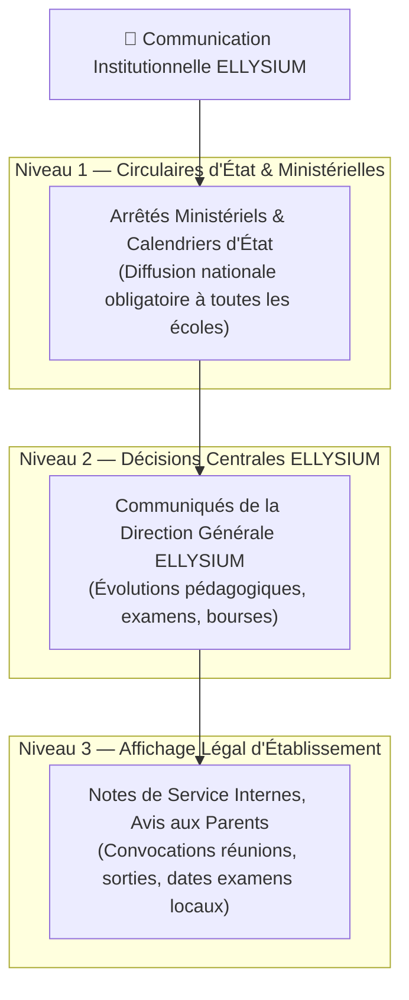

# Module 205 — Communiqués Officiels et Affichage Institutionnel

> **Positionnement :** Tome 11 — Administration et Communication Interne · Module 205 sur 210
> **Autorité :** Porte-parole Institutionnel / Secrétariat Général / Direction de la Communication
> **Liaison amont/aval :** ← Module 204 (Messagerie) → Module 206 (Réunions virtuelles) →

---

## 1. Objet

Ce module régit la publication, la diffusion certifiée, le scellement et l'archivage des communiqués officiels, avis aux parents, circulaires administratives et affichages légaux émanant du Ministère de tutelle, de la Direction Générale ELLYSIUM ou de la direction des établissements scolaires partenaires.

---

## 2. Typologie de la Communication Institutionnelle



---

## 3. Circuit de Validation et Scellement Cryptographique

Pour éliminer définitivement le phénomène des fausses circulaires ou rumeurs de suspension de cours circulant sur les réseaux sociaux :
1. **Rdaction & Double Visa** : Le projet de communiqué est rédigé par le secrétariat et validé conjointement par le Directeur et le Préfet des Études.
2. **Scellement Numérique Cloud KMS** : Apposition de la signature asymétrique de l'institution et d'un QR code infalsifiable.
3. **Diffusion Synchrone Multicanale** :
   - Publication sur le **Tableau d'Affichage Numérique** de l'espace parent/élève (PWA et app mobile).
   - Notification Push FCM immédiate.
   - Dépôt automatique du document PDF/A officiel téléchargeable.
4. **Authentification Instantanée** : Tout usager peut scanner le QR Code du communiqué pour vérifier sur `verification.ellysium.cd` si le document est authentique, actif ou démenti.

---

## 4. Spécifications du Tableau d'Affichage Numérique (In-App)

- **Accessibilité Universelle** : Rendu visuel optimisé, traduit automatiquement en français et disponible avec synthèse vocale en langues nationales (Lingala, Swahili, Kikongo, Tshiluba) pour les parents analphabètes.
- **Accusé de Prise de Connaissance Numérique** : Pour les notes de service ou convocations critiques, les parents doivent cliquer sur un bouton *"J'ai pris connaissance"* générant un horodatage d'émargement légal.
- **Épinglage Prioritaire (Bannière d'Urgence)** : Les communiqués d'alerte météorologique, sanitaire ou sécuritaire s'affichent en bandeau rouge persistant en haut de l'application.

---

## 5. Modèle de Données des Communiqués (Cloud SQL)

```sql
CREATE TABLE communiques_officiels (
    id                      UUID PRIMARY KEY DEFAULT gen_random_uuid(),
    reference_officielle    TEXT UNIQUE NOT NULL, -- Ex: "COM-2026-NAT-0012"
    emetteur_type           TEXT NOT NULL CHECK (emetteur_type IN ('MINISTERE', 'DIRECTION_GENERALE', 'ETABLISSEMENT')),
    etablissement_id        UUID REFERENCES etablissements(id), -- NULL si national
    portee                  TEXT NOT NULL CHECK (portee IN ('NATIONALE', 'PROVINCIALE', 'ETABLISSEMENT', 'CLASSE')),
    titre                   TEXT NOT NULL,
    corps_texte             TEXT NOT NULL,
    priorite                TEXT NOT NULL DEFAULT 'NORMALE' CHECK (priorite IN ('URGENTE', 'NORMALE', 'INFORMATION')),
    exige_accuse_lecture    BOOLEAN NOT NULL DEFAULT FALSE,
    date_publication        TIMESTAMPTZ DEFAULT NOW(),
    date_expiration         DATE,
    signature_kms_token     TEXT NOT NULL,
    hash_sha256             TEXT NOT NULL,
    uri_pdf_gcs             TEXT NOT NULL
);
```

---

## 6. Verrous Fonctionnels

| ID | Règle | Niveau |
|---|---|---|
| VF-205-01 | Tout communiqué officiel est scellé par signature numérique Cloud KMS vérifiable | CONSTITUTIONNEL |
| VF-205-02 | Disponibilité vocale des annonces majeures dans les 4 langues nationales | INCLUSION |
| VF-205-03 | Impossibilité de modifier un communiqué après publication (amendement par erratum) | OBLIGATOIRE |
| VF-205-04 | Rétention illimitée de l'historique des communiqués dans le registre public | ARCHIVE |
| VF-205-05 | Affichage obligatoire en bandeau d'urgence pour les alertes sanitaires et sécuritaires | SÉCURITÉ CIVILE |
| VF-205-06 | Toute opération administrative est réversible jusqu'à validation humaine explicite par le responsable hiérarchique | OBLIGATOIRE |

---

*Sous-tome rédigé conformément aux Normes documentaires ELLYSIUM — Fondations 04.*
