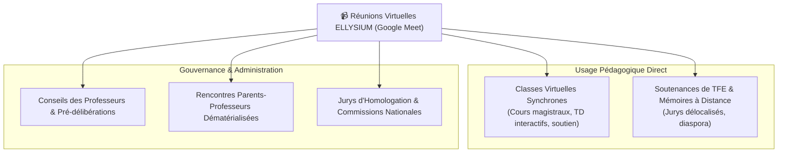
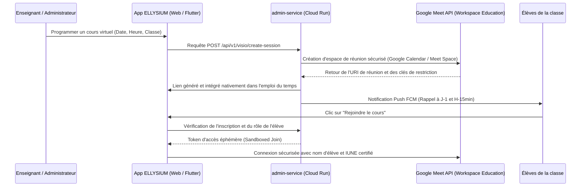

# Module 206 — Gestion des Réunions Virtuelles (Google Meet API / Workspace)

> **Positionnement :** Tome 11 — Administration et Communication Interne · Module 206 sur 210
> **Autorité :** Direction Technique / Responsable Collaboration Google Workspace
> **Liaison amont/aval :** ← Module 205 (Communiqués) → Module 207 (Support usagers) →

---

## 1. Objet

Ce module formalise l'orchestration, la programmation sécurisée, l'intégration applicative et le contrôle d'accès aux visioconférences et classes virtuelles au sein d'ELLYSIUM. Conformément à la **DOCTRINE INFRASTRUCTURE GOOGLE**, ce service s'appuie nativement sur **Google Meet API** et **Google Workspace for Education**, éliminant toute solution tierce ou auto-hébergée fragile.

---

## 2. Cas d'Usage Institutionnels de la Réunion Virtuelle



---

## 3. Architecture d'Intégration Google Meet API



---

## 4. Sécurité et Contrôle Pédagogique (Host Controls)

Pour prévenir tout dérapage, intrusion (*zoombombing*) ou perturbation :
- **Verrouillage de la Salle d'Attente** : Les élèves ne peuvent entrer dans la réunion avant que l'enseignant titulaire (Host certifié) ne soit connecté.
- **Désactivation Automatique des Micros et Caméras** : À l'entrée des élèves pour préserver la bande passante collective (frugalité réseau congolaise).
- **Enregistrement Pédagogique Automatique (Cloud Storage)** : Si le cours est enregistré pour rediffusion asynchrone, le fichier MP4 est directement versé dans le bucket GCS de la classe et mis à disposition des élèves absents ou en zone enclavée.
- **Identité Certifiée Obligatoire** : Aucun participant anonyme n'est autorisé. Seuls les comptes authentifiés Google Workspace ELLYSIUM avec l'IUNE validé peuvent rejoindre.

---

## 5. Mode Frugal et Optimisation Réseau (2G / 3G)

Google Meet intègre une adaptation dynamique de débit, renforcée par ELLYSIUM :
- **Mode Audio Seul / Partage d'Écran Frugal** : Réduction du flux vidéo à 180p ou bascule automatique en flux audio basse consommation (12 kbps Opus) lorsque la latence réseau dépasse 350 ms.
- **Sous-titrage Automatique en Temps Réel** : Transcription textuelle directe activable pour les élèves malentendants ou en environnement bruyant.

---

## 6. Table de Suivi des Sessions Virtuelles (Cloud SQL)

```sql
CREATE TABLE sessions_virtuelles (
    id                      UUID PRIMARY KEY DEFAULT gen_random_uuid(),
    etablissement_id        UUID NOT NULL REFERENCES etablissements(id),
    classe_id               UUID REFERENCES classes(id),
    organisateur_id         UUID NOT NULL REFERENCES users(id),
    titre_reunion           TEXT NOT NULL,
    type_reunion            TEXT NOT NULL CHECK (type_reunion IN ('COURS', 'SOUTENANCE', 'CONSEIL_DISCIPLINE', 'REUNION_PARENTS')),
    meet_space_uri          TEXT NOT NULL,
    date_heure_debut        TIMESTAMPTZ NOT NULL,
    duree_minutes_prevue    INTEGER NOT NULL DEFAULT 60,
    est_enregistree         BOOLEAN NOT NULL DEFAULT FALSE,
    uri_enregistrement_gcs  TEXT,
    nb_participants_reels   INTEGER DEFAULT 0,
    statut                  TEXT NOT NULL DEFAULT 'PROGRAMMEE' CHECK (statut IN ('PROGRAMMEE', 'EN_COURS', 'CLOTUREE', 'ANNULEE')),
    created_at              TIMESTAMPTZ DEFAULT NOW()
);
```

---

## 7. Verrous Fonctionnels

| ID | Règle | Niveau |
|---|---|---|
| VF-206-01 | Intégration exclusive de Google Meet API (proscription totale des outils tiers non-Google) | CONSTITUTIONNEL |
| VF-206-02 | Accès interdit à tout participant non authentifié par son compte IUNE | SÉCURITÉ |
| VF-206-03 | Les cours virtuels ne peuvent démarrer sans la présence connectée de l'enseignant | PÉDAGOGIQUE |
| VF-206-04 | Enregistrements de cours stockés exclusivement sur Google Cloud Storage | CONSTITUTIONNEL |
| VF-206-05 | Mode basse consommation obligatoire activé par défaut pour les zones rurales | TECHNIQUE |
| VF-206-06 | Toute opération administrative est réversible jusqu'à validation humaine explicite par le responsable hiérarchique | OBLIGATOIRE |

---

*Sous-tome rédigé conformément aux Normes documentaires ELLYSIUM — Fondations 04.*
