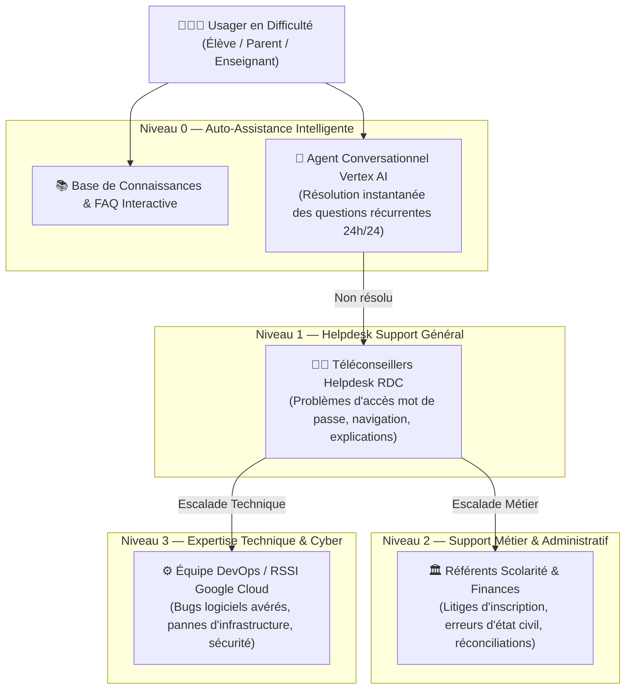

# Module 207 — Support Utilisateur et Gestion des Tickets d'Assistance

> **Positionnement :** Tome 11 — Administration et Communication Interne · Module 207 sur 210
> **Autorité :** Direction de l'Expérience Usager / Responsable Helpdesk National
> **Liaison amont/aval :** ← Module 206 (Réunions virtuelles) → Module 208 (Tableaux de bord administratifs) →

---

## 1. Objet

Ce module définit l'architecture et les processus opérationnels du centre d'assistance et de support technique aux usagers d'ELLYSIUM (élèves, parents, enseignants, administrateurs scolaires). Il associe un **triage intelligent assisté par Vertex AI**, une gestion stricte des engagements de service (SLO/SLA) et un routage vers des téléconseillers humains basés en République Démocratique du Congo.

---

## 2. Typologie et Niveaux d'Assistance (L1, L2, L3)



---

## 3. Canaux de Dépôt de Ticket Dématérialisés

Pour garantir l'accessibilité dans toute la RDC :
1. **Module In-App Dédié** : Bouton *"Besoin d'aide ?"* présent sur chaque écran avec capture automatique du contexte applicatif (version de l'app, appareil, réseau).
2. **Canal WhatsApp Officiel ELLYSIUM** : Interface conversationnelle automatisée pour les parents peu familiers des formulaires web.
3. **Assistance Téléphonique Gratuite (Numéro Vert National)** : Serveur vocal interactif en 5 langues (Français, Lingala, Swahili, Kikongo, Tshiluba) opérant de 07h00 à 20h00.
4. **Guichet d'Établissement** : Prise en charge physique par le secrétariat de l'école partenaire.

---

## 4. Objectifs de Niveau de Service (SLO / SLA)

| Gravité du Ticket | Exemples de Problèmes | Temps de Première Réponse (SLA) | Temps de Résolution Garanti |
|---|---|---|---|
| **Critique (Bloquant)** | Impossibilité de soumettre un examen en ligne, compte usurpé | $< 15 \text{ minutes}$ | $< 2 \text{ heures}$ |
| **Haute (Majeur)** | Erreur de paiement Mobile Money, bulletin non disponible | $< 1 \text{ heure}$ | $< 6 \text{ heures}$ |
| **Normale (Moyen)** | Question sur l'emploi du temps, mise à jour d'adresse | $< 4 \text{ heures}$ | $< 24 \text{ heures}$ |
| **Basse (Mineur)** | Suggestion d'amélioration ergonomique, question générale | $< 24 \text{ heures}$ | $< 72 \text{ heures}$ |

---

## 5. Triage et Pré-résolution par Vertex AI

L'intelligence artificielle souveraine Vertex AI intervient comme premier niveau de filtrage :
- **Analyse du Sentiment et de l'Urgence** : Détection de la détresse ou de l'urgence scolaire (examen imminent).
- **Catégorisation Automatique** : Classification immédiate dans la bonne file d'attente (Finances, Pédagogie, Technique).
- **Propositions de Réponses Documentées** : Suggestion d'articles de la base de connaissances avant soumission définitive du ticket.

---

## 6. Modèle de Données des Tickets (Cloud SQL)

```sql
CREATE TABLE tickets_support (
    id                      UUID PRIMARY KEY DEFAULT gen_random_uuid(),
    numero_ticket           TEXT UNIQUE NOT NULL, -- Ex: "TIC-2026-04812"
    demandeur_id            UUID NOT NULL REFERENCES users(id),
    etablissement_id        UUID REFERENCES etablissements(id),
    categorie               TEXT NOT NULL CHECK (categorie IN ('ACCES_COMPTE', 'PEDAGOGIE', 'FINANCES_CAISSE', 'TECHNIQUE', 'EXAMENS')),
    severite                TEXT NOT NULL CHECK (severite IN ('CRITIQUE', 'HAUTE', 'NORMALE', 'BASSE')),
    sujet                   TEXT NOT NULL,
    description             TEXT NOT NULL,
    contexte_appareil       JSONB, -- OS, Navigateur, Réseau
    statut                  TEXT NOT NULL DEFAULT 'OUVERT' CHECK (statut IN ('OUVERT', 'ASSIGNE', 'EN_ATTENTE_USAGER', 'RESOLU', 'CLOS')),
    agent_assigne_id        UUID REFERENCES users(id),
    sla_premiere_reponse    TIMESTAMPTZ NOT NULL,
    date_resolution         TIMESTAMPTZ,
    score_satisfaction      INTEGER CHECK (score_satisfaction BETWEEN 1 AND 5),
    created_at              TIMESTAMPTZ DEFAULT NOW(),
    updated_at              TIMESTAMPTZ DEFAULT NOW()
);
```

---

## 7. Verrous Fonctionnels

| ID | Règle | Niveau |
|---|---|---|
| VF-207-01 | Les tickets critiques relatifs aux examens sont traités en moins de 15 minutes | SLO |
| VF-207-02 | Disponibilité du centre d'assistance téléphonique dans les 4 langues nationales | INCLUSION |
| VF-207-03 | L'IA propose des solutions mais n'a aucun droit de clôturer un ticket sans accord usager | CONSTITUTIONNEL |
| VF-207-04 | Tous les échanges de support sont historisés et chiffrés (AES-256) | SÉCURITÉ |
| VF-207-05 | Enquête de satisfaction obligatoire soumise après chaque clôture de ticket | QUALITÉ |

---

*Sous-tome rédigé conformément aux Normes documentaires ELLYSIUM — Fondations 04.*
