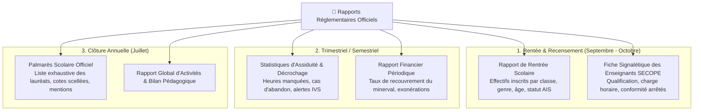

# Module 208 — Tableaux de Bord Administratifs et Rapports Réglementaires

> **Positionnement :** Tome 11 — Administration et Communication Interne · Module 208 sur 210
> **Autorité :** Direction de l'Audit Interne et de la Régulation / Inspection Provinciale
> **Liaison amont/aval :** ← Module 207 (Support usagers) → Module 209 (Journal des opérations) →

---

## 1. Objet

Ce module régit la génération dématérialisée, la consolidation analytique et la diffusion des rapports administratifs périodiques exigés par le Ministère de l'Éducation Nationale et Nouvelle Citoyenneté (EPST) et le Ministère de l'Enseignement Supérieur et Universitaire (ESU). Il fournit des cockpits de pilotage en temps réel aux directeurs d'écoles, promoteurs et inspecteurs d'État.

---

## 2. Typologie des Rapports Réglementaires Officiels en RDC

---

## 3. Architecture Décisionnelle (Google BigQuery & Looker)

Conformément à la **DOCTRINE INFRASTRUCTURE GOOGLE**, les données de gestion administrative sont répliquées de façon continue depuis Google Cloud SQL vers **Google BigQuery** :

- **Vues Réglementaires Normalisées** : Schémas de données calqués sur les questionnaires officiels de la Direction des Statistiques de l'EPST (DPE).
- **Export en Un Clic** : Génération instantanée des maquettes ministérielles au format tableur officiel (.xlsx) ou document scellé PDF/A avec signature KMS.

---

## 4. Cockpits de Pilotage par Persona

| Persona | Indicateurs Visibles sur le Tableau de Bord | Périmètre de Données |
|---|---|---|
| **Promoteur / Chef d'Établissement** | Taux d'inscription, trésorerie de caisse temps réel, assiduité globale, solde de paie | Son établissement uniquement |
| **Préfet des Études** | Couverture des programmes, progression des cotes, alertes absentéisme, ratio garçons/filles | Volet pédagogique de son école |
| **Inspecteur Provincial (DIPROMAT)** | Comparatif des écoles de la sous-division, détection des anomalies de notation, effectifs réels | Circonscription provinciale |
| **Secrétaire Général Ministériel** | Baromètre national de rentrée, respect des 220 jours de classe, prévisions EXETAT | National (26 provinces consolidées) |

---

## 5. Automatisation du Palmarès Scolaire

En fin d'année scolaire, le palmarès officiel de chaque promotion est généré de manière entièrement autonome par le système :
- Classement officiel des lauréats selon le Module 181.
- Mention du numéro IUNE et du numéro de diplôme.
- Signature numérique automatique du Préfet et de l'Inspecteur Chef de Centre.
- Versement automatique au registre central des parchemins d'État (Module 184).

---

## 6. Verrous Fonctionnels

| ID | Règle | Niveau |
|---|---|---|
| VF-208-01 | Les rapports ministériels doivent être générés selon les maquettes officielles sans altération | LÉGAL |
| VF-208-02 | Aucun rapport financier ou de caisse n'est visible par les corps d'inspection pédagogique | CONSTITUTIONNEL |
| VF-208-03 | Les palmarès annuels sont scellés et immuables dès la clôture de la délibération finale | OBLIGATOIRE |
| VF-208-04 | Agrégation des données sur BigQuery respectant le k-anonymat (Module 167) | SÉCURITÉ |
| VF-208-05 | Export garanti sous format ouvert non propriétaire (PDF/A, CSV, ODS) | TECHNIQUE |

---

*Sous-tome rédigé conformément aux Normes documentaires ELLYSIUM — Fondations 04.*
