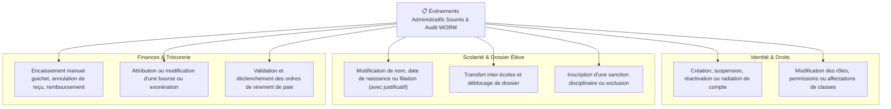
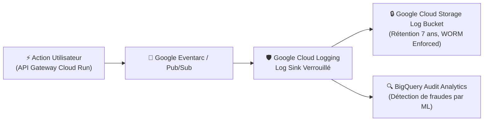

# Module 209 — Journal des Opérations Administratives (Traçabilité WORM)

> **Positionnement :** Tome 11 — Administration et Communication Interne · Module 209 sur 210
> **Autorité :** DPO Souverain ELLYSIUM / Auditeur Général d'État
> **Liaison amont/aval :** ← Module 208 (Tableaux de bord) → Module 210 (Matrice des dépendances Tome 11) →

---

## 1. Objet

Ce module régit la journalisation exhaustive, inaltérable, horodatée et infalsifiable de toutes les opérations administratives sensibles réalisées au sein de la plateforme ELLYSIUM. Il matérialise l'**Article 8 de la Constitution** (Traçabilité Totale) en instaurant une piste d'audit probante opposable devant les juridictions administratives et judiciaires de la République Démocratique du Congo.

---

## 2. Périmètre des Opérations Obligatoirement Tracées

Toute transaction ou modification relevant des catégories suivantes fait l'objet d'un enregistrement automatique immédiat dans le journal d'audit :



---

## 3. Architecture Technique de Traçabilité WORM (Google Cloud Platform)

Conformément à la **DOCTRINE INFRASTRUCTURE GOOGLE**, le journal est totalement découplé de la base de données applicative principale :



- **Format WORM (Write Once, Read Many)** : Les entrées de log sont écrites de manière séquentielle dans un bucket GCS verrouillé. Aucune API, aucun administrateur système, ni même le Super-Admin ne possède le droit `storage.objects.delete` sur ce compartiment.
- **Chaînage de Merkle** : Chaque entrée contient le hash SHA-256 de l'entrée précédente, rendant toute tentative de purge ou d'omission immédiatement détectable par le DPO.

---

## 4. Structure Normée de l'Événement d'Audit

Chaque log administratif respecte la structure JSON canonique suivante :

```json
{
  "event_id": "c8a49f12-8e71-4a9b-bc23-92f8a1048b29",
  "timestamp": "2026-09-17T15:24:10.842Z",
  "action_type": "ADMIN_MODIFICATION_ETAT_CIVIL",
  "severite": "CRITICAL",
  "acteur": {
    "user_id": "usr-kin-admin-004",
    "iune": "CD-EL-2024-00000012",
    "role": "SECRETAIRE_ETUDES",
    "ip_address": "197.242.14.88",
    "user_agent": "ELLYSIUM-Admin/2.4 (Android 14)",
    "mfa_verified": true
  },
  "cible": {
    "entite": "eleves",
    "id": "elv-kin-008194",
    "iune": "CD-EL-2025-01428590",
    "etablissement_id": "etab-kin-gomb-0012"
  },
  "modifications": {
    "champ": "nom",
    "ancienne_valeur": "KABAMBA",
    "nouvelle_valeur": "KABAMBA MUKENDI",
    "motif_legal": "Jugement supplétif n° 412/2026 TGI Gombe",
    "justificatif_uri": "gs://ellysium-prod-docs/legal/jugements/JUG-412.pdf"
  },
  "prev_log_hash": "e3b0c44298fc1c149afbf4c8996fb92427ae41e4649b934ca495991b7852b855",
  "current_log_hash": "7f83b1657ff1fc53b92dc18148a1d65dfc2d4b1fa3d677284addd200126d9069"
}
```

---

## 5. Détection Automatisée des Anomalies Administratives

Un pipeline d'analyse continue (Vertex AI + BigQuery) surveille les comportements suspects :
- **Opérations hors des heures ouvrables** : Modifications massives d'état civil ou de caisse entre 22h00 et 05h00 du matin.
- **Accès simultané anormal** : Même compte utilisateur se connectant depuis deux villes distantes (ex: Kinshasa et Lubumbashi) en moins de 30 minutes.
- **Volume d'exemptions anormal** : Caissier ou directeur accordant un taux d'exonération de minerval supérieur à 25% de l'effectif sans visa du comité de gestion.

---

## 6. Verrous Fonctionnels

| ID | Règle | Niveau |
|---|---|---|
| VF-209-01 | Immutabilité WORM absolue : suppression ou modification de log impossible | CONSTITUTIONNEL |
| VF-209-02 | Rétention minimale légale de 7 ans pour tous les événements administratifs | LÉGAL |
| VF-209-03 | Horodatage certifié par synchronisation continue NTP Google Cloud (TrueTime) | TECHNIQUE |
| VF-209-04 | Alerte immédiate au DPO et RSSI en cas de rupture de la chaîne de Merkle | SÉCURITÉ |
| VF-209-05 | Consultation des logs réservée au DPO et aux auditeurs d'État sous mandat | CONSTITUTIONNEL |

---

*Sous-tome rédigé conformément aux Normes documentaires ELLYSIUM — Fondations 04.*
