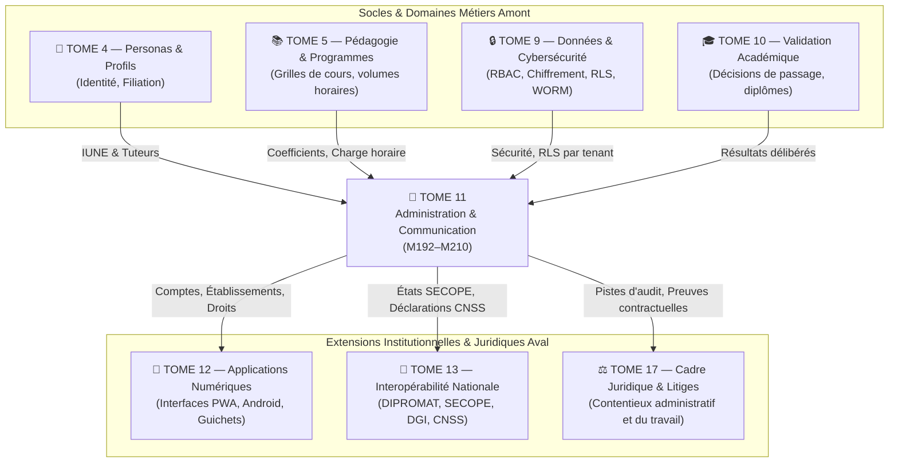

# Module 210 — Matrice des Dépendances — Tome 11 avec Tomes 5, 13, 17

> **Positionnement :** Tome 11 — Administration et Communication Interne · Module 210 sur 210 (CLÔTURE DU TOME 11)
> **Autorité :** Architecte Souverain ELLYSIUM / Comité Technique Central
> **Liaison amont/aval :** ← Module 209 (Journal des opérations) · Clôture Tome 11 → Tome 12 (Applications numériques) →

---

## 1. Objet

Ce module formalise la matrice d'interopérabilité et les contrats d'interface régissant les interactions entre le **Tome 11 (Administration et Communication Interne)** et les autres composantes de l'architecture souveraine ELLYSIUM, en ciblant particulièrement les articulations avec la pédagogie (Tome 5), les passerelles de l'État (Tome 13) et le cadre juridique et contentieux (Tome 17).

---

## 2. Vue Globale des Interconnexions du Tome 11

---

## 3. Matrice Détaillée des Dépendances

### 3.1 Dépendances Amont (Ce que le Tome 11 consomme)

| Composant Consommé | Module Source | Rôle dans le Tome 11 | Point de Contrôle / Contract API |
|---|---|---|---|
| **Référentiel des Matières et Horaires** | **Tome 5** (Modules 55–83) | Calcul de la charge horaire enseignante (Paie) | `matieres.volume_horaire_hebdo` |
| **Row-Level Security Multitenant** | **Tome 9** (Module 152) | Étanchéité absolue entre écoles partenaires | PostgreSQL Policy `tenant_isolation` |
| **Double Authentification (MFA)** | **Tome 9** (Module 160) | Validation obligatoire des arrêtés de caisse et de paie | Claim JWT `mfa_verified=true` |
| **Décisions de Passage de Classe** | **Tome 10** (Module 180) | Déclenchement de la réinscription ou radiation | Table `deliberation_scellement` |
| **Gestion des Frais & Caisse** | **Tome 9** (Module 166) | Sécurisation et conformité PCI-DSS des encaissements | APIs Mobile Money chiffrées |

### 3.2 Dépendances Aval (Ce que le Tome 11 fournit)

| Livrable du Tome 11 | Module Récepteur | Usage dans le Système Global |
|---|---|---|
| **Comptes et Droits Contextualisés** | **Tome 12** (PWA / Mobile) | Écrans personnalisés selon le rôle d'établissement |
| **Fiches Signalétiques Enseignants** | **Tome 13** (Module 226) | Synchronisation nationale avec le fichier central SECOPE |
| **Déclarations Sociales et Fiscales** | **Tome 13** (Module 228) | Téléversement des déclarations IPR (DGI) et CNSS |
| **Contrats de Travail Scellés** | **Tome 17** (Droit du Travail) | Pièces probantes en cas de litige prud'homal |
| **Données Agrégées d'Assiduité** | **Tome 19** (Analytics) | Modèles d'entraînement de détection précoce du décrochage |

---

## 4. Tableau Récapitulatif de Complétude du Tome 11

| Sous-tome | Intitulé officiel | Statut Documentaire |
|---|---|---|
| Module 192 | Périmètre du Tome 11 – fonctions administratives centralisées | ✅ COMPLET |
| Module 193 | Conformité avec la Constitution (transparence, protection) | ✅ COMPLET |
| Module 194 | Gestion des comptes utilisateurs (création, suspension, radiation) | ✅ COMPLET |
| Module 195 | Gestion des rôles et responsabilités (affectation des personnels) | ✅ COMPLET |
| Module 196 | Gestion des établissements partenaires (agrément, paramétrage) | ✅ COMPLET |
| Module 197 | Gestion des inscriptions, réinscriptions et transferts inter-écoles | ✅ COMPLET |
| Module 198 | Gestion administrative des élèves, étudiants et enseignants | ✅ COMPLET |
| Module 199 | Paramétrage des années académiques, périodes et calendriers | ✅ COMPLET |
| Module 200 | Gestion financière – frais, échéanciers, bourses, exonérations | ✅ COMPLET |
| Module 201 | Module Caisse – encaissements, reçus, rapprochement | ✅ COMPLET |
| Module 202 | Gestion de la paie enseignante (contrats, heures, versements) | ✅ COMPLET |
| Module 203 | Gestion des documents administratifs (contrats, conventions, PV) | ✅ COMPLET |
| Module 204 | Messagerie interne et notifications multicanaux (SMS, push FCM) | ✅ COMPLET |
| Module 205 | Communiqués officiels et affichage institutionnel | ✅ COMPLET |
| Module 206 | Gestion des réunions virtuelles (Google Meet API / Workspace) | ✅ COMPLET |
| Module 207 | Support utilisateur et gestion des tickets d'assistance | ✅ COMPLET |
| Module 208 | Tableaux de bord administratifs et rapports réglementaires | ✅ COMPLET |
| Module 209 | Journal des opérations administratives (traçabilité WORM) | ✅ COMPLET |
| Module 210 | Dépendances – avec les Tomes 5, 13, 17 | ✅ COMPLET |

---

## 5. Prochaine Étape du Chantier

Le Tome 11 étant **intégralement achevé, validé et scellé**, le chantier ELLYSIUM continue avec l'ouverture du :

> **→ TOME 12 — APPLICATIONS NUMÉRIQUES**
> *Modules 211 à 223 — Architecture PWA, Applications Android (Flutter), mode offline et Design System appliqué*

---

*Sous-tome rédigé conformément aux Normes documentaires ELLYSIUM — Fondations 04.*
*Tome 11 — ADMINISTRATION ET COMMUNICATION INTERNE — COMPLET ✅*
*19 modules rédigés : M192 → M210*
