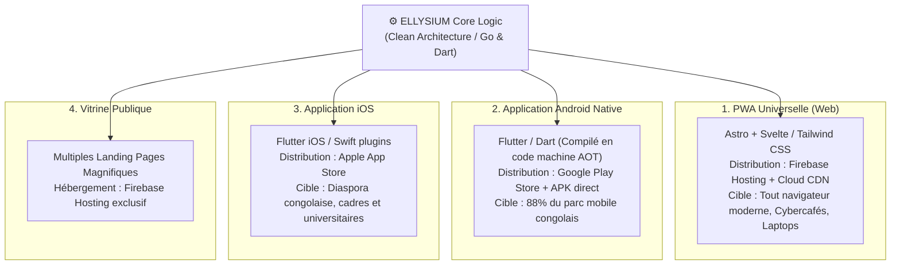

# Module 211 — Périmètre du Tome 12 — Stratégie Multi-Plateformes

> **Positionnement :** Tome 12 — Applications Numériques · Module 211 sur 227
> **Autorité :** Lead Architect Mobile & Web / Direction de l'Expérience Utilisateur (UX)
> **Liaison amont/aval :** ← Tome 11 (Administration) · Module 212 (Conformité) →

---

## 1. Objet

Ce module définit la stratégie technologique multi-plateformes d'ELLYSIUM, destinée à couvrir l'ensemble du parc de terminaux en République Démocratique du Congo : des smartphones d'entrée de gamme (Itel, Tecno, Infinix) jusqu'aux ordinateurs d'administration et tablettes éducatives. Il unifie le code métier tout en offrant des performances natives optimisées.

---

## 2. Matrice des Cibles Technologiques

---

## 3. Répartition du Parc d'Équipements en RDC et Choix Stratégiques

L'analyse de l'écosystème numérique congolais impose des arbitrages stricts :

| Plateforme | Part de Marché Estimée RDC | Technologie Retenue | Contrainte Majeure |
|---|---|---|---|
| **Android (Entrée de gamme)** | ~78 % | Flutter (Profil AOT optimisé) | RAM $< 2$ Go, Stockage flash lent, Android 8+ |
| **Android (Moyenne/Haute)** | ~12 % | Flutter (Expérience 60 fps complète) | Écrans AMOLED, biométrie native |
| **Web Mobile / Desktop (PWA)** | ~8 % | Progressive Web App (Service Worker WASM) | Zéro installation préalable requise |
| **Apple iOS** | ~2 % | Flutter iOS (Compatibilité App Store) | Strict respect des guidelines Apple Human Interface |

---

## 4. Partage de Code et Architecture Hexagonale

Pour éviter la duplication d'efforts et garantir une cohérence métier absolue entre Web et Mobile :
- **Logique Métier Partagée (Dart Core)** : Modèles de données, règles de validation, calculs arithmétiques des notes, et moteur de synchronisation CRDT partagés à 100% entre Android et iOS.
- **Design System Unifié (Tome 6)** : Bibliothèque de composants graphiques `ellysium_ui` reproduisant scrupuleusement la charte souveraine (Bleu `#0B2545`, Or `#D4AF37`).
- **Adaptation Sensorielle** : Utilisation d'abstractions pour la caméra (CameraX sous Android, AVFoundation sous iOS, MediaDevices API sur le Web).

---

## 5. Déploiement et Distribution Dématérialisée

- **Google Play Store** : Canal primaire pour les utilisateurs urbains disposant de connectivité.
- **Téléchargement Direct d'APK Frugal (< 15 Mo)** : Hébergé sur **Firebase Hosting** et distribuable en pair-à-pair via Bluetooth ou Wi-Fi Direct (Nearby Share) dans les villages sans couverture Internet.
- **PWA Instantanée** : Accessible immédiatement via l'URL souveraine `app.ellysium.cd`.

---

## 6. Verrous Fonctionnels

| ID | Règle | Niveau |
|---|---|---|
| VF-211-01 | Priorité absolue Android : tout écran doit être fluide sur appareil doté de 1 Go de RAM | CONSTITUTIONNEL |
| VF-211-02 | Taille maximale de l'APK fixée à 15 Mo en première installation | TECHNIQUE (SLO) |
| VF-211-03 | Hébergement de l'ensemble des bundles web et assets sur Firebase Hosting | CONSTITUTIONNEL |
| VF-211-04 | Parité fonctionnelle garantie : 100% des cours accessibles en PWA et sur App Android | PÉDAGOGIQUE |
| VF-211-05 | Distribution autonome de l'APK hors Play Store pour garantir la souveraineté | STRATÉGIQUE |

---

*Sous-tome rédigé conformément aux Normes documentaires ELLYSIUM — Fondations 04.*
