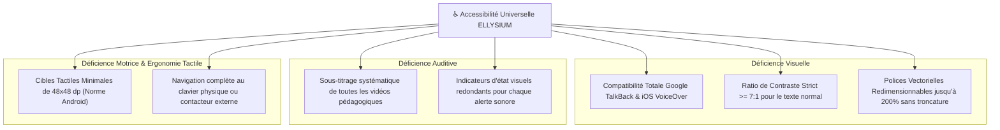

# Module 212 — Conformité avec la Constitution (Accessibilité, Mobile-First)

> **Positionnement :** Tome 12 — Applications Numériques · Module 212 sur 227
> **Autorité :** Conseil Constitutionnel ELLYSIUM / Comité d'Inclusion Numérique
> **Liaison amont/aval :** ← Module 211 (Périmètre) → Module 213 (PWA grand public) →

---

## 1. Objet

Ce module traduit les impératifs constitutionnels de justice sociale, d'égalité territoriale et d'inclusion numérique dans la conception des interfaces logicielles d'ELLYSIUM. Il formalise l'approche **Mobile-First intransigeante**, l'optimisation frugale de la consommation de données et le respect rigoureux des standards internationaux d'accessibilité numérique (**WCAG 2.2 Niveau AAA**).

---

## 2. Traduction Constitutionnelle Article par Article

### 2.1 Article 2 — Primauté du Local-First et Mode Hors-Ligne
- **Principe d'Autonomie du Terminal** : Une perte de connectivité ne doit jamais bloquer la lecture d'une leçon déjà ouverte, la saisie d'un devoir, ou le passage d'une interrogation formelle.
- **Synchronisation Non Bloquante** : Les requêtes réseau s'exécutent en tâche de fond (Background Sync), sans geler l'interface graphique utilisateur.

### 2.2 Article 4 — Gratuité Totale pour l'Apprenant Indépendant (AIS/AIU)
- **Zéro Publicité Commerciale** : Aucune bannière publicitaire, aucun tracker commercial (Google AdMob, Meta Pixel) n'est incorporé dans les applications.
- **Zéro Paiement Masqué (*In-App Purchase*)** : Les parcours d'apprentissage indépendants ne contiennent aucun péage numérique ou déblocage payant de contenu.

### 2.3 Article 7 — Frugalité Énergétique et Économie de Forfait Data
- **Plafond de Consommation Data** : Le chargement d'une leçon complète (texte, schémas vectoriels SVG et exercices) ne doit pas excéder **350 Ko**.
- **Mode Sombre Économique (AMOLED Pure Black `#000000`)** : Réduction de 40% de la consommation de batterie sur les terminaux OLED répandus chez les jeunes.

---

## 3. Matrice d'Inclusion et d'Accessibilité (WCAG 2.2 AAA)



---

## 4. Spécifications Ergonomiques Mobile-First

1. **Zone de Préhension Naturelle au Pouce (*Thumb Zone*)** :
   - Tous les boutons d'action critique (Valider, Suivant, Revenir) sont situés dans les 40% inférieurs de l'écran.
   - Les barres de navigation complexes en haut d'écran sont proscrites sur mobile au profit d'une barre inférieure (*Bottom Navigation Bar* à 4 onglets max).
2. **Gestion des Écrans Dégradés ou Fissurés** :
   - Préservation d'une marge de sécurité de 12 dp sur les bords d'écran pour rester fonctionnel sur les smartphones dont la vitre tactile est brisée sur les pourtours (fréquent en milieu populaire).

---

## 5. Audit Automatisé d'Accessibilité dans la CI/CD

Chaque build de production exécuté sur **Google Cloud Build** est audité par des tests automatisés stricts :

```bash
# Extrait du pipeline Cloud Build (Test d'accessibilité Lighthouse & Axe-core)
- name: 'gcr.io/ellysium-ci/lighthouse-audit'
  args:
    - '--target=https://staging.ellysium.cd'
    - '--accessibility-score=100' # Zéro régression tolérée
    - '--pwa-score=100'
```

---

## 6. Verrous Fonctionnels

| ID | Règle | Niveau |
|---|---|---|
| VF-212-01 | Score d'accessibilité Lighthouse strictement égal à 100% en build release | CONSTITUTIONNEL |
| VF-212-02 | Aucune dépendance réseau synchrone bloquante pour l'affichage d'un écran | TECHNIQUE |
| VF-212-03 | Proscription totale des bibliothèques de régies publicitaires ou trackers commerciaux | ÉTHIQUE |
| VF-212-04 | Cible tactile minimale garantie de 48 x 48 points sur tous les éléments cliquables | ERGONOMIE |
| VF-212-05 | Compatibilité native garantie avec le lecteur d'écran Google TalkBack | INCLUSION |
| VF-212-06 | L'application Android consomme moins de 2 Mo de données pour 60 minutes d'utilisation terrain | PERFORMANCE |

---

*Sous-tome rédigé conformément aux Normes documentaires ELLYSIUM — Fondations 04.*
