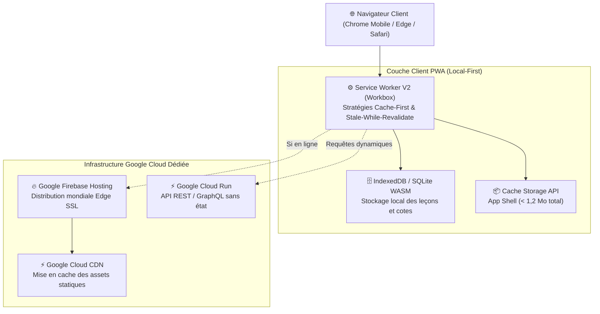

# Module 213 — Application Web Progressive (PWA) — Grand Public

> **Positionnement :** Tome 12 — Applications Numériques · Module 213 sur 227
> **Autorité :** Lead Frontend Architect / Direction Technique ELLYSIUM
> **Liaison amont/aval :** ← Module 212 (Conformité) → Module 214 (App Android) →

---

## 1. Objet

Ce module régit la conception, l'architecture logicielle, la mise en cache agressive et le déploiement de l'Application Web Progressive (PWA) universelle d'ELLYSIUM. Accessible via tout navigateur web moderne sans nécessiter le passage par un store d'applications, cette PWA garantit une installation instantanée, un fonctionnement hors-ligne par Service Worker et un hébergement exclusif sur **Google Firebase Hosting**.

---

## 2. Architecture Technique de la PWA



---

## 3. Manifeste Web de l'Application (`manifest.webmanifest`)

Le fichier manifeste permet l'installation en mode autonome (*standalone*) sur l'écran d'accueil du terminal, procurant l'illusion parfaite d'une application native :

```json
{
  "name": "ELLYSIUM — Centre National d'Étude en Ligne",
  "short_name": "ELLYSIUM",
  "description": "Plateforme souveraine d'éducation nationale de la République Démocratique du Congo",
  "start_url": "/?source=pwa",
  "scope": "/",
  "display": "standalone",
  "orientation": "portrait-primary",
  "background_color": "#0B2545",
  "theme_color": "#0B2545",
  "lang": "fr-CD",
  "dir": "ltr",
  "icons": [
    {
      "src": "/icons/icon-192.png",
      "sizes": "192x192",
      "type": "image/png",
      "purpose": "any maskable"
    },
    {
      "src": "/icons/icon-512.png",
      "sizes": "512x512",
      "type": "image/png",
      "purpose": "any maskable"
    }
  ],
  "shortcuts": [
    {
      "name": "Mes Cours",
      "url": "/apprenant/cours",
      "icons": [{ "src": "/icons/cours.png", "sizes": "96x96" }]
    },
    {
      "name": "Mes Bulletins",
      "url": "/apprenant/bulletins",
      "icons": [{ "src": "/icons/bulletin.png", "sizes": "96x96" }]
    }
  ]
}
```

---

## 4. Stratégies de Mise en Cache du Service Worker (Workbox)

Pour garantir une ouverture instantanée même lors d'une rupture totale de réseau :

1. **App Shell (Architecture HTML/CSS/JS de base)** :
   - Stratégie : **Cache-First (Précaching)**.
   - Poids total de l'App Shell minifié et compressé Brotli : **850 Ko**.
2. **Contenus Pédagogiques (Textes de cours, résumés)** :
   - Stratégie : **Stale-While-Revalidate**.
   - Consultation immédiate de la version en cache, mise à jour transparente en arrière-plan dès détection d'une connexion.
3. **Médias et Schémas Vectoriels (SVG, WebP)** :
   - Stratégie : **Cache-First avec expiration LRU (Least Recently Used)** limitée à 250 Mo de quota local.
4. **Requêtes d'Authentification et Transactions Caisse** :
   - Stratégie : **Network-Only strict** (proscription absolue de mise en cache pour préserver l'Article 5).

---

## 5. Déploiement et Performance sur Firebase Hosting

Configuration déclarative `firebase.json` garantissant une sécurité et une vitesse maximales :

```json
{
  "hosting": {
    "public": "dist",
    "ignore": ["firebase.json", "**/.*", "**/node_modules/**"],
    "rewrites": [
      {
        "source": "**",
        "destination": "/index.html"
      }
    ],
    "headers": [
      {
        "source": "**/*.@(js|css)",
        "headers": [
          {
            "key": "Cache-Control",
            "value": "max-age=31536000, immutable"
          }
        ]
      },
      {
        "source": "**",
        "headers": [
          {
            "key": "X-Content-Type-Options",
            "value": "nosniff"
          },
          {
            "key": "X-Frame-Options",
            "value": "DENY"
          },
          {
            "key": "Content-Security-Policy",
            "value": "default-src 'self' https://*.googleapis.com https://*.firebaseio.com; img-src 'self' data: https://storage.googleapis.com; style-src 'self' 'unsafe-inline';"
          }
        ]
      }
    ]
  }
}
```

---

## 6. Verrous Fonctionnels

| ID | Règle | Niveau |
|---|---|---|
| VF-213-01 | Hébergement exclusif sur Google Firebase Hosting avec certificat SSL automatique | CONSTITUTIONNEL |
| VF-213-02 | Fonctionnement garanti hors-ligne dès la deuxième visite de l'utilisateur | TECHNIQUE |
| VF-213-03 | Poids total initial de l'App Shell inférieur à 1 Mo compressé | SLO PERFORMANCE |
| VF-213-04 | Interdiction stricte de mettre en cache les requêtes de caisse et de paiement | CONSTITUTIONNEL |
| VF-213-05 | Compatibilité multi-navigateurs : Chrome, Firefox, Edge, Safari Mobile | PORTABILITÉ |

---

*Sous-tome rédigé conformément aux Normes documentaires ELLYSIUM — Fondations 04.*
