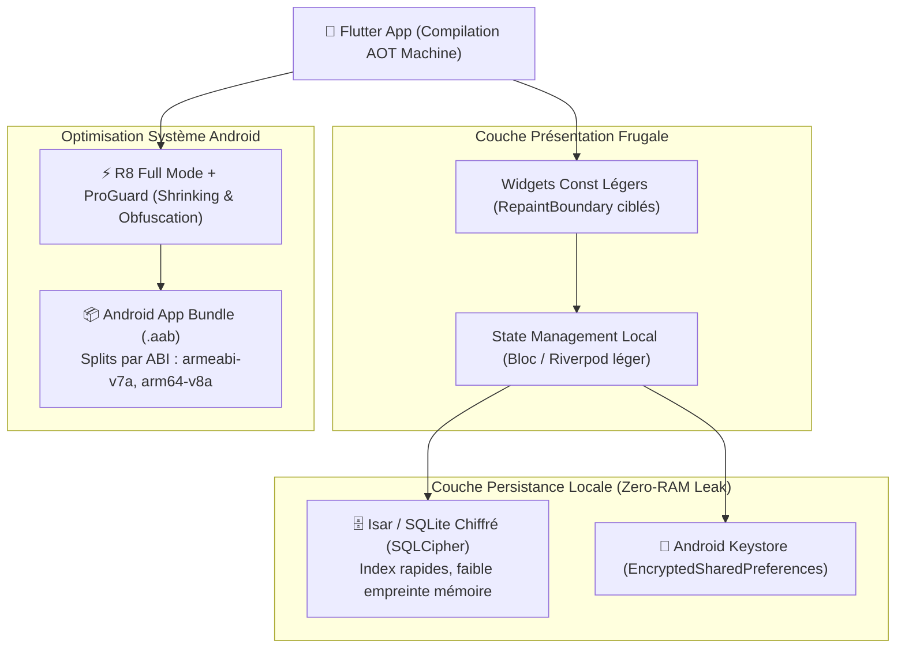

# Module 214 — Application Android — Spécifications et Optimisation Entrée de Gamme

> **Positionnement :** Tome 12 — Applications Numériques · Module 214 sur 227
> **Autorité :** Lead Android Engineer / Direction Technique ELLYSIUM
> **Liaison amont/aval :** ← Module 213 (PWA) → Module 215 (App iOS) →

---

## 1. Objet

Ce module fixe les spécifications architecturales, les contraintes de compilation, l'optimisation matérielle et les profils de performance de l'application mobile native Android d'ELLYSIUM. Compte tenu de la prédominance des smartphones d'entrée de gamme en République Démocratique du Congo (marques Itel, Tecno, Infinix, modèles sous Android Go avec 1 à 2 Go de RAM), ce sous-tome érige la frugalité en exigence absolue.

---

## 2. Profil de l'Appareil Référence RDC (Target Persona Device)

Toute release de l'application Android est testée et profilée sur un terminal étalon :

| Caractéristique | Spécification Cible Minimale ELLYSIUM |
|---|---|
| **Modèle Référence** | Tecno Pop 7 / Itel A60 / Infinix Smart 7 |
| **Système d'Exploitation** | Android 8.1 (Oreo - API 27) jusqu'à Android 15 |
| **Mémoire Vive (RAM)** | **1 Go à 2 Go** (avec contrainte de ZRAM compressée) |
| **Stockage Interne Disponible** | $< 4$ Go libres pour l'utilisateur |
| **Processeur (SoC)** | Quad-Core ARM Cortex-A53 @ 1.3 GHz (Unisoc / MediaTek Helio A22) |
| **Réseau** | 2G / 3G / 4G instable, latence moyenne 250–500 ms |

---

## 3. Architecture Logicielle Flutter / Android



---

## 4. Mesures Drastiques d'Optimisation des Ressources

### 4.1 Frugalité Mémoire (RAM $< 120$ Mo en exécution)
- **Nettoyage Agressif des Images** : Décodage des images à la dimension exacte du conteneur d'affichage (`cacheWidth` et `cacheHeight` fixés) pour éviter d'allouer des bitmaps 4K en mémoire vive.
- **Garbage Collection Paisible** : Recyclage systématique des contrôleurs de saisie et des listes déroulantes via `ListView.builder` avec destruction des éléments hors champ.

### 4.2 Optimisation du Poids de Téléchargement (Download Size $< 12$ Mo)
- **Android App Bundle (.aab)** : La séparation des ressources par densité d'écran et par architecture processeur réduit la taille de l'APK téléchargé sur l'appareil à moins de **12 Mo**.
- **Vectorisation SVG** : 100% des icônes et illustrations sont vectorielles, éliminant les volumineux répertoires de bitmaps multi-résolutions (ldpi, mdpi, hdpi, xhdpi).

### 4.3 Préservation de la Batterie et Échauffement Thermique
- **Désactivation des Animations Superfétatoires** : Détection automatique du mode économie d'énergie d'Android pour basculer en mode 30 fps et supprimer les transitions à particules.
- **WakeLocks Proscrits** : Aucune tâche de fond ne maintient le CPU éveillé sans consentement explicite de l'utilisateur.

---

## 5. Spécifications de Build Gradle

```groovy
// android/app/build.gradle
android {
    compileSdkVersion 34

    defaultConfig {
        applicationId "cd.ellysium.app"
        minSdkVersion 21        // Support de 99,2% des appareils en RDC
        targetSdkVersion 34
        versionCode 100
        versionName "1.0.0"
        multiDexEnabled false   // Moins de 64k méthodes pour un démarrage instantané
    }

    buildTypes {
        release {
            minifyEnabled true
            shrinkResources true
            proguardFiles getDefaultProguardFile('proguard-android-optimize.txt'), 'proguard-rules.pro'
            ndk {
                abiFilters 'armeabi-v7a', 'arm64-v8a'
            }
        }
    }
}
```

---

## 6. Verrous Fonctionnels

| ID | Règle | Niveau |
|---|---|---|
| VF-214-01 | Taille de l'APK téléchargé strictement inférieure à 15 Mo sur Play Store | TECHNIQUE (SLO) |
| VF-214-02 | Consommation maximale de RAM en régime de croisière inférieure à 150 Mo | PERFORMANCE |
| VF-214-03 | Lancement à froid (*Cold Start*) réalisé en moins de 1,8 seconde sur Tecno Pop 7 | ERGONOMIE |
| VF-214-04 | Compilation avec R8 et obfuscation obligatoire de tout code release | SÉCURITÉ |
| VF-214-05 | Clés et jetons sensibles stockés exclusivement via Android Keystore sécurisé | CONSTITUTIONNEL |
| VF-214-06 | L'application Android consomme moins de 2 Mo de données pour 60 minutes d'utilisation terrain | PERFORMANCE |

---

*Sous-tome rédigé conformément aux Normes documentaires ELLYSIUM — Fondations 04.*
