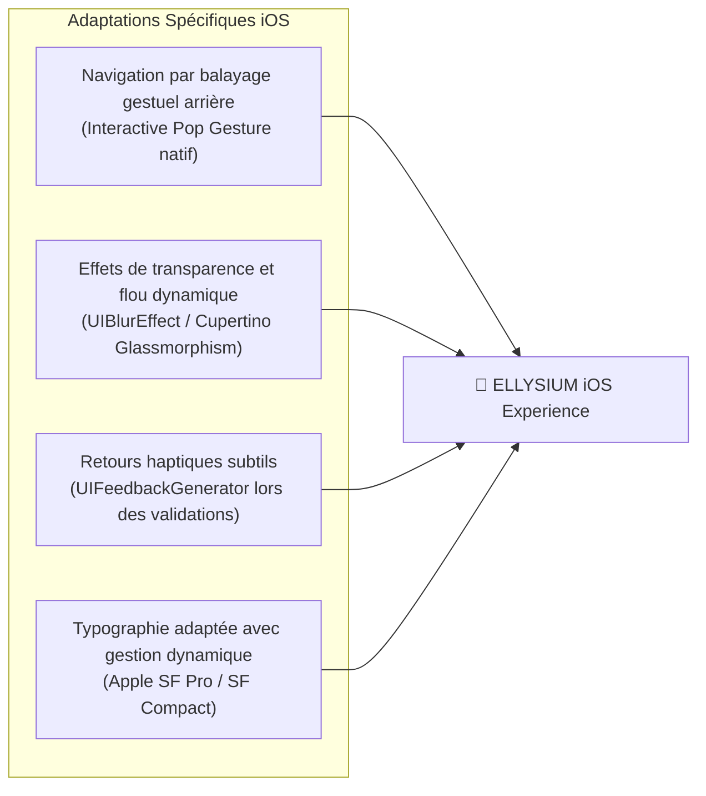

# Module 215 — Application iOS — Normes, Ergonomie, Déploiement App Store

> **Positionnement :** Tome 12 — Applications Numériques · Module 215 sur 227
> **Autorité :** Lead iOS Engineer / Direction Technique ELLYSIUM
> **Liaison amont/aval :** ← Module 214 (App Android) → Module 216 (Landing pages) →

---

## 1. Objet

Ce module régit la déclinaison de l'écosystème mobile ELLYSIUM sur le système d'exploitation **Apple iOS** (iPhone et iPad). Destinée prioritairement à la diaspora congolaise, aux étudiants et aux corps académiques universitaires, cette application respecte scrupuleusement les *Human Interface Guidelines* (HIG) d'Apple, intègre les mécanismes de sécurité du Secure Enclave et assure la conformité aux exigences strictes de validation de l'App Store.

---

## 2. Spécifications Techniques iOS

| Composant | Norme Retenue ELLYSIUM |
|---|---|
| **Framework** | Flutter iOS avec plugins natifs Swift |
| **Version Minimale Supportée** | iOS 15.0 (Couvre plus de 98% des terminaux Apple actifs) |
| **Architecture** | 64-bit ARM (arm64) exclusive |
| **Sécurité Locale** | iOS Keychain API adossée à l'Apple Secure Enclave |
| **Authentification Biométrique** | Face ID / Touch ID (LocalAuthentication Framework) |
| **Distribution** | Apple App Store officiel + Apple TestFlight pour les bêta-testeurs |

---

## 3. Conformité aux Apple Human Interface Guidelines (HIG)

L'expérience utilisateur sur iOS adapte les composants du Design System (Tome 6) aux idiomes natifs Apple :



---

## 4. Stratégie de Déploiement et Validation App Store

Pour franchir avec succès le processus d'approbation d'Apple (*App Review Guidelines*) :

1. **Règle 3.1.1 (In-App Purchase) & Dérogation Éducative** :
   - Les frais d'études (Minerval) et les transactions Mobile Money ne constituent pas l'achat de biens numériques consommables au sens d'Apple, mais des droits de scolarité institutionnels d'un établissement d'enseignement agréé.
   - Les fonctionnalités de paiement guichet et Mobile Money sont déclarées comme services financiers bimonétaires régulés.
2. **Protection de la Vie Privée (App Tracking Transparency - ATT)** :
   - ELLYSIUM n'utilisant aucun tracker publicitaire tiers, la déclaration de confidentialité (*Privacy Nutrition Labels*) indique : **"Données non utilisées pour le pistage"**.
3. **Suppression de Compte en Libre-Service (Règle 5.1.1)** :
   - Bouton de suppression et d'export du compte présent directement dans les paramètres de l'application avec traitement par Crypto-Shredding (Module 168).

---

## 5. Pipeline CI/CD iOS (Google Cloud Build + Fastlane)

Le packaging et la signature des builds de production iOS sont orchestrés par **Fastlane** hébergé sur des exécuteurs automatisés intégrant les certificats de signature de distribution de l'État :

```ruby
# fastlane/Fastfile
lane :release_appstore do
  setup_ci
  match(type: "appstore", readonly: true)
  build_app(
    workspace: "Runner.xcworkspace",
    scheme: "Runner",
    export_method: "app-store"
  )
  upload_to_app_store(
    force: true,
    skip_waiting_for_build_processing: true
  )
end
```

---

## 6. Verrous Fonctionnels

| ID | Règle | Niveau |
|---|---|---|
| VF-215-01 | Respect intégral des Apple App Review Guidelines (zéro rejet de soumission) | LÉGAL |
| VF-215-02 | Stockage des jetons d'accès dans le Keychain adossé au Secure Enclave | SÉCURITÉ |
| VF-215-03 | Zéro tracking publicitaire : étiquette de confidentialité App Store immaculée | CONSTITUTIONNEL |
| VF-215-04 | Prise en charge native complète de l'accessibilité iOS VoiceOver | INCLUSION |
| VF-215-05 | Fonction d'effacement de compte intégrée et fonctionnelle en un clic (Règle 5.1.1) | OBLIGATOIRE |
| VF-215-06 | L'application Android consomme moins de 2 Mo de données pour 60 minutes d'utilisation terrain | PERFORMANCE |

---

*Sous-tome rédigé conformément aux Normes documentaires ELLYSIUM — Fondations 04.*
