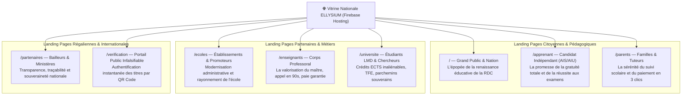
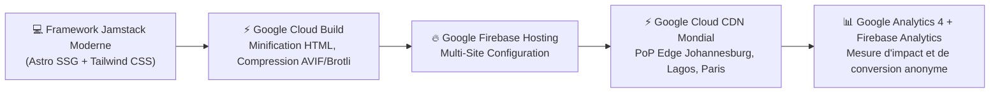

# Module 216 — Site Internet Institutionnel — Multiples Landing Pages d'Excellence (Firebase Hosting)

> **Positionnement :** Tome 12 — Applications Numériques · Module 216 sur 227
> **Autorité :** Direction de la Communication / Lead Creative Designer / Promoteur ELLYSIUM
> **Liaison amont/aval :** ← Module 215 (App iOS) → Module 217 (Mode hors-ligne) →

---

## 1. Objet et Directive Solennelle

Ce module formalise l'architecture, la direction artistique, l'ergonomie persuasive et le déploiement du site vitrine institutionnel souverain d'ELLYSIUM. 

Conformément à la **DIRECTIVE EN MARBRE DU PROMOTEUR DU 17 SEPTEMBRE 2026** :
> *"Ce chantier est et restera et sera déployé et mis en production EXCLUSIVEMENT dans un environnement GOOGLE, et son site sera fait de multiples landing pages belles les unes que les autres. GOOGLE ET GOOGLE."*

Le site n'est pas un simple portail générique, mais une constellation de **landing pages d'une beauté graphique éblouissante**, chacune sculptée sur mesure pour séduire et convertir une audience cible spécifique.

---

## 2. Constellation des Landing Pages Dédiées

Chaque page dispose de sa propre scénographie visuelle, de visuels cinématiques haute définition optimisés en format WebP/AVIF et d'un storytelling captivant célébrant l'excellence et la fierté congolaise :



---

## 3. Direction Artistique et Standards Esthétiques d'Élite

Chaque landing page doit provoquer un choc esthétique de niveau mondial (*World-Class Institutional Design*) :
- **Palette Chromatique Royale** :
  - Bleu Nuit Souverain : `#0B2545` (Profondeur, autorité, stabilité républicaine).
  - Or Académique Précieux : `#D4AF37` (Excellence des diplômes, lumière, couronnement du savoir).
  - Ivoire Pur : `#F5F5F0` (Lisibilité apaisante, élégance intemporelle).
- **Typographie Noble** : Association harmonieuse d'une police avec empattement pour les titres solennels (*Playfair Display* ou *Cinzel*) et d'une sans-serif ultra-lisible pour le corps de texte (*Inter* ou *Plus Jakarta Sans*).
- **Animations Subtiles et Micro-Interactions** : Transitions au scroll par **Framer Motion**, révélations progressives au défilement, micro-reflets dorés sur les boutons d'action.
- **Iconographie Vectorielle Sur-Mesure** : Pas de banques d'images génériques occidentales ; représentations valorisantes et authentiques de la jeunesse et des savants congolais.

---

## 4. Architecture Technique 100% Google Cloud & Firebase



### Configuration Multi-Site Firebase Hosting (`firebase.json`)
```json
{
  "hosting": [
    {
      "target": "site-vitrine-public",
      "public": "dist/marketing",
      "ignore": ["firebase.json", "**/.*"],
      "cleanUrls": true,
      "trailingSlash": false,
      "headers": [
        {
          "source": "**",
          "headers": [
            { "key": "X-Frame-Options", "value": "DENY" },
            { "key": "X-Content-Type-Options", "value": "nosniff" },
            { "key": "Strict-Transport-Security", "value": "max-age=31536000; includeSubDomains; preload" }
          ]
        }
      ]
    }
  ]
}
```

---

## 5. Performances Extrêmes et Frugalité Réseau

Bien que somptueuses, les landing pages restent ultra-légères pour s'ouvrir en un éclair sur les réseaux de Kinshasa, Goma ou Lubumbashi :
- **Score Google Lighthouse** : **100 / 100** sur Performance, Accessibilité, Best Practices et SEO.
- **Largest Contentful Paint (LCP)** : $< 1,2$ seconde sur connexion mobile 3G.
- **Images Haute Définition Frugales** : Servies exclusivement en **AVIF et WebP** avec balise responsive `<picture>` et attributs `loading="lazy"` et `fetchpriority="high"` sur le hero visual.
- **Zéro JavaScript Bloquant** : Génération en Static Site Generation (SSG) pure via Astro. Les composants interactifs s'hydratent uniquement lorsqu'ils entrent dans le viewport (*Islands Architecture*).

---

## 6. Verrous Fonctionnels

| ID | Règle | Niveau |
|---|---|---|
| VF-216-01 | Déploiement exclusif et irrévocable sur Google Firebase Hosting | CONSTITUTIONNEL |
| VF-216-02 | Score Lighthouse Performance supérieur ou égal à 95 sur terminal mobile | TECHNIQUE (SLO) |
| VF-216-03 | Chaque landing page dispose d'une identité visuelle d'élite sans médiocrité admise | ARTISTIQUE |
| VF-216-04 | Disponibilité intégrale en français et dans les 4 langues nationales congolaises | INCLUSION |
| VF-216-05 | Zéro tracker publicitaire commercial ou script de régie tiers | ÉTHIQUE |
| VF-216-06 | L'application Android consomme moins de 2 Mo de données pour 60 minutes d'utilisation terrain | PERFORMANCE |

---

*Sous-tome rédigé conformément aux Normes documentaires ELLYSIUM — Fondations 04.*
