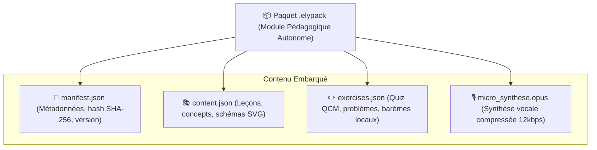
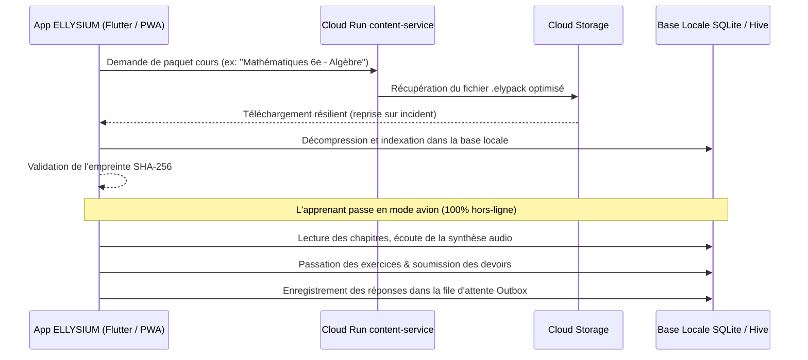

# Module 217 — Mode Hors-Ligne — Téléchargement des Cours, Exercices et Feuilles de Route

> **Positionnement :** Tome 12 — Applications Numériques · Module 217 sur 227
> **Autorité :** Lead Architect Local-First / Comité National de Continuité Pédagogique
> **Liaison amont/aval :** ← Module 216 (Landing pages) → Module 218 (Synchronisation) →

---

## 1. Objet

Ce module opérationnalise l'**Article 2 de la Constitution ELLYSIUM** (Impératif du Local-First). Il garantit que tout apprenant ou enseignant peut étudier, réviser, soumettre des devoirs et noter des élèves sans exiger de connexion Internet active. Il organise l'encapsulation frugale des unités de cours, des exercices interactifs et des feuilles de route dans des paquets autonomes chiffrés.

---

## 2. Architecture du Paquet Pédagogique Autonome (`.elypack`)

Pour éliminer la dépendance aux requêtes HTTP en cascade lors des coupures de réseau :
- Un cours complet ou un chapitre forme une archive compressée autonome au format souverain **`.elypack`** (conteneur compressé Brotli / tar sécurisé).
- Poids cible d'un module hebdomadaire complet : **entre 1,5 Mo et 4 Mo** (incluant le texte, les formules KaTeX vectorisées, les illustrations WebP basse résolution et les quiz interactifs).

---

## 3. Workflow de Téléchargement et d'Usage Déconnecté

---

## 4. Téléchargement Intelligent et Opportuniste

Pour préserver le forfait des familles et éviter les frais de données mobiles :
- **Détection Automatique du Réseau** : Le téléchargement lourd des paquets ne se déclenche par défaut que lorsque l'appareil est connecté à un réseau **Wi-Fi** ou à une borne locale **CNELE Local Box** déployée dans l'école.
- **Téléchargement Progressif Résilient** : Prise en charge native des en-têtes HTTP `Range` : si la connexion s'interrompt à 80 %, la reprise s'effectue exactement au 80e pour cent sans recommencer à zéro.
- **Purge Programmée et Gestion de l'Espace Disque** : L'élève peut définir la taille maximale allouée au mode hors-ligne (ex: 500 Mo). Les anciens cours déjà validés sont automatiquement purgés selon un algorithme LRU (*Least Recently Used*).

---

## 5. Moteur d'Évaluation Hors-Ligne

Les quiz d'entraînement et les interrogations de travaux journaliers (TJ) sont exécutés localement :
- Le barème et la logique de validation sont interprétés en JavaScript (WASM) ou en Dart natif.
- Le score provisoire est calculé immédiatement pour l'élève à des fins pédagogiques.
- La copie chiffrée avec signature du terminal est placée dans la file d'attente sortante (**Outbox**) pour scellement ultérieur par le serveur (Module 218).

---

## 6. Verrous Fonctionnels

| ID | Règle | Niveau |
|---|---|---|
| VF-217-01 | 100% des leçons textuelles et quiz d'un cours doivent pouvoir fonctionner hors-ligne | CONSTITUTIONNEL |
| VF-217-02 | Poids d'un paquet de cours hebdomadaire strictement inférieur à 5 Mo | TECHNIQUE (SLO) |
| VF-217-03 | Reprise sur incident obligatoire pour tout téléchargement interrompu | TECHNIQUE |
| VF-217-04 | Chiffrement local des épreuves d'examen non encore soumises (SQLCipher / AES-256) | SÉCURITÉ |
| VF-217-05 | L'élève garde la maîtrise totale de son espace de stockage avec bouton de purge en 1 clic | ERGONOMIE |
| VF-217-06 | L'application Android consomme moins de 2 Mo de données pour 60 minutes d'utilisation terrain | PERFORMANCE |

---

*Sous-tome rédigé conformément aux Normes documentaires ELLYSIUM — Fondations 04.*
