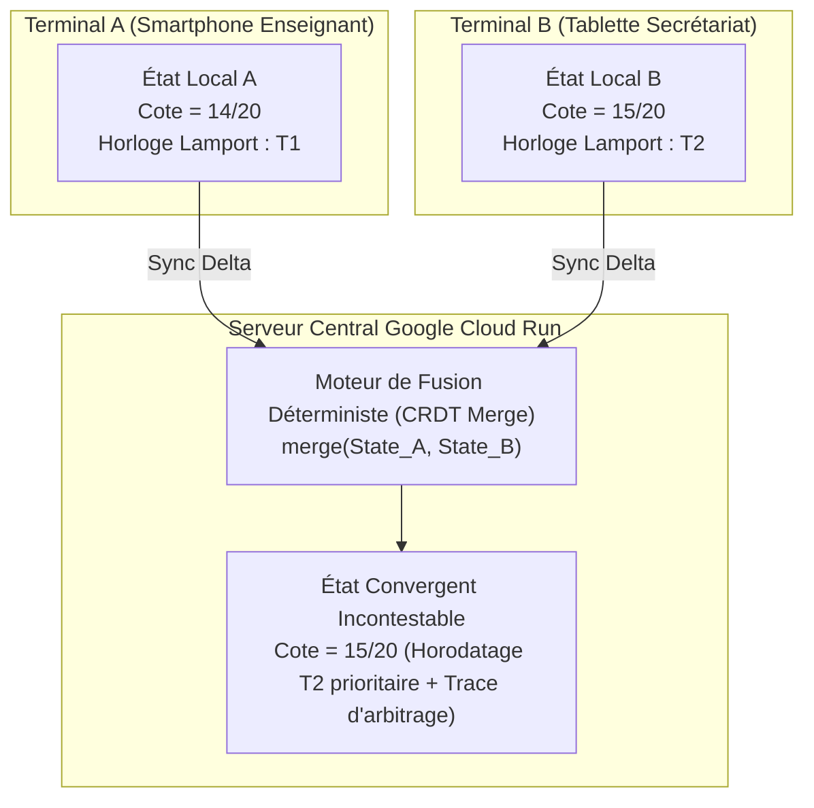

# Module 218 — Synchronisation Multi-Appareils — Priorisation et Résolution de Conflits

> **Positionnement :** Tome 12 — Applications Numériques · Module 218 sur 227
> **Autorité :** Lead Distributed Systems Architect / Direction Technique ELLYSIUM
> **Liaison amont/aval :** ← Module 217 (Mode hors-ligne) → Module 219 (Cache et compression) →

---

## 1. Objet

Ce module régit la synchronisation bidirectionnelle, décentralisée et résiliente des données d'apprentissage et des actes administratifs entre les terminaux des utilisateurs (smartphones, tablettes, ordinateurs) et le cloud centralisé Google Cloud. Il détaille l'algorithme mathématique de résolution de conflits fondé sur les **CRDT (Conflict-free Replicated Data Types)** et la priorisation des paquets sur bande passante dégradée.

---

## 2. Défis de Synchronisation dans le Contexte Congolais

Les apprenants et enseignants congolais partagent fréquemment des terminaux au sein d'une même famille, alternent entre cybercafés et smartphones d'appoint, et subissent des coupures de réseau pouvant durer plusieurs jours :
- **Conflits de versions concurrentes** : Modification de la même fiche de cotes par deux professeurs ou soumission différée d'un devoir.
- **Ressynchronisation massive lors du retour du réseau** : Risque d'engorgement des passerelles API si des milliers d'appareils envoient leurs données accumulées au même instant.

---

## 3. Modèle Mathématique de Résolution CRDT

ELLYSIUM adopte un modèle **State-based CRDT (Pn-Counter et LWW-Element-Set)** :



### 3.1 Règle LWW (Last-Write-Wins) avec Horodatage Logique
Chaque mutation locale enregistre :
$$\text{Mutation} = \{ \text{ID}, \text{Champ}, \text{Valeur}, \text{ClientID}, \text{HorlogeLamport}, \text{HashSignature} \}$$
En cas de modification simultanée hors-ligne, la mutation possédant l'horloge logique la plus récente prévaut de façon purement mathématique, sans jamais perdre l'historique des états antérieurs.

---

## 4. Priorisation des Flux de Données (QoS Réseau Frugal)

Lorsque la connexion revient, les données en attente dans la file d'attente sortante (**Outbox**) ne sont pas transmises de manière désordonnée. Le système applique 4 files de priorité décroissante :

| Niveau de Priorité | Type de Données | Poids Bande Passante | Délai de Transmission Requis |
|---|---|---|---|
| **Priorité 1 (Critique)** | Copies d'examens soumises, jetons de sécurité, alertes fraude | 50 % | Immédiat dès détection d'un octet de réseau |
| **Priorité 2 (Administrative)** | Cotes d'interrogations TJ, présences de cours, reçus caisse | 30 % | En arrière-plan dans les 15 minutes |
| **Priorité 3 (Pédagogique)** | Devoirs ordinaires, progression de lecture des leçons | 15 % | En arrière-plan sans contrainte horaire |
| **Priorité 4 (Télémétrie)** | Logs d'usage, statistiques de batterie, métriques d'erreur | 5 % | Uniquement sur réseau Wi-Fi stable |

---

## 5. Architecture de la File d'Attente Outbox (Client Mobile)

```dart
// Modèle de la file d'attente locale (Flutter / Dart)
class OutboxItem {
  final String id;
  final String entityType; // "COTE", "DEVOIR", "PRESENCE"
  final Map<String, dynamic> deltaPayload;
  final int priority;      // 1 (Urgent) à 4 (Basse)
  final int lamportClock;
  final DateTime createdAt;
  int retryAttempts;

  OutboxItem({
    required this.id,
    required this.entityType,
    required this.deltaPayload,
    required this.priority,
    required this.lamportClock,
    required this.createdAt,
    this.retryAttempts = 0,
  });
}
```

---

## 6. Verrous Fonctionnels

| ID | Règle | Niveau |
|---|---|---|
| VF-218-01 | Résolution mathématique des conflits par algorithme CRDT déterministe | CONSTITUTIONNEL |
| VF-218-02 | Priorisation stricte de la file Outbox : les examens passent toujours en premier | OBLIGATOIRE |
| VF-218-03 | Aucune donnée saisie hors-ligne ne peut être écrasée silencieusement | INTÉGRITÉ |
| VF-218-04 | Rétention locale des éléments envoyés jusqu'à confirmation d'acquittement (ACK) serveur | FIABILITÉ |
| VF-218-05 | La synchronisation complète d'une journée de cours doit consommer moins de 500 Ko | FRUGALITÉ |
| VF-218-06 | L'application Android consomme moins de 2 Mo de données pour 60 minutes d'utilisation terrain | PERFORMANCE |

---

*Sous-tome rédigé conformément aux Normes documentaires ELLYSIUM — Fondations 04.*
