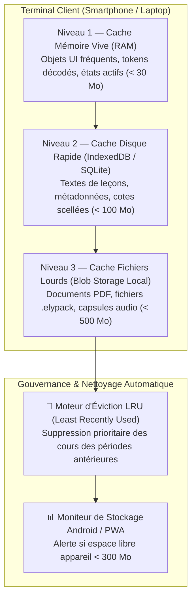

# Module 219 — Gestion du Cache Local et Téléchargement Intelligent

> **Positionnement :** Tome 12 — Applications Numériques · Module 219 sur 227
> **Autorité :** Lead Performance Engineer / Expert Compression Multimédia ELLYSIUM
> **Liaison amont/aval :** ← Module 218 (Synchronisation) → Module 220 (Notifications push) →

---

## 1. Objet

Ce module formalise l'ingénierie du cache local sur les terminaux clients et les algorithmes de compression de pointe employés par ELLYSIUM pour minimiser l'empreinte de stockage physique et diviser par cinq la consommation de bande passante réseau. Il standardise l'usage des formats de nouvelle génération (**Brotli, WebP, AVIF, Opus**) et la gouvernance intelligente du quota disque.

---

## 2. Matrice des Formats et Ratios de Compression

| Type de Donnée | Format Traditionnel Brut | Format Optimisé ELLYSIUM | Gain de Bande Passante Réalisé |
|---|---|---|---|
| **Flux Textuel & Données JSON** | GZIP | **Brotli Niveau 9** | $-32\%$ par rapport à GZIP |
| **Illustrations Pédagogiques** | PNG / JPEG 1080p (1,5 Mo) | **WebP / AVIF Vectorisé** (85 Ko) | **$-94\%$ de poids** |
| **Micro-synthèses Vocales / Cours Audio** | MP3 128 kbps (3,5 Mo) | **Opus Speech 12 kbps** (220 Ko) | **$-93\%$ de poids** |
| **Polices Typographiques** | TTF / OTF (2 Mo) | **WOFF2 Sous-ensemble Latin étendu** (45 Ko) | **$-97\%$ de poids** |

---

## 3. Architecture Multi-Niveaux du Cache Client



---

## 4. Téléchargement Intelligent et Négociation de Contenu (Content Negotiation)

Le client mobile ELLYSIUM négocie dynamiquement la qualité du contenu avec les serveurs **Google Cloud Run** et **Cloud Storage** en fonction de l'indicateur de connectivité fourni par le terminal (**Network Information API**) :

```mermaid
flowchart TD
    DETECT["📡 Détection du Débit et Latence Réseau"]
    TYPE{"Qualité de Connexion ?"}

    TYPE -->|Connexion Rapide (Wi-Fi / 4G)| HAUTE["🖼️ Images AVIF Haute Résolution<br/>Capsules Audio HD 24 kbps"]
    TYPE -->|Connexion Moyenne (3G)| NORMALE["🖼️ Images WebP Résolution Moyenne<br/>Capsules Audio Standard 16 kbps"]
    TYPE -->|Connexion Dégradée (2G / Edge)| FRUGALE["📄 Schémas Vectoriels SVG Seuls<br/>Audio 12 kbps ou Synthèse Vocale Locale TTS"]

    DETECT --> TYPE
```

---

## 5. Algorithme d'Éviction et Quotas Utilisateur

Pour ne pas saturer la mémoire interne des téléphones d'entrée de gamme :
1. **Plafond Configurable** : L'apprenant ou l'enseignant choisit son budget de stockage dans les paramètres (options : 250 Mo, 500 Mo, 1 Go, ou Illimité).
2. **Éléments Inexpugnables (Pinning)** :
   - Les cotes, les bulletins et les devoirs en cours d'évaluation ne sont **jamais évincés** du cache local.
   - Seuls les médias de cours déjà consultés et archivés peuvent être purgés par le système.
3. **Purge Volontaire en Un Clic** : Bouton *"Libérer de l'espace"* supprimant instantanément les fichiers temporaires sans déconnecter l'utilisateur.

---

## 6. Verrous Fonctionnels

| ID | Règle | Niveau |
|---|---|---|
| VF-219-01 | Compression Brotli activée par défaut sur tous les flux de données texte et JSON | TECHNIQUE |
| VF-219-02 | Format audio obligatoire pour les leçons vocales : codec Opus à bas débit (12 kbps) | FRUGALITÉ |
| VF-219-03 | L'application ne doit jamais utiliser plus de 90% de l'espace disque libre de l'appareil | PROTECTION |
| VF-219-04 | Les documents officiels (bulletins, cotes scellées) sont protégés contre toute éviction automatique | CONSTITUTIONNEL |
| VF-219-05 | Vérification de l'intégrité SHA-256 de chaque fichier extrait du cache | SÉCURITÉ |

---

*Sous-tome rédigé conformément aux Normes documentaires ELLYSIUM — Fondations 04.*
