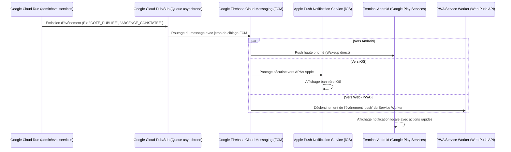

# Module 220 — Notifications Push (Firebase Cloud Messaging)

> **Positionnement :** Tome 12 — Applications Numériques · Module 220 sur 227
> **Autorité :** Lead Mobile Architect / Responsable Infrastructure Messagerie Google
> **Liaison amont/aval :** ← Module 219 (Cache et compression) → Module 221 (Appareils entrée de gamme) →

---

## 1. Objet

Ce module définit l'ingénierie, la délivrance, le cycle de vie et le ciblage des notifications push sur les plateformes mobiles (Android, iOS) et le Web (PWA). Conformément à la **DOCTRINE INFRASTRUCTURE GOOGLE**, ce service s'appuie exclusivement sur **Google Firebase Cloud Messaging (FCM)** pour assurer une distribution instantanée avec une consommation minimale de batterie et de bande passante.

---

## 2. Architecture de Délivrance Push (Firebase Cloud Messaging)



---

## 3. Typologie des Notifications et Priorités FCM

FCM propose deux niveaux de priorité radio, calibrés selon la criticité scolaire :

| Type d'Événement | Priorité FCM | Comportement Matériel | Exemple |
|---|---|---|---|
| **Alerte d'Urgence / Absence Injustifiée** | `high` | Réveille instantanément le processeur, sonnerie prioritaire | Absence d'un enfant constatée à 08h05 |
| **Scellement de Bulletin / Convocation Examen** | `high` | Affichage immédiat en bandeau persistant | Publication des résultats officiels EXETAT |
| **Nouveau Devoir / Rappel de Cours** | `normal` | Délivré lors de la prochaine synchronisation radio (batch) | Devoir de physique à rendre dans 48 heures |
| **Mise à Jour Silencieuse (Data Push)** | `normal` (sans alerte sonore) | Met à jour le cache local en arrière-plan sans déranger | Nouvelle version de leçon disponible |

---

## 4. Format de la Charge Utile FCM (JSON Frugal $< 4$ Ko)

Pour respecter la bande passante limitée des usagers congolais, les charges utiles FCM sont strictement inférieures à 4 Ko et ne contiennent aucune donnée personnelle en clair :

```json
{
  "message": {
    "token": "fcm_token_device_unique_xyz123",
    "android": {
      "priority": "high",
      "notification": {
        "title": "Alerte Présence Scolaire",
        "body": "Votre enfant KABEYA David n'a pas répondu à l'appel de 08h00.",
        "icon": "ic_alerte_ecole",
        "color": "#0B2545",
        "click_action": "OPEN_ABSENCE_DETAILS",
        "channel_id": "cnel_urgences"
      }
    },
    "data": {
      "type_evenement": "ABSENCE_CONSTATEE",
      "seance_id": "sea-kin-00481",
      "horodatage": "2026-09-17T08:05:00Z",
      "requires_ack": "true"
    }
  }
}
```

---

## 5. Gestion des Tokens FCM et Confidentialité

1. **Cycle de Vie du Token** :
   - Généré à la première installation de l'application.
   - Associé à l'IUNE de l'utilisateur de manière pseudonymisée.
   - Révoqué instantanément lors de la déconnexion (*Logout*) ou de la suspension administrative du compte.
2. **Segmentation par Sujets (FCM Topics)** :
   - Souscription à des canaux thématiques d'établissement (ex: `/topics/etab_saint_joseph_parents`).
   - Diffusion en un seul appel à 5 000 parents sans surcharge de base de données.
3. **Respect du Sommeil et Mode Frugal** :
   - Suspension des bannières sonores entre 21h00 et 06h00 (sauf alerte de sécurité civile).

---

## 6. Verrous Fonctionnels

| ID | Règle | Niveau |
|---|---|---|
| VF-220-01 | Intégration exclusive de Google Firebase Cloud Messaging (FCM) | CONSTITUTIONNEL |
| VF-220-02 | Notification d'absence d'un élève transmise en mode haute priorité sous 60 secondes | OBLIGATOIRE |
| VF-220-03 | Zéro donnée confidentielle ou note d'examen détaillée en clair dans le payload FCM | SÉCURITÉ |
| VF-220-04 | Révocation immédiate des jetons FCM lors de la déconnexion de l'appareil | CONSTITUTIONNEL |
| VF-220-05 | Canaux de notification distincts sous Android pour permettre aux parents de filtrer | ERGONOMIE |
| VF-220-06 | L'application Android consomme moins de 2 Mo de données pour 60 minutes d'utilisation terrain | PERFORMANCE |

---

*Sous-tome rédigé conformément aux Normes documentaires ELLYSIUM — Fondations 04.*
