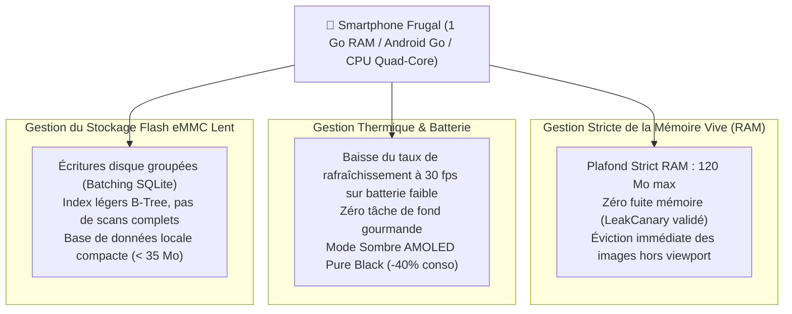

# Module 221 — Compatibilité avec Appareils d'Entrée de Gamme (RAM, Batterie, Stockage)

> **Positionnement :** Tome 12 — Applications Numériques · Module 221 sur 227
> **Autorité :** Lead Hardware & Performance Engineer / Laboratoire de Frugalité Numérique
> **Liaison amont/aval :** ← Module 220 (Notifications push) → Module 222 (Accessibilité mobile) →

---

## 1. Objet

Ce module fixe les règles d'ingénierie matérielle, de gestion de l'énergie et de compression mémoire assurant une exécution irréprochable des applications ELLYSIUM sur le parc réel des terminaux congolais. Il sanctuarise le fonctionnement sur les smartphones les plus modestes disposant de **1 Go à 2 Go de RAM**, de batteries dégradées et de processeurs à faible fréquence thermique.

---

## 2. Profil d'Exécution sur Terminaux Frugaux (Android Go)



---

## 3. Optimisation Mémoire Extrême en Flutter / Dart

Pour éviter le déclenchement intempestif de l'**Out-Of-Memory Killer (OOM Killer)** d'Android :
1. **Redimensionnement des Bitmaps au Pixel Près** :
   ```dart
   // Utilisation systématique de ResizeImage pour ne pas charger les pixels superflus
   Image(
     image: ResizeImage(
       AssetImage('assets/illustrations/biologie_cellule.webp'),
       width: 320,  // Calibré sur la largeur réelle d'affichage
     ),
     gaplessPlayback: true,
   )
   ```
2. **Virtualisation Intégrale des Listes** : Proscription formelle de `SingleChildScrollView` enveloppant des colonnes de widgets volumineux. Emploi exclusif de `ListView.builder` et `SliverList` qui instancient uniquement les éléments visibles à l'écran.
3. **Destruction Proactive des Contrôleurs** : Implémentation systématique de la méthode `dispose()` sur tous les flux, contrôleurs de texte et écouteurs d'événements.

---

## 4. Préservation de l'Énergie et Gestion des Pannes Électriques

En République Démocratique du Congo, les coupures de courant et les recharges de téléphone limitées (cabines de charge payantes) sont monnaie courante :
- **Surveillance de la Jauge de Batterie (Battery API)** :
  - Dès que la batterie passe sous le seuil critique des **15 %**, l'application bascule automatiquement en mode *"Survie Pédagogique"* : désactivation des animations, baisse de la luminosité intégrée de l'app, coupure des tentatives de synchronisation réseau non urgentes.
- **Sauvegarde d'État Toutes les 10 Secondes (State Checkpoint)** :
  - Si le téléphone s'éteint brutalement au milieu d'un exercice ou d'une lecture, la position exacte et les réponses déjà saisies sont récupérées à 100 % au redémarrage.

---

## 5. Résilience aux Écrans de Basse Résolution (FWVGA & qHD)

Une part importante du parc utilise des résolutions modestes ($480 \times 854$ ou $540 \times 960$ pixels) :
- **Responsive Fluid Layout** : Aucun élément graphique n'est codé avec des dimensions fixes en pixels absolus. Usage exclusif de pourcentages et de `MediaQuery` adaptatifs.
- **Gestion des Débordements (*RenderFlex Overflow*)** : Tous les blocs de texte intègrent un contrôle de débordement avec ellipsis ou défilement automatique pour éviter l'apparition des bandes hachurées jaunes et noires de Flutter.

---

## 6. Verrous Fonctionnels

| ID | Règle | Niveau |
|---|---|---|
| VF-221-01 | Consommation mémoire vive inférieure à 120 Mo sur appareil de test 1 Go RAM | PERFORMANCE |
| VF-221-02 | Zéro plantage par Crash OOM toléré sur les versions de release de production | QUALITÉ |
| VF-221-03 | Mode Survie Énergétique activé automatiquement sous 15% de batterie restante | ERGONOMIE |
| VF-221-04 | Sauvegarde d'état locale continue pour résister aux extinctions brutales du terminal | FIABILITÉ |
| VF-221-05 | Compatibilité certifiée jusqu'à la résolution minimale de 480 x 800 pixels | PORTABILITÉ |
| VF-221-06 | L'application Android consomme moins de 2 Mo de données pour 60 minutes d'utilisation terrain | PERFORMANCE |

---

*Sous-tome rédigé conformément aux Normes documentaires ELLYSIUM — Fondations 04.*
